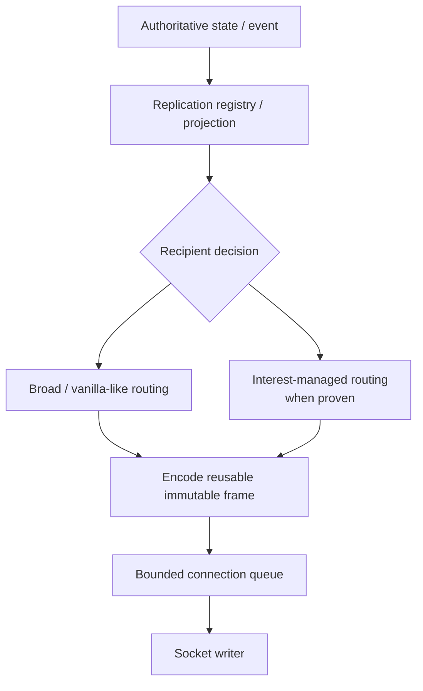
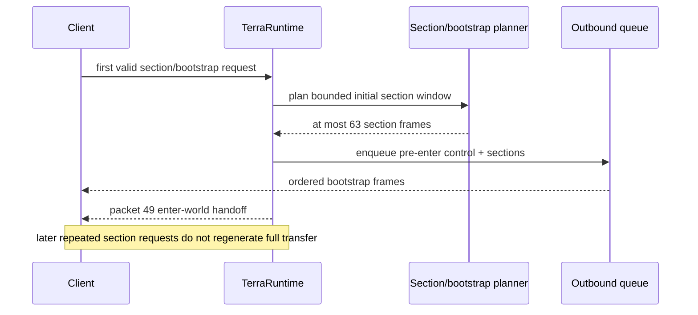
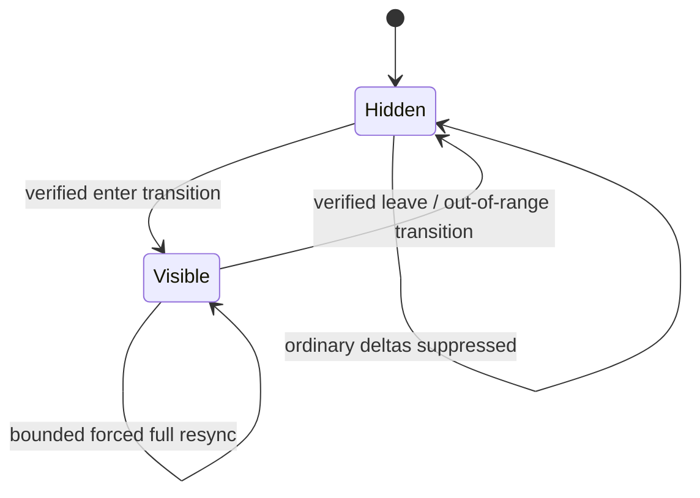
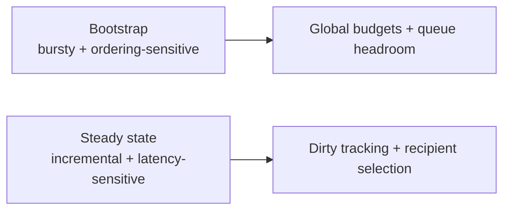

# Синхронизация, bootstrap и interest management

[English](../en/synchronization.md) · [Документация](README.md) · [Архитектура](architecture.md) · [Performance roadmap](../roadmap/performance-tick-stability.md)

## 1. Область документа

Synchronization project'ит authoritative runtime state в per-client state protocol `326`. Сюда входят join/bootstrap, sections, player/event fanout, NPC/projectile/world-item/object replication, recipient selection и future interest-management suppression/resync semantics.

Synchronization наблюдает authoritative state/events и не владеет gameplay mutation.

## 2. Общий flow

Recipient selection не мутирует underlying entity ради удобства replication.

## 3. Initial bootstrap

Exact packet ordering защищается live official-world probes, а не замораживается prose recipe.

## 4. Bootstrap frame budget

Current `PlayerBootstrapFrameBudget` доказывает:

$$
F_{\mathrm{sections,max}}=63,
\qquad
F_{\mathrm{pre49,max}}=65,
\qquad
F_{\mathrm{probe}}=96.
$$

Для default player capacity $P=8$ `ConnectionOutboundQueueSizing` даёт:

$$
F_{\mathrm{queue}}(8)=4\,077\ \text{frames}.
$$

Следовательно:

$$
65 < 96 < 4\,077.
$$

Historical larger pre-enter budget больше не описывает production: runtime entity/global baselines намеренно вынесены за final packet-10-to-packet-49 contract.

## 5. Sections

Section work одновременно подчиняется correctness, invalidation и bounded-cost constraints. Client должен получить required region, stale encoded section должен invalidated после mutation, а generation/compression uncached sections не monopolize tick.

Join work поэтому использует global subsystem budgets, а не умножает полный expensive-work allowance на число joining players.

## 6. Replication registries

TerraRuntime отделяет authoritative storage от transport projection. Dedicated replication state/registries существуют для player events/movement, NPCs, projectiles, world items, chests, signs и tile manipulation.

Если identical bytes действительно recipient-independent, preferred path — один immutable encoded frame shared между queues. Recipient-specific identity/slot/visibility требует separate projection.

## 7. Владение interest management

Interest management принадлежит TerraRuntime. External hosts получают только `IInterestManagementControl` enable/disable. Spatial layout, radii, hysteresis, transitions, forced resync и entity-specific policy остаются internal.

## 8. Текущий spatial foundation

`RuntimeInterestRouter` владеет section-based player spatial index и visibility tracker при доступных world dimensions.

Current default radii:

$$
r_{\mathrm{enter}}=3\ \text{sections},
\qquad
r_{\mathrm{leave}}=4\ \text{sections}.
$$

Так как $r_{\mathrm{leave}}>r_{\mathrm{enter}}$, policy имеет hysteresis и не создаёт boundary flicker.

Invalid/non-finite positions не должны оставлять stale membership. Untrustworthy location data fail-open.

## 9. Текущий статус suppression

**State tracking существует, но enabled default policy остаётся `PassthroughInterestPolicy`.** То есть enable interest management поддерживает ownership/spatial state, но пока не suppress'ит player movement updates.

Это deliberate до verification enter/leave/full-state-on-entry, teleport/respawn, slot reuse, out-of-range behavior и bounded forced resynchronization.

## 10. Visibility state model

`Hidden -> Visible` обязан отправить complete state для observation. `Visible -> Hidden` использует verified Terraria semantics, а не invented generic despawn.

## 11. Teleports, respawn и slot reuse

Spatial visibility должна сразу обрабатывать discontinuous movement, respawn, disconnect/slot reuse, invalid-to-valid positions и server-controlled player create/despawn.

Generation-safe identities не дают stale visibility примениться к новой entity, переиспользовавшей numeric slot.

## 12. Movement scaling

Broad player-to-player movement fanout стремится к:

$$
W(P)=\Theta(P^2),
$$

где $P$ — simultaneously active players. Поэтому movement является важным interest-management target, но raw distance suppression недопустим без transition/resync proof.

## 13. Другие dynamic entities

NPCs, projectiles и world items могут использовать ту же architecture только после verification собственных first-observation, leave/despawn, re-entry, slot-reuse и global-update semantics. Player policy нельзя blindly копировать.

## 14. Dirty-state replication

Target избегает scan каждой entity для каждого client каждый tick, когда work можно вести от revisions/events.

## 15. Bootstrap и steady state

Queue/budget decisions должны проверяться на обеих фазах.

## 16. Slow clients

Synchronization заканчивается bounded connection queue. Peer, который не drain'ит outbound data, становится local `SlowClient` problem вместо blocking authoritative simulation.

Interest management может снизить future queue pressure, но queue bounds mandatory.

## 17. Observability

Useful telemetry: connection queue depth/high-water marks, slow-client disconnects, bootstrap frame count, deferred section work, spatial membership changes, invalid-position removals, visibility transitions, suppressed/relayed counts, forced resync и oldest pending synchronization work.

Telemetry bounded и избегает formatted strings на каждый movement update.

## 18. Evidence

Evidence включает spatial-index/hysteresis tests, interest-control tests, bootstrap budget tests, entity bootstrap tests, replication-registry tests, real-process slow-client tests и live `Vanilla World Load` join/movement probes.

После enable real suppression live tests должны доказать и отсутствие hidden updates, и complete correct state restoration on re-entry.

## 19. Текущие ограничения

Incomplete: production movement suppression, complete enter/leave outbound wiring, full-state-on-entry разных entity types, forced-resync policy, generalized NPC/projectile/item routing, measurement-derived final radii/queue sizing и complete section-cache/per-client accounting.

## 20. Checklist изменения synchronization

Synchronization change не завершён, пока authoritative/replication state separated, join work/queues globally bounded, transitions/resync tested до suppression, invalid state fail-open, slot reuse не наследует stale visibility, protocol-sensitive transitions имеют live evidence, diagrams используют Mermaid, dimensional quantities используют LaTeX, и эта page изменена вместе с `docs/en/synchronization.md`.
