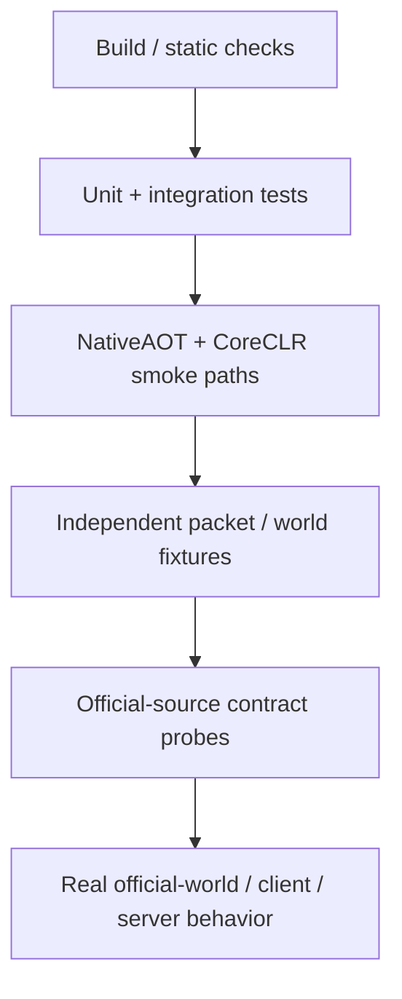
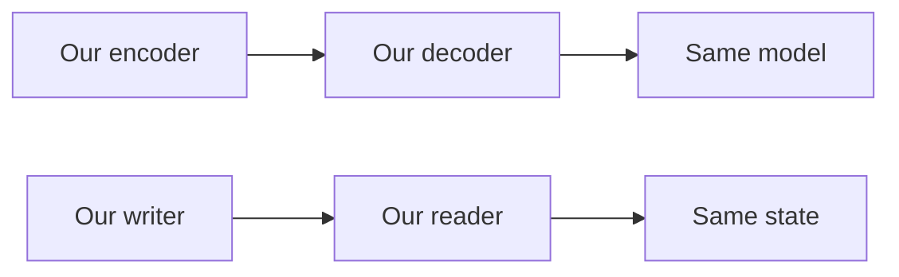
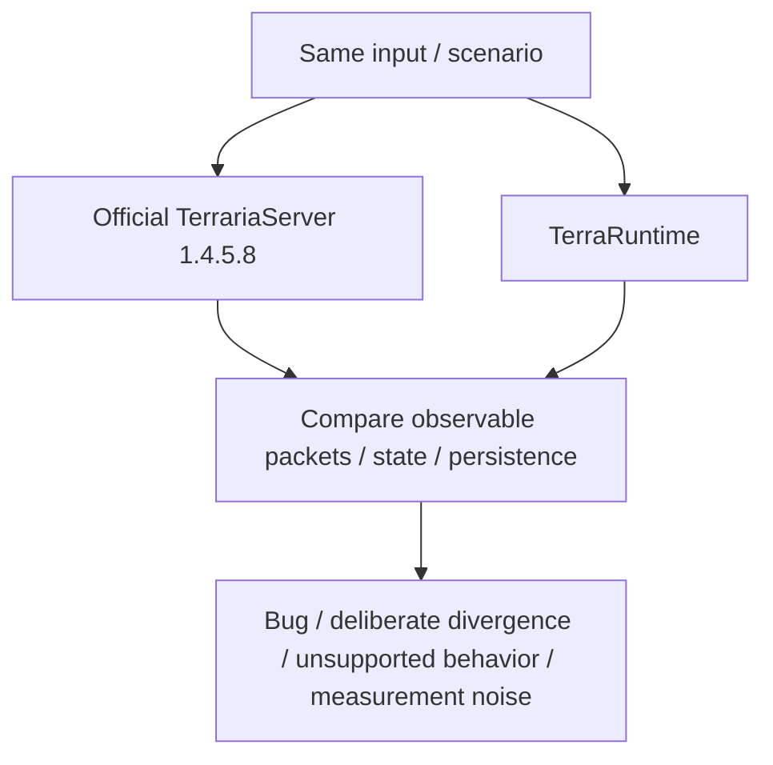

# Testing, verification и evidence

[English](../en/testing-evidence.md) · [Документация](README.md) · [Reference policy](../reference-policy.md) · [Roadmap](../roadmap.md)

## 1. Зачем нужен этот документ

TerraRuntime восстанавливает observable behavior TerrariaServer 1.4.5.8, не копируя его внутреннюю архитектуру. Green unit-test suite необходим, но сам по себе не является proof vanilla parity.

Более сильный evidence layer нужен, когда нижний слой может разделять ту же ошибочную гипотезу, что и implementation under test.

## 2. Source hierarchy

При расхождении sources порядок такой:

1. locally decompiled official `TerrariaServer.exe` 1.4.5.8 для gameplay behavior, `.wld` layout, ordering, constants и server semantics;
2. `VegaKernel/Multiplicity` 3.0.x для protocol 326 typed wire models;
3. `bybrooklyn/terrustia` как independent implementation cross-check и источник testing/performance ideas;
4. TShock/OTAPI только для historical compatibility и exploit lessons.

Secondary implementations не переопределяют verified current official behavior. Decompiled source остаётся local reference material; copied method bodies, game assets и game text не коммитятся.

## 3. Политика roadmap checkboxes

Roadmap `[x]` означает, что claim verified на `main` implementation + tests/CI или equivalent executable proof.

Наличие type/interface, successful compile, stub, self-round-trip, incomplete architectural layer или сходство с decompiled source недостаточны. Foundation-only work остаётся `[ ]`.

## 4. Build и test baseline

Main CI baseline включает bilingual documentation structure/link validation, .NET 11 restore, Release build/analyzers, `TerraRuntime.Tests`, authoritative loop smoke, protocol smoke, network smoke, world smoke и Terminal UI smoke.

Failure ломает базовый implementation baseline. Pass не означает automatic vanilla compatibility behavior-sensitive change.

## 5. Dual-host runtime gates

TerraRuntime проверяет оба shipping profiles.

**NativeAOT standalone:** публикуются Linux x64 и Windows x64 native artifacts, проверяется runnable layout/native sidecars, затем smoke paths выполняются из published directory.

**CoreCLR extensible:** публикуются self-contained Linux x64/Windows x64 hosts; drop-in trusted host-module fixture устанавливается и прогоняется через extensible-host smoke path.

Это защищает правило: runtime core остаётся AOT-compatible, managed profile явно загружает trusted host modules.

## 6. Regression test обязан ловить regression

Bug-fix test полезен только если различает broken и fixed behavior. Для non-trivial fix test должен падать при удалении fix, возврате old behavior или reintroduction неверного constant/order/path.

Test, который green до и после fix, почти ничего не доказывает про баг.

## 7. Ограничение self-round-trip

Protocol и persistence особенно подвержены ложной уверенности от self-round-trip.

Обе стороны могут реализовать одинаковый неправильный layout и пройти test. Round-trip полезен для internal consistency, но wire/file compatibility требует independent evidence.

## 8. Golden bytes и independent fixtures

Critical packet layouts по возможности привязываются к independently known-good evidence: official client/server captures, official-server `.wld`, независимо полученные header/section values и failure artifacts live workflows.

Expected data не должна генерироваться тем же code path, который тестируется.

## 9. Official-source contract workflows

Dedicated workflows проверяют узкие contracts TerrariaServer 1.4.5.8: source/reference probes, tile protocol/framing, dirt/stone mutations, projectile/NPC behavior, signs/chests и world generation/load/save slices.

Contract workflow должен быть достаточно узким, чтобы failure указывал на конкретный rule, а не превращался в длинную black-box интеграцию.

## 10. Live official-world verification

`Vanilla World Load` family может создать world официальным TerrariaServer и затем прогнать TerraRuntime на этом artifact. Current end-to-end coverage включает world loading, join/bootstrap, movement relay, selected chest/sign behavior, warm runtime-snapshot startup, canonical checkpoint restore/export и startup/cache evidence.

Official-world artifact сильнее synthetic world, созданного implementation under test.

## 11. Differential behavior

Если важны exact output/order, один scenario прогоняется на обоих implementations:

Useful targets: packet sequences, world mutations, AI transitions, projectiles, drops и persistence effects.

## 12. Network и process tests

In-process tests могут скрывать OS scheduling, socket backpressure и process lifecycle. Real process/socket tests предпочтительны для slow readers, admission churn, join bursts, queue saturation, `SIGTERM`, malformed traffic followed by valid connection и save behavior вокруг connection failure.

## 13. Malformed input и fuzzing

Trust-boundary tests доказывают bounded failure. Targets включают framing, variable-length packet decoders, section/tile input, `.wld` parsing и command/text parsing.

Сильный adversarial test доказывает и bounded rejection, и способность server после этого обработать valid operation.

Permanent broad fuzz corpus пока incomplete.

## 14. Persistence evidence

Persistence changes могут требовать official `.wld`, preserved-section byte checks, interrupted/failed-save recovery, atomic publication checks, runtime-cache corruption fallback, cold/warm startup comparison, live chest/sign/tile persistence и reload verification resulting canonical checkpoint.

Unknown/newer layouts fail conservatively, а не получают green tests через guessed offsets.

## 15. Gameplay и RNG evidence

Gameplay parity доказывается subsystem by subsystem: deterministic transitions, verified catalogs/defaults, generation-safe slot-reuse tests, collision/world-query tests, replication tests, official-source AI/default probes и real client/server behavior для ordering-sensitive interactions.

NPC AI, loot и world generation могут зависеть от RNG call order, не только distributions. RNG consumption order сохраняется, parallelism не меняет order, используются deterministic scenarios и official comparison where possible.

## 16. Performance evidence

Performance claims требуют before/after measurement на одинаковых hardware/environment, world и workload.

Relevant metrics: wall/CPU time, allocation rate, GC counts/pauses, queue depth/backlog age, throughput, RSS/working set и latency percentiles $p_{50}$, $p_{95}$, $p_{99}$.

Optimization не merge'ится только потому, что она «должна быть быстрее».

## 17. CPU time и wall time

Большой wall-time spike при низком authoritative-thread CPU может означать scheduler/OS contention, а не expensive simulation. Timing data из несовместимых clocks/workloads нельзя сравнивать как evidence.

## 18. Production-like scale matrix

Полезные checkpoints:

$$
P\in\{1,8,24,64,128,255\}.
$$

$P=24$ — realistic optimization baseline; $P=255$ — stress/scalability target. Они не заменяют idle, normal-play, join-burst, slow-reader и persistence workloads.

## 19. Failure artifacts

Live/reference failure должен сохранять небольшой artifact, который объясняет что произошло: packet-sequence summary, expected/observed counters, selected bytes/metadata, startup profile, world/checkpoint identity, typed stop/rejection reason и bounded logs.

Artifacts не содержат copyrighted decompiled source или ненужные большие game assets.

## 20. CI cancellation и concurrent main work

Main CI использует concurrency cancellation. Run может стать `cancelled`, если новый push supersede'нул его; это не test failure. Pending/queued также не является green.

Status claim относится к workflow run exact current SHA.

## 21. Documentation validation

`tools/ci/check_documentation.py` проверяет mirrored RU/EN page sets, required baseline pages и repository-local relative Markdown links, не выходящие за repository root.

Semantic translation equivalence он не доказывает; factual RU/EN parity остаётся review responsibility.

## 22. Сила evidence должна соответствовать claim

| Claim | Minimum useful evidence |
|---|---|
| Interface exists | code + API tests могут быть достаточны |
| Packet bytes match Terraria | independent bytes / live reference |
| World saves safely | real world + recovery / reload evidence |
| AI matches vanilla | state tests + official behavior reference |
| Optimization improves performance | reproducible before/after measurement |
| NativeAOT deployable | publish + execute published artifact |

## 23. Checklist изменения tests/evidence

Test/evidence change не завершён, пока test способен упасть на regression, compatibility expectations independent where required, official version pinned, local decompile material не committed, process/socket risks tested at correct layer, performance claims имеют reproducible measurements, roadmap checkboxes отражают evidence, diagrams используют Mermaid, measured quantities используют LaTeX where applicable, и эта page изменена вместе с `docs/en/testing-evidence.md`.
