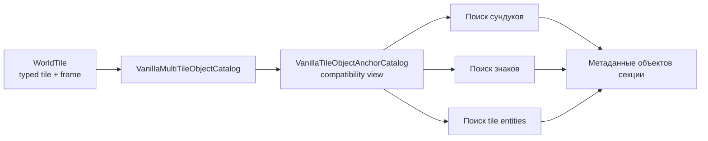

# Каталог multi-tile объектов

TerraRuntime теперь владеет source-backed правилами frame-anchor, которые используются при поиске сундуков, знаков и поддерживаемых tile entities в метаданных секции. Цель узкая, но важная: ванильная арифметика кадров должна принадлежать границе определения tile-объекта, а не случайному packet/persistence-кодировщику, которому она понадобилась.

## Владение

`VanillaMultiTileObjectDefinition` хранит типизированный `TileTypeId`, width и height base-style, placement origin, metadata family, горизонтальный и вертикальный периоды frame и признак требования `FrameY == 0` для metadata anchor. `VanillaTileObjectAnchorDefinition` является compatibility view, который использует section encoder. Метод `Matches` также требует активный тайл. Поэтому вызывающий код использует семантическую geometry и anchor predicates вместо размножения арифметики `% 18`, `% 36`, `% 54` или `% 72`.

Текущий каталог покрывает только семейства объектов, которые уже выдаёт `WorldSectionObjectMetadataEncoder`: ванильные chest/container-якоря, знаки с текстом, training dummy, item frame, Dead Cells display jar, food platter, weapons rack, display doll, hat rack и teleportation pylon.

## Правило совместимости

Эти определения закреплены за `TileObjectData.Initialize` TerrariaServer 1.4.5.8 и поведением, которое уже было реализовано в section-object path. Отдельный source-contract workflow проверяет семь inherited base styles и их связь с 15 поддерживаемыми object types. Рефакторинг не меняет порядок объектов секции и байты payload; он переносит существующие проверенные факты распознавания под одного типизированного владельца.

Тайл считается якорем только при совпадении content identity, active-состояния и выравнивания frame. Каталог намеренно сохраняет vanilla modulo-семантику кадров, включая различие обычных контейнеров (периоды `36 x 36`) и dresser (`54 x 36`). Для teleportation pylon используется `54 x 72`; tile entities, у которых существующее правило требует верхний кадр, явно используют семантику `FrameY == 0`.

## Граница области

Каталог покрывает полную geometry, необходимую текущим поддерживаемым семействам section metadata, но не каждый vanilla furniture type. Alternate placement origins, support rules, style/substyle mapping, liquid placement constraints и mutation hooks остаются вне этого definition slice. Placement, break и framing operations отслеживаются отдельно в D5; каталог не заявляет полную `TileObjectData` parity.
