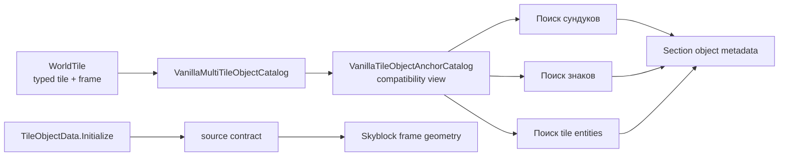

# Каталог multi-tile объектов

TerraRuntime владеет source-backed правилами frame-anchor для поиска сундуков, знаков и поддерживаемых tile entities в section metadata. Ванильная арифметика кадров должна принадлежать границе определения tile-object, а не случайному packet/persistence-кодировщику.

## Владение

`VanillaMultiTileObjectDefinition` хранит типизированный `TileTypeId`, base-style width/height, placement origin, metadata family, frame periods и признак требования `FrameY == 0`. Runtime catalog намеренно остаётся ограничен семействами, которые реально выдаёт `WorldSectionObjectMetadataEncoder`.

## Source-backed geometry для worldgen

Тот же закреплённый source contract `TileObjectData.Initialize` проверяет небольшой набор frame-important worldgen-объектов, которые не несут section side-table metadata и поэтому не должны притворяться элементами `VanillaMultiTileObjectCatalog`.

Skyblock использует проверенную связь со `Style3x2` для:

| Объект | Tile ID | Геометрия | Frame grid |
|---|---:|---:|---|
| Demon / Crimson Altar | 26 | `$3\times2$` | клетки по `$18$` px; Crimson использует свой style offset |
| Hellforge | 77 | `$3\times2$` | клетки по `$18$` px |
| Lihzahrd Altar | 237 | `$3\times2$` | клетки по `$18$` px |

Разделение намеренное: geometry может быть source-backed, не означая, что объект имеет chest/sign/tile-entity metadata.

## Правило совместимости

Определения закреплены за `TileObjectData.Initialize` TerrariaServer 1.4.5.8. Workflow проверяет семь inherited base styles, связь с 15 поддерживаемыми section-metadata objects и три дополнительных `Style3x2` progression-объекта Skyblock.

Metadata tile считается anchor только при совпадении content identity, active-state и frame alignment. Каталог сохраняет vanilla frame-modulo semantics, включая обычные containers (`36 x 36`), dresser (`54 x 36`) и teleportation pylon (`54 x 72`).

## Граница области

Metadata catalog всё ещё не заявляет полную `TileObjectData` parity. Alternate origins, support rules, style/substyle mapping, liquid constraints и mutation hooks остаются отдельной gameplay/placement работой. Аналогично доказательство геометрии Lihzahrd Altar `$3\times2$` само по себе не реализует расход Power Cell или summon Golem.
