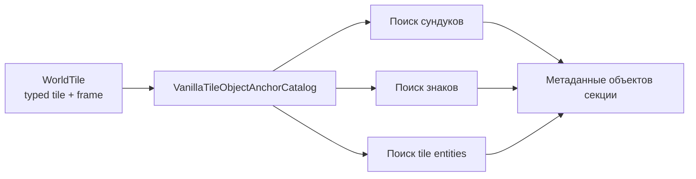

# Каталог якорей tile-объектов

TerraRuntime теперь владеет source-backed правилами frame-anchor, которые используются при поиске сундуков, знаков и поддерживаемых tile entities в метаданных секции. Цель узкая, но важная: ванильная арифметика кадров должна принадлежать границе определения tile-объекта, а не случайному packet/persistence-кодировщику, которому она понадобилась.

## Владение

`VanillaTileObjectAnchorDefinition` хранит типизированный `TileTypeId`, горизонтальный период frame, вертикальный период frame и признак требования `FrameY == 0`. Метод `Matches` также требует активный тайл. Поэтому вызывающий код использует семантический предикат якоря вместо размножения арифметики `% 18`, `% 36`, `% 54` или `% 72`.

Текущий каталог покрывает только семейства объектов, которые уже выдаёт `WorldSectionObjectMetadataEncoder`: ванильные chest/container-якоря, знаки с текстом, training dummy, item frame, Dead Cells display jar, food platter, weapons rack, display doll, hat rack и teleportation pylon.

## Правило совместимости

Эти определения закреплены за поведением TerrariaServer 1.4.5.8, которое уже было реализовано в section-object path. Рефакторинг не меняет порядок объектов секции и байты payload; он переносит существующие проверенные факты распознавания под одного типизированного владельца.

Тайл считается якорем только при совпадении content identity, active-состояния и выравнивания frame. Каталог намеренно сохраняет vanilla modulo-семантику кадров, включая различие обычных контейнеров (периоды `36 x 36`) и dresser (`54 x 36`). Для teleportation pylon используется `54 x 72`; tile entities, у которых существующее правило требует верхний кадр, явно используют семантику `FrameY == 0`.

## Намеренная граница области

Это **ещё не** полный D5 milestone multi-tile object definitions. Полные определения всё ещё требуют независимо подтверждённых dimensions, origin, support/anchor rules, style mapping, placement/break/framing behavior и связанных mutation semantics. Эта граница оставлена явной, чтобы полезный каталог section-anchor не превратился в ложное заявление о полном `TileObjectData` parity.
