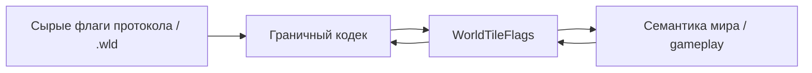

# Флаги состояния тайла

TerraRuntime отделяет нормализованное состояние тайла от битовых раскладок пакетов Terraria и формата `.wld`. `WorldTile` является упакованным runtime/snapshot-представлением, а протокольные и persistence-кодеки преобразуют сырые маски на границе и не протаскивают их в gameplay-код.

## Владение состоянием

`WorldTile.Flags` использует именованный enum `WorldTileFlags`. Поле остаётся enum с базовым типом `ushort`, поэтому замороженный snapshot ABI `WorldTile` сохраняет размер

$$
S_{\mathrm{WorldTile}}=16\,\mathrm{B}.
$$

Текущие runtime-owned биты:

| Бит | Флаг | Смысл |
|---:|---|---|
| 0 | `Active` | содержимое тайла активно |
| 1 | `WireRed` | присутствует красный провод |
| 2 | `WireBlue` | присутствует синий провод |
| 3 | `WireGreen` | присутствует зелёный провод |
| 4 | `WireYellow` | присутствует жёлтый провод |
| 5 | `Actuator` | присутствует актуатор |
| 6 | `Inactive` | тайл находится в actuated/inactive-состоянии |
| 7 | `InvisibleBlock` | невидимость блока |
| 8 | `InvisibleWall` | невидимость стены |
| 9 | `FullbrightBlock` | fullbright блока |
| 10 | `FullbrightWall` | fullbright стены |

`WorldTileFlagMasks` объединяет именованные биты в группы `Wires`, `Actuation`, `Visibility`, `Fullbright` и `Known`. Gameplay-код должен использовать эти группы либо семантические свойства `HasAnyWire`, `HasActuator`, `IsActuated`, `IsBlockInvisible`, `IsWallFullbright`, а не размножать числовые маски.

## Правило мутации

`WorldTile.TrySetFlags(...)` изменяет только известные runtime-биты и отклоняет неопределённые. Так посторонний gameplay-path не может незаметно придумать новый сохраняемый бит snapshot ABI. Добавление настоящего нового флага требует явного элемента `WorldTileFlags`, проверки ABI, преобразования в кодеках там, где это нужно, тестов и синхронной RU/EN документации.

`Inactive` намеренно представлен семантическим свойством `IsActuated`. Это не отрицание `Active`: активный тайл может быть актуатором переведён в vanilla inactive-состояние для collision/visibility-логики.

## Правило границы

Числовые позиции битов выше являются нормализованным snapshot ABI TerraRuntime. Это не утверждение, что протокол Terraria или `.wld` используют те же позиции. `WorldFileTileDecoder`, `WorldFileTileEncoder`, section encoders и protocol adapters отвечают за преобразование внешнего представления в именованное runtime-состояние.

Идентичность tile/wall подчиняется тому же правилу: упакованные `ushort` остаются частью snapshot ABI, а gameplay читает их через типизированные `TileTypeId` и `WallTypeId`.
