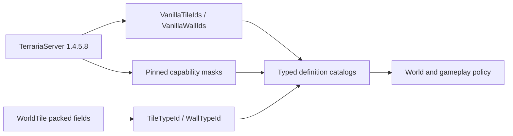

# Vanilla-определения тайлов и стен

Сыпучие блоки используют общую операцию `VanillaWorldTileMutationService.ClearTile`, отличную от добычи через `KillTile`: Terraria `Tile.ClearTile` очищает active/inActive/slope, но сохраняет краску, покрытия, актуатор, провода, стенку, жидкость и неактивные type/frame поля исходной клетки. Допуск происходит после резервирования provenance/capacity падающего projectile, не в обход клиентских разрешений. Оседание использует обычные PlaceTile/SetShape либо резервирование world item. См. [границы и лимиты сыпучих блоков](gameplay.md#сыпучие-блоки-в-работающем-мире-2026-09-09) и [автономный Mining](runtime-bot-architecture.md#режимы-оператора). Абзац о лопате ниже описывает прежнее отдельное исправление инструмента.

Лопата могильщика (`4711`) — специальный инструмент, не обычная кирка: `Item.SetDefaults` оставляет `pick=0`; `Player.UseShovel` обрабатывает область 3×3, а `DamageTileWithShovel` применяет силу `30` только к `TileID.Sets.CanBeDugByShovel`. Допуск packet 17 теперь проверяет именно этот исходный набор, затем использует существующие пути failed-pick transformation, mutation, drop и replication. Обычный лимит игрока остаётся $8\,\text{events/tick}$; подтверждённая пара лопата/тайл допускает до $18\,\text{events/tick}$ для девяти клеток с двумя событиями снятия травы/удара. Счётчик общий: смена инструмента его не сбрасывает. Неизвестные определения тайлов, структуры и неподдерживаемые пути разрушения остаются закрыты. Это не реализация сыпучих блоков и не расширение добычи ботами.

TerraRuntime представляет content тайлов и стен Terraria `1.4.5.8` через типизированные version-pinned catalogs. Упакованные поля `ushort` остаются ABI world snapshot, а gameplay получает их семантику через `TileTypeId`, `WallTypeId`, `VanillaTileDefinitionCatalog` и `VanillaWallDefinitionCatalog`.

## Поток определений

`VanillaTileDefinitionCatalog` покрывает ровно `754` vanilla tile identities и работает как flyweight-таблица: mutable `WorldTile` хранит только состояние конкретной ячейки, а один immutable `VanillaTileDefinition` на type содержит collision/frame facts, mutation path, mining profile, source-pinned drop rule, contextual simple-cell strategy и failed-pick transform target. Так invariant behavior не копируется в миллионы клеток мира, а runtime-authority не обрастает параллельными allow-list'ами сырых TileID.

Drop-image для simple-cell тайлов pinned к TerrariaServer 1.4.5.8 `WorldGen.KillTile_GetItemDrops`. `Fixed`, `None`, `Contextual` и `Object` являются категориями поведения, а не одним `CanDrop` boolean: vines зависят от functional Cordage ближайшего игрока, Mushroom Vines используют vanilla RNG branch, Hive может оставить honey и породить Bee/SmallBee, а frame-important contextual identities остаются на собственном frame/object path.

`VanillaWallDefinitionCatalog` покрывает ровно `367` vanilla wall identities. Его packed definition image соответствует `Main.wallHouse`, `Main.wallDungeon` и `Main.wallLight` после `Main.Initialize_TileAndNPCData2`. `WallTypeId(0)` является валидной identity отсутствующей стены; `VanillaWallDefinition.IsPresent` отличает её от занятой wall-cell.

## Именованные progression identities

Именованная поверхность IDs растёт только тогда, когда identity действительно нужна production gameplay/worldgen и source contract может её проверить. Skyblock progression добавляет:

| Tile | ID |
|---|---:|
| DemonAltar | 26 |
| Cobweb | 51 |
| MushroomGrass | 70 |
| Hellforge | 77 |
| Hive | 225 |
| LihzahrdBrick | 226 |
| LihzahrdAltar | 237 |
| Marble | 367 |
| Granite | 368 |

| Wall | ID |
|---|---:|
| SpiderUnsafe | 62 |
| HiveUnsafe | 86 |
| LihzahrdBrickUnsafe | 87 |

Эти имена являются типизированными aliases поверх уже существующего полного диапазона и не меняют snapshot ABI или vanilla counts.

## Правила boundary

- Неизвестные IDs отклоняются методом `TryGet`; отсутствие определения не трактуется как угаданные vanilla defaults.
- World-file decoders могут сохранять storage values по собственной compatibility policy, но authoritative gameplay обязан запросить version-pinned definition перед использованием content capabilities.
- Размер tile-object, origin, anchors и placement rules намеренно не входят в базовые определения и относятся к object/worldgen contracts.
- Collision- и frame-masks остаются независимо source-backed; tile catalog объединяет их вместо копирования ещё одной непроверенной таблицы.

Workflow `Tile Wall Definition Source Contract` загружает официальный сервер с закреплённым SHA-256, декомпилирует только `Main`, `TileID` и `WallID` и проверяет counts, именованные progression-константы и wall capability images, не добавляя decompiled source в репозиторий.
