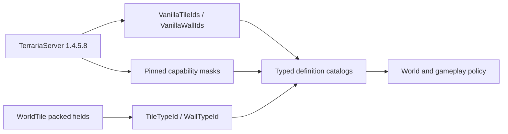

# Vanilla-определения тайлов и стен

TerraRuntime представляет content тайлов и стен Terraria `1.4.5.8` через типизированные version-pinned catalogs определений. Упакованные поля `ushort` остаются ABI world snapshot, а gameplay получает их семантику через `TileTypeId`, `WallTypeId`, `VanillaTileDefinitionCatalog` и `VanillaWallDefinitionCatalog`.

## Поток определений

`VanillaTileDefinitionCatalog` покрывает ровно `754` vanilla tile identities. Каждое определение объединяет существующие source-backed таблицы solid, solid-top и frame-important для формата `326`, а также отмечает тайлы, для которых section snapshot несёт container- или sign-metadata в side table.

`VanillaWallDefinitionCatalog` покрывает ровно `367` vanilla wall identities. Его packed definition image соответствует `Main.wallHouse`, `Main.wallDungeon` и `Main.wallLight` после `Main.Initialize_TileAndNPCData2`. `WallTypeId(0)` является валидной catalog identity отсутствующей стены; `VanillaWallDefinition.IsPresent` отличает её от занятой wall-cell.

## Правила boundary

- Неизвестные IDs отклоняются методом `TryGet`; отсутствие определения не трактуется как угаданные vanilla defaults.
- World-file decoders могут сохранять storage values согласно собственной compatibility policy, но authoritative gameplay обязан запросить типизированное version-pinned definition перед использованием content capabilities.
- Размер tile-object, origin, anchors и placement rules намеренно не входят в базовые определения и принадлежат multi-tile object catalog.
- Collision- и frame-masks остаются независимо source-backed; tile catalog объединяет их вместо копирования ещё одной непроверенной таблицы.

Workflow `Tile Wall Definition Source Contract` загружает официальный сервер с закреплённым SHA-256, декомпилирует только `Main`, `TileID` и `WallID` и проверяет counts identities и wall capability images, не добавляя decompiled source в репозиторий.
