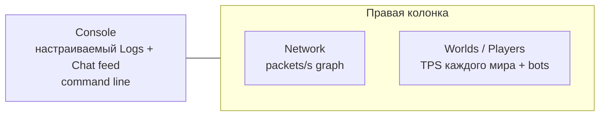

# Взаимодействие с TUI dashboard

[English](../en/tui-dashboard-interaction.md) · [Operations и TUI](operations-tui.md)

## Назначение

Встроенный System Dashboard TerraRuntime держит presentation state отдельно от authoritative runtime state. Действия UI отправляют typed operations; поток Terminal.Gui напрямую мир не мутирует.

## Layout



Console занимает примерно две трети workspace. Справа сверху остаётся компактный Network graph, а всё остальное место получает Worlds / Players. Старый общий TPS graph удалён намеренно: Level 1 runtimes имеют независимые authoritative game loops и, следовательно, независимый tick rate.

## TPS каждого мира и roster

Каждый live `WorldRuntime` публикует target TPS и observed TPS, рассчитанный по tick counter именно его game loop. Значение показывается прямо в строке мира:

```text
▼ Main   [primary]            TPS 60.0/60
  └─ #0 Alice
▼ arena  [sandbox]            TPS 119.8/120
  └─ #1 Bob
```

У запущенного sandbox избыточное слово `running` не показывается: строка содержит просто `[sandbox]`. Остальные lifecycle states остаются явными, например `[sandbox · stopping]`. У sandbox, который ещё materialize/start, live game loop пока нет, поэтому выводится `TPS --`, а не метрика primary мира.

Roster переведён на `ListView`: focus/selection выделяет пункт целиком, а не текст внутри строки. Drag-and-drop игрока отправляет typed Level 1 move operation с точным `PlayerHandle` (`slot + generation`), захваченным в момент начала drag. Этот captured source остаётся неизменным до release кнопки, поэтому ни фоновый refresh/reorder, ни повторные held-button mouse events над строкой другого игрока не могут подменить переносимого player. Drop surface — вся ветка destination world: заголовок мира, строка любого игрока этой ветки и `<no players>` placeholder ведут в один и тот же semantic target.

У actionable строк sandbox-world, player и bot справа выводится явное действие `[X]`. Нажатие проходит через typed operations: для sandbox подтверждается `Destroy`, для player — `Kick`, для bot запрашивается typed despawn. Уничтожение primary мира намеренно не предлагается. `Kick` запрашивает закрытие process-owned connection через connection route/outbound queue; UI никогда не удаляет authoritative state напрямую.

Action row roster содержит ровно **`+ Sandbox`**, затем **`+ Bot`**. `+ Sandbox` открывает окно создания sandbox. Форма напрямую отображает typed sandbox creation surface:

- имя sandbox;
- один dropdown isolation с вариантами `In-process sandbox isolation` и `Dedicated-process sandbox isolation`;
- generated world или существующий `.wld`;
- generator ID и numeric/random seed;
- размер primary или явные width/height;
- выпадающий список mode: Classic, Expert, Master и Journey;
- выпадающий список evil: Corruption и Crimson.

Форма строит тот же typed `SandboxCreateRequest`, который использует command handling, а не собирает строку команды и не парсит её повторно.

Action row содержит **`+ Sandbox`**, затем **`+ Bot`**. Теперь создаются только PlayerBot: hostile NpcBot/защитники и их presets удалены. Обычный NPC actor, interaction и shop foundation сохранён отдельно. Double-click открывает weapon policy, flight, target, Idle/Follow/Guard и GodMode. Боты начинают с 500/500 HP и 200/200 mana, получают уникальные случайные имена, согласованные random functional/vanity loadouts и запас healing/mana potions. Pickup, лечение и поддерживаемые Archery/Wrath используются автоматически с расходом authoritative inventory. Зелья не тратятся на незначительную потерю HP/mana; лечение и mana в одном тике сохраняют оба обновления vitals. Поддерживаемые NPC contact, hostile projectiles и их termination explosions проходят существующий authoritative damage pipeline; смертельный урон создаёт настоящее dead state и packet 118. Наличие loadout не означает поддержку неподтверждённых combat/equipment effects.

PlayerBot использует существующие server-player, projectile и world-item authorities. Automatic selection выбирает поддерживаемые Muramasa, Platinum Bow и gun loadouts с Unholy Arrow/Silver Bullet; held slots и use-item controls реплицируются. Упреждение учитывает настоящую скорость weapon/ammo/accessories, source projectile substeps и tile-aware проверку линии/траектории. Guard удерживает generation-safe цель, сближается до эффективной дистанции, сохраняет открытую огневую позицию и выбирает ограниченную стабильную reposition point при перекрытом выстреле. Flight позволяет подняться над препятствием; Follow сохраняет разнесённые formation и ходьбу/полёт. Catch-up recovery показывает Magic Mirror из inventory (item 50, использование 90 ticks), переносит на tick 45 и затем возвращается к оружию. Packet 12 RecallFromItem передаёт наблюдателю recall floor. Перенос к игроку вместо сохранённой кровати — явно политика бота, а не новое vanilla-правило зеркала. Полный pathfinding, все weapon/accessory effects и live-client visual parity не входят в этот проверенный slice.

Повторная проверка замечаний тестера исправляет отображение remote item в protocol 326: packet `13` передаёт нормальную гравитацию и флаг успешного использования, требуемый remote `Player.ItemCheck`; прицельные выстрелы дополнительно отправляют packet `41` с authoritative rotation/animation. PvP melee claims, trusted player projectiles и termination explosions теперь включают серверных ботов в существующий damage/mitigation path, сохраняя hostility/team/generation checks и GodMode. Смертельный PvP отправляет packet `118`. Bullet `14`, Silver Bullet `981`, Green Laser `20` и Jester's Arrow `5` сохраняют source AI_001 timer без обычной гравитации стрелы; prediction использует то же различие. Открытые настройки обновляют текущий PvP. Потеря exact target generation очищает цель и выбирает Idle без привязки переподключившегося игрока по имени. Follow сокращает formation offset, попавший внутрь твёрдого препятствия. World replacement деактивирует все remote player slots перед destination baseline, кроме собственного slot соединения и sentinel `255`; primary-бот остаётся в primary. Проверены три повторных перехода, но это не устанавливает причину Lost connection тестера и не заменяет визуальную проверку живым клиентом.

Обычные мирные NPC actors и будущие магазины сохраняют существующий NPC authority/UI foundation; удаление hostile operator bots не удаляет generic contracts.

На dashboard **нет дублирующей видимой кнопки Settings**. Runtime listener/settings controls остаются в **Settings → Runtime settings**.

## Player details и GodMode

Double-click по player row открывает generation-safe окно конкретной player session. `God mode` отображается как `Disabled` / `Enabled` dropdown и применяется кнопкой `Apply`. Периодический dashboard refresh не перетирает пользовательский выбор, ожидающий Apply; после применения значение проходит через typed trusted-host administration boundary и authoritative game loop. Liveness и command routing используют process-level world route выбранного игрока, поэтому управление одинаково работает для primary и sandbox players, а primary telemetry больше не служит gate.

## Выбор мира в detail screens

В Players, NPCs, Projectiles, Items и World есть выпадающий список `World:`. Выбор привязан к стабильному `WorldRuntimeId`, а не к текущему session ID, поэтому regenerate/restart sandbox может сменить session и при этом не переключает оператора на другой логический мир.

Selector работает через process-owned detached inspection directory/cache. Terminal.Gui thread не хранит ссылки на `WorldRuntime` и не захватывает тяжёлое entity state напрямую. Snapshots игроков/NPC/projectiles/items обновляются только для выбранного мира и только после того, как соответствующий detail screen запросил эту категорию. У Network и Logs selector намеренно отсутствует: это process-scoped диагностика.

Entity telemetry для sandbox включается, когда включён terminal UI. Поэтому sandbox получает те же bounded NPC/projectile/item diagnostics, что и primary, но headless process не платит за ненужный diagnostic capture. Для primary экран World сохраняет расширенные startup/cache/persistence данные; для sandbox он показывает собственные lifecycle, source, persistence policy, TPS и entity counts.

## Maximize и focus

Double-click по title плитки растягивает её на весь dashboard workspace и скрывает остальные. Повторный double-click восстанавливает tiled layout. Keyboard/mouse focus включает Accent scheme и добавляет к активному title `▶`.

## Настраиваемый Console feed

Console остаётся одним bounded хронологическим потоком Logs + Chat. Два выпадающих списка наверху задают видимость structured logs, минимальный log level и видимость Chat. Старая строка runtime/tick status намеренно убрана: lifecycle и TPS теперь относятся к конкретному миру и показываются в per-world roster и world-scoped detail screens. Detached TUI cache заранее захватывает bounded Debug-level overview superset, поэтому смена фильтра не вызывает синхронное чтение runtime state из Terminal.Gui thread.

Те же настройки доступны через command line:

```text
feed
feed all
feed logs on|off
feed chat on|off
feed level debug|info|warn|error
```

## Network graph

Network использует bounded custom block-column view для истории inbound/outbound **packet rate**. IN рисуется по левой вертикальной шкале, OUT — по независимой правой, а временная ось у них общая. Направления имеют разные attributes и столбцы `█` / `▓`; `▒` показывает наложение. Поскольку packet rates IN и OUT нормализуются независимо, тихое направление остаётся видимым рядом с интенсивным и не сплющивается общей шкалой. Numeric legend показывает одновременно текущий packet rate (`p/s`) и byte throughput (`KiB/s` или `MiB/s`). Rates считаются по разнице process-lifetime message counters и byte counters между detached snapshots. Некорректный interval или rollback counters сбрасывает локальный sample вместо искусственного spike.

Detail screen Network дополнительно показывает самые тяжёлые Terraria message IDs из rolling message-traffic window: направление, numeric ID, известное enum-имя, frames/s, KiB/s и lifetime frame count. Это позволяет отличить нормальный entity replication от конкретного packet family, которое создаёт аномальный outbound поток, не включая глобальный packet dump.

Тот же detail view показывает количество точных duplicate updates, подавленных до peer fanout отдельно для movement, appearance, equipment, health packet 16, NPC packet 23 и projectile packet 27. Отдельно показано cadence-подавление packet `23`, чтобы оператор отличал default-семплирование движения в $30\ \text{ticks}$ от byte-identical commits. Vitals counters дополнительно показывают relayed health и health/mana spawn baselines. Эти counters считаются за lifetime процесса; реальную on-wire частоту пакетов по-прежнему показывает rolling message table.

## Строка команд Console

В Console находится постоянно видимый Accent input `>`. `Ctrl+P` переводит focus на него. Sandbox commands и действия UI в итоге используют один runtime-owned operation layer; неизвестный input показывается локально и не превращается в произвольную runtime mutation.

## Выделение текста

Console и Details screens остаются read-only selectable text surfaces для копирования диагностики. Worlds / Players намеренно отличается: это список пунктов, поэтому selection выделяет строку целиком и не создаёт text selection.

## Отзывчивость

Authoritative operations capture остаётся вне Terminal.Gui thread. UI читает последний atomically published cache snapshot, поэтому input, row selection, явные row actions и окно создания sandbox не ждут world/network/log snapshot acquisition. Detached snapshot worker планируется примерно каждые 100 мс, а lightweight UI publication/input pump работает примерно каждые 16 мс.
