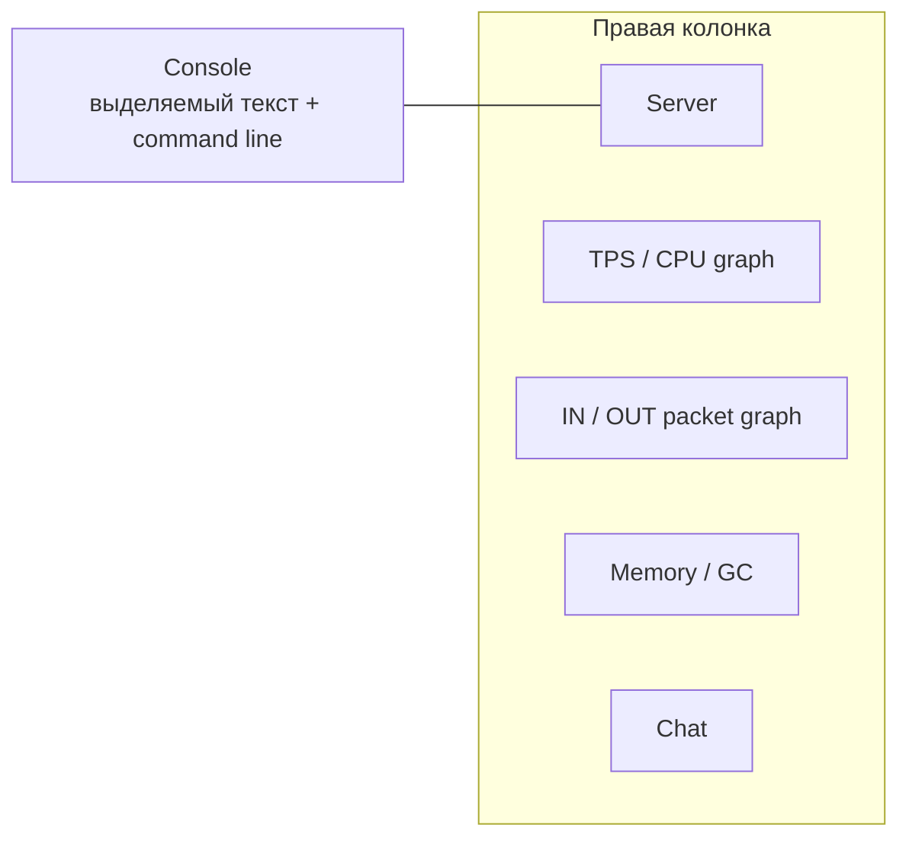

# Взаимодействие с TUI dashboard

[English](../en/tui-dashboard-interaction.md) · [Operations и TUI](operations-tui.md)

## Назначение

Built-in System Dashboard TerraRuntime использует interaction model, проверенную в Vega, но data/mutation boundaries остаются полностью runtime-owned.

## Layout



Console занимает левую часть. Справа вертикально расположены Server, TPS/CPU, Network, Memory/GC и Chat.

## Maximize и focus

Double-click по title плитки обрабатывается через title/border view, а не через content view. Выбранная плитка растягивается на весь dashboard workspace и скрывает остальные. Повторный double-click по title восстанавливает tiled layout.

Keyboard или mouse focus включает Accent scheme и добавляет к активному title префикс `▶`, поэтому focus остаётся заметным даже в terminal, который урезает настроенную палитру.

## Графики

TPS/CPU использует настоящий Terminal.Gui `GraphView` по модели dashboard Vega:

- history текущего TPS;
- history process CPU;
- reference line целевого TPS.

Network имеет отдельный `GraphView` с раздельными histories входящих и исходящих packet rate. Legend также показывает текущие `pkt/s` и throughput в `KiB/s`. Rate вычисляется по разнице subsystem-owned process-lifetime counters входящих/исходящих Terraria messages между двумя последовательными detached network snapshots. Интервал берётся из snapshot capture timestamps, поэтому график показывает traffic за фактический UI sampling interval, а не ошибочно делит lifetime totals на длину telemetry rolling window. При откате counters или некорректном/слишком длинном sampling interval локальный rate sample сбрасывается вместо искусственного spike.

Histories и предыдущий counter sample являются bounded presentation state самого UI. Они не становятся authoritative telemetry и не добавляют новые counters в packet hot paths.

## Строка команд Console

Внизу плитки Console находится постоянно видимая input line `>`. `Ctrl+P` переводит focus на неё. Текущие runtime-owned команды:

```text
help
save
interest on
interest off
system
players
npcs
projectiles
items
network
world
logs
```

`save` и `interest on|off` делегируются в существующий bounded operations ingress. Navigation commands только переключают текущий workspace screen. Неизвестный input показывается локально и никогда не трактуется как arbitrary runtime mutation.

## Выделение текста

Console, Server, Memory/GC и Chat используют read-only selectable text surfaces. Поддерживаются selection мышью/клавиатурой и `Ctrl+C`. Snapshot refresh не заменяет отображаемый текст при активном непустом selection, поэтому обычное обновление telemetry не уничтожает выделение в момент копирования.

Все встроенные Details screens (Players, NPCs, Projectiles, Items, Network, World и Logs) используют ту же read-only selectable проекцию. Существующий bounded `rows[]` render model остаётся внутренним форматом для formatting и smoke assertions, а оператору эти строки показывает один scrollable `TextView`. Automatic refresh сохраняет активное selection; явный переход на другой Details screen сначала сбрасывает selection предыдущего экрана и только потом показывает новые данные.

## Отзывчивость

Authoritative operations capture остаётся вне Terminal.Gui thread. UI читает последний atomically published cache snapshot, поэтому input processing, selection, menu navigation и interaction с окнами не ждут world/network snapshot acquisition.

Runtime snapshots имеют целевой период примерно

$$
T_{\mathrm{snapshot}}\approx500\,\mathrm{ms},
$$

а lightweight UI publication check выполняется примерно каждые

$$
T_{\mathrm{ui\ pump}}\approx25\,\mathrm{ms}.
$$

Эти периоды определяют свежесть данных, а не latency обработки keyboard/mouse input.
