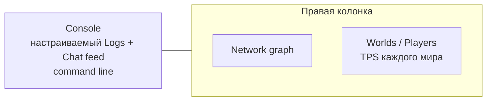

# Взаимодействие с TUI dashboard

[English](../en/tui-dashboard-interaction.md) · [Operations и TUI](operations-tui.md)

## Назначение

Встроенный System Dashboard TerraRuntime держит presentation state отдельно от authoritative runtime state. Действия UI отправляют typed operations; поток Terminal.Gui напрямую мир не мутирует.

## Layout



Console занимает примерно две трети workspace. Справа сверху остаётся компактный Network graph, а всё остальное место получает Worlds / Players. Старый общий TPS graph удалён намеренно: Level 1 runtimes имеют независимые authoritative game loops и, следовательно, независимый tick rate.

## TPS каждого мира и roster

Каждый live `WorldRuntime` публикует target TPS и observed TPS, рассчитанный по tick counter именно его game loop. Значение показывается прямо в строке мира:

```text
▼ Main   [primary]            TPS 60.0/60
  └─ #0 Alice
▼ arena  [sandbox · running]  TPS 119.8/120
  └─ #1 Bob
```

У sandbox, который ещё materialize/start, live game loop пока нет, поэтому выводится `TPS --`, а не метрика primary мира.

Roster переведён на `ListView`: focus/selection выделяет пункт целиком, а не текст внутри строки. Drag-and-drop игрока по-прежнему отправляет typed Level 1 move operation.

У actionable строк sandbox-world и player справа выводится явное действие `[X]`. Нажатие открывает confirmation dialog: для sandbox подтверждается `Destroy`, для player — `Kick`. Уничтожение primary мира намеренно не предлагается. `Kick` запрашивает закрытие process-owned connection через connection route/outbound queue; UI не удаляет строку самостоятельно и не мутирует player state напрямую.

Кнопка `+` сверху roster открывает окно создания sandbox. Форма напрямую отображает typed sandbox creation surface:

- имя sandbox;
- один dropdown isolation с вариантами `In-process sandbox isolation` и `Dedicated-process sandbox isolation`;
- generated world или существующий `.wld`;
- generator ID и numeric/random seed;
- размер primary или явные width/height;
- выпадающий список mode: Classic, Expert, Master и Journey;
- выпадающий список evil: Corruption и Crimson.

Форма строит тот же typed `SandboxCreateRequest`, который использует command handling, а не собирает строку команды и не парсит её повторно.

## Выбор мира в detail screens

В Players, NPCs, Projectiles, Items и World есть выпадающий список `World:`. Выбор привязан к стабильному `WorldRuntimeId`, а не к текущему session ID, поэтому regenerate/restart sandbox может сменить session и при этом не переключает оператора на другой логический мир.

Selector работает через process-owned detached inspection directory/cache. Terminal.Gui thread не хранит ссылки на `WorldRuntime` и не захватывает тяжёлое entity state напрямую. Snapshots игроков/NPC/projectiles/items обновляются только для выбранного мира и только после того, как соответствующий detail screen запросил эту категорию. У Network и Logs selector намеренно отсутствует: это process-scoped диагностика.

Entity telemetry для sandbox включается, когда включён terminal UI. Поэтому sandbox получает те же bounded NPC/projectile/item diagnostics, что и primary, но headless process не платит за ненужный diagnostic capture. Для primary экран World сохраняет расширенные startup/cache/persistence данные; для sandbox он показывает собственные lifecycle, source, persistence policy, TPS и entity counts.

## Maximize и focus

Double-click по title плитки растягивает её на весь dashboard workspace и скрывает остальные. Повторный double-click восстанавливает tiled layout. Keyboard/mouse focus включает Accent scheme и добавляет к активному title `▶`.

## Настраиваемый Console feed

Console остаётся одним bounded хронологическим потоком Logs + Chat. Два выпадающих списка наверху задают видимость structured logs, минимальный log level и видимость Chat. Старая строка runtime/tick status намеренно убрана: lifecycle и TPS теперь относятся к конкретному миру и показываются в per-world roster и world-scoped detail screens. Detached TUI cache заранее захватывает bounded Debug-level overview superset, поэтому смена фильтра не вызывает синхронное чтение runtime state из Terminal.Gui thread.

Те же настройки доступны через command line:

```text
feed
feed all
feed logs on|off
feed chat on|off
feed level debug|info|warn|error
```

## Network graph

Network использует Terminal.Gui `GraphView` с inbound/outbound packet-rate histories. Legend показывает packet rate и throughput в `KiB/s`. Rate считается по разнице process-lifetime message counters между detached snapshots. Некорректный interval или rollback counters сбрасывает локальный sample вместо искусственного spike.

## Строка команд Console

В Console находится постоянно видимый Accent input `>`. `Ctrl+P` переводит focus на него. Sandbox commands и действия UI в итоге используют один runtime-owned operation layer; неизвестный input показывается локально и не превращается в произвольную runtime mutation.

## Выделение текста

Console и Details screens остаются read-only selectable text surfaces для копирования диагностики. Worlds / Players намеренно отличается: это список пунктов, поэтому selection выделяет строку целиком и не создаёт text selection.

## Отзывчивость

Authoritative operations capture остаётся вне Terminal.Gui thread. UI читает последний atomically published cache snapshot, поэтому input, row selection, явные row actions и окно создания sandbox не ждут world/network/log snapshot acquisition. Detached snapshot worker планируется примерно каждые 100 мс, а lightweight UI publication/input pump работает примерно каждые 16 мс.
