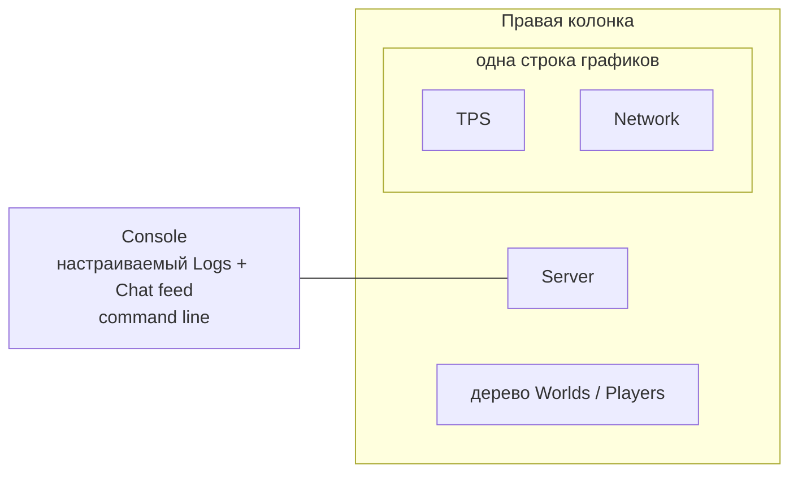

# Взаимодействие с TUI dashboard

[English](../en/tui-dashboard-interaction.md) · [Operations и TUI](operations-tui.md)

## Назначение

Built-in System Dashboard TerraRuntime использует interaction model, проверенную в Vega, но data/mutation boundaries остаются полностью runtime-owned.

## Layout



Console занимает левую часть. Справа остаётся компактный Server, TPS и Network находятся в одной строке, а всё оставшееся место получает дерево Worlds / Players. CPU и Memory/GC намеренно отсутствуют на обзорном dashboard: подробная системная диагностика остаётся в Details и не конкурирует с действительно операторскими данными.

## Maximize и focus

Double-click по title плитки обрабатывается через title/border view, а не через content view. Выбранная плитка растягивается на весь dashboard workspace и скрывает остальные. Повторный double-click по title восстанавливает tiled layout.

Keyboard или mouse focus включает Accent scheme и добавляет к активному title префикс `▶`, поэтому focus остаётся заметным даже в terminal, который урезает настроенную палитру.

## Настраиваемый Console feed

Console теперь является одним хронологическим bounded-потоком вместо отдельных Log и Chat окон. Три элемента управления наверху меняют только UI-проекцию:

- `Logs ON/OFF` включает или исключает structured runtime logs;
- `Chat ON/OFF` включает или исключает public chat;
- `Level DEBUG+/INFO+/WARN+/ERROR+` задаёт минимальный уровень structured logs. Chat от log threshold не зависит.

При включённых Logs и Chat записи объединяются по timestamp и отображаются одним потоком. UI хранит только последние 64 спроецированные записи. Это presentation state: authoritative recent-log и chat stores остаются отдельными bounded-буферами своих operations backends.

Detached TUI cache заранее захватывает bounded Debug-level overview superset, поэтому смена фильтра не вызывает синхронное чтение logging state из Terminal.Gui thread. Ручная прокрутка и активное выделение текста сохраняются во время refresh.

Те же настройки доступны из command line:

```text
feed
feed all
feed logs on|off
feed chat on|off
feed level debug|info|warn|error
```

## Графики

TPS использует Terminal.Gui `GraphView` с history текущего TPS и reference line целевого TPS. Network имеет отдельный `GraphView` с inbound/outbound packet-rate histories. Legend также показывает текущий packet rate и throughput в `KiB/s`.

Rate вычисляется по разнице subsystem-owned process-lifetime counters между последовательными detached network snapshots. Интервал берётся из snapshot capture timestamps. При откате counters или некорректном/слишком длинном sampling interval локальный rate sample сбрасывается вместо искусственного spike.

Histories и предыдущий counter sample являются bounded presentation state самого UI. Они не становятся authoritative telemetry и не добавляют counters в packet hot paths.

## Дерево Worlds / Players

Overview теперь резервирует большую нижнюю правую плитку под runtime roster. В текущем single-world runtime активный мир отображается как primary root, а игроки как дочерние строки:

```text
▼ Main  [primary]
  ├─ #0 Alice
  └─ #1 Bob
```

Такая форма специально совпадает с sandbox roadmap, где одновременно будут видны несколько live `WorldRuntime`, а игроков можно будет переносить между runtime sessions.

Реальный drag-and-drop transfer пока не объявляется реализованным. Authoritative multi-world registry и client-transfer ingress всё ещё относятся к S1/S2 sandbox. TUI обязан вызывать будущую bounded transfer operation и не имеет права напрямую менять ownership игрока/мира только потому, что оба объекта находятся в одном process.

## Строка команд Console

Внизу Console находится постоянно видимая Accent-рамка input `>`. `Ctrl+P` переводит focus на неё. Текущие runtime-owned команды:

```text
help
feed ...
save
interest on
interest off
system
players
npcs
projectiles
items
network
world
logs
```

`save` и `interest on|off` делегируются в существующий bounded operations ingress. Navigation commands только переключают текущий workspace screen. Неизвестный input показывается локально и никогда не трактуется как arbitrary runtime mutation.

## Выделение текста

Console, Server и Worlds / Players используют read-only selectable text surfaces. Поддерживаются selection мышью/клавиатурой и `Ctrl+C`. Snapshot refresh не заменяет отображаемый текст при активном непустом selection, поэтому обычное обновление telemetry не уничтожает выделение во время копирования.

Все встроенные Details screens (Players, NPCs, Projectiles, Items, Network, World и Logs) используют ту же read-only selectable проекцию. Bounded `rows[]` render model остаётся внутренним форматом для formatting и smoke assertions, а оператору строки показывает один scrollable `TextView`.

## Отзывчивость

Authoritative operations capture остаётся вне Terminal.Gui thread. UI читает последний atomically published cache snapshot, поэтому input processing, selection, menu navigation и interaction с окнами не ждут world/network/log snapshot acquisition.

Runtime snapshots имеют целевой период примерно

$$
T_{\mathrm{snapshot}}\approx500\,\mathrm{ms},
$$

а lightweight UI publication check выполняется примерно каждые

$$
T_{\mathrm{ui\ pump}}\approx25\,\mathrm{ms}.
$$

Эти периоды определяют свежесть данных, а не latency обработки keyboard/mouse input.
