# Встроенная vanilla-генерация мира

[English](../en/vanilla-world-generation.md) · [Генерация мира](world-generation.md) · [Roadmap](../roadmap/gameplay-worldgen-extensibility.md)

TerraRuntime публикует два runtime-owned генератора через обычный world-generation contract:

- `terraruntime:flat` остаётся небольшим детерминированным baseline для проверки контрактов и persistence;
- `terraruntime:vanilla` является clean-room генератором совместимости с TerrariaServer 1.4.5.8 и постепенно переводится на source-backed поведение по отдельным проходам.

Идентификатор генератора при миграции не меняется. Host выбирает `terraruntime:vanilla`, а точным составом проходов владеет runtime.

## Текущий pipeline обычного мира

Для канонических размеров Terraria (`4200x1200`, `6400x1800`, `8400x2400`) и обычного seed production-provider теперь владеет source-backed/source-shaped цепочкой от Reset до Slush. Текущий план содержит 40 записей, потому что после границы source-backed реализации временно остаются compatibility barriers.

```mermaid
flowchart LR
    Reset["Reset"] --> Terrain["Terrain"]
    Terrain --> Early["Dunes → caves → ice → grass → Jungle"]
    Early --> Mid["Mud Caves To Grass → Full Desert → micro-biomes"]
    Mid --> Resources["Dirt To Mud → Silt → Shinies → Webs"]
    Resources --> Deep["Underworld → Corruption/Crimson → Lakes → Slush"]
    Deep --> Ocean["compatibility ocean residual"]
    Ocean --> Compat["оставшийся cave/dungeon/secret compatibility frontier"]
    Compat --> Metadata["Metadata + fresh .wld v326"]
```

Второй source-backed блок содержит 14 проходов в закреплённом порядке регистрации TerrariaServer 1.4.5.8:

`Mud Caves To Grass`, `Full Desert`, `Mushroom Patches`, `Marble`, `Granite`, `Floating Islands`, `Dirt To Mud`, `Silt`, `Shinies`, `Webs`, `Underworld`, `Corruption`, `Lakes`, `Slush`.

Все 14 используют `WorldGenerationRngMode.VanillaSharedRng`; один и тот же экземпляр `VanillaUnifiedRandom1458` последовательно продвигается по source-backed цепочке. Поэтому перестановка этих проходов или отдельный reseed является ошибкой совместимости, а не безобидной деталью реализации.

## Переход владения

### Генерация руд

`Shinies` теперь владеет размещением pre-hardmode ores для обычных canonical worlds. Проход использует варианты руд, выбранные Reset bootstrap (`CopperOre`, `IronOre`, `SilverOre`, `GoldOre`), source-shaped плотности по глубинным диапазонам, а также Demonite/Crimtane. Старый aggregate-узел `terraria:1.4.5.8/Ores` временно остаётся в dependency graph как no-op barrier, чтобы не переписывать преждевременно зависимости более поздних compatibility-проходов.

### Биомы

Старый aggregate `Biomes` больше не владеет внутренней частью мира после нового блока. Он отфильтрован до временного ocean-edge residual по Reset-derived границам левого и правого пляжа. Записи во внутренние биомы и Underworld отбрасываются, поэтому compatibility-код не может снова закрасить source-backed Jungle, Desert, evil biome и Underworld.

### Прямые записи candidate world

Крупные generation passes работают напрямую с неопубликованным contiguous `WorldTileStore` через внутренний generation workspace. Это не создаёт искусственный backlog dirty sections и не заставляет миллионы раз копировать tile через общий интерфейс, пока candidate ещё никем не наблюдается.

## Что генерирует новый блок

Новый сегмент содержит детерминированные source-shaped реализации: распространение jungle grass по mud caves, full desert shell с underground chambers, mushroom patches, marble/granite micro-biomes, floating islands и sky lakes, глубокое преобразование dirt→mud в jungle, silt, выбранные Reset pre-hardmode ores, cave webs, ash/lava/hellstone Underworld, Corruption или Crimson с преобразованием поверхности и chasms, underground lakes и slush в snow region.

Даже когда отдельный алгоритм ещё не является method-for-method parity-портом, сохраняются официальный pass boundary и владение shared RNG. Это существенно лучше, чем прятать несколько независимых приближений внутри одного `Biomes`, потому что следующий source probe сможет заменить конкретный pass без изменения публичного generator contract.

## Reset и Terrain

`terraria:1.4.5.8/Reset` владеет pre-Terrain RNG/bootstrap state обычного мира: beach bounds, dungeon side/location, jungle и snow origins, pre-hardmode ore variants, tree/cave/background styles и другими начальными значениями. `Terrain` использует это состояние и публикует world-surface/rock-layer metadata. Более поздние source-backed passes читают эти значения, а не строят независимые приблизительные копии.

## Special и secret seeds

`VanillaWorldSeedResolver1458` распознаёт special-world семейства Terraria 1.4.5.8 и сохранённые secret-seed phrases. Source-backed путь Reset/Terrain/early/mid пока включается только для ordinary seed profile. Special/secret worlds и synthetic noncanonical dimensions намеренно остаются на compatibility-плане, пока соответствующие ветви не перенесены по source. Подменять их ordinary-world RNG-последовательностью нельзя.

## Проверка

`terraria-vanilla-generated-world-acceptance.yml` является production gate этого направления. Он собирает TerraRuntime, запускает focused world-generation contracts, создаёт настоящий canonical small world через `terraruntime:vanilla`, валидирует `.wld` загрузчиком TerraRuntime, затем запускает закреплённый официальный TerrariaServer 1.4.5.8 с этим миром и требует открытия server listener.

Отдельный acceptance для `terraruntime:flat` остаётся без изменений.

## Граница parity

`terraruntime:vanilla` пока не является reference-world или byte-identical клоном генерации Terraria. Текущая source-backed граница заканчивается на `Slush`.

Внутри нового блока ещё отличаются точные внутренности Underground Desert, структуры floating islands, Underworld houses, точная топология Corruption/Crimson orb/heart/altar и точное потребление RNG внутри нескольких source-shaped алгоритмов. После `Slush` ещё предстоит перенос dungeon, поздних cave/ocean passes, structures, liquids, chests, vegetation, decoration, cleanup и special-seed branches по закреплённому каталогу из 109 проходов Terraria 1.4.5.8.

Следующая естественная граница миграции начинается с dungeon-era сегмента после `Slush`, а не с дальнейшего раздувания compatibility aggregates.
