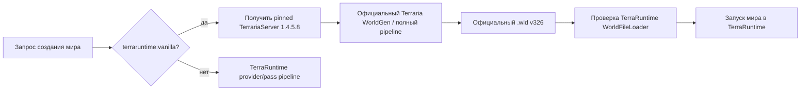

# Встроенная vanilla-генерация мира

[English](../en/vanilla-world-generation.md) · [Генерация мира](world-generation.md) · [Roadmap](../roadmap/gameplay-worldgen-extensibility.md)

`terraruntime:vanilla` теперь означает **настоящую генерацию мира Terraria 1.4.5.8** на пользовательском startup-интерфейсе. При создании vanilla-мира больше не используется предварительный семипроходный compatibility generator TerraRuntime.

## Модель выполнения

Для `terraruntime:vanilla` TerraRuntime запускает официальный dedicated-server пакет Terraria 1.4.5.8 и позволяет самой Terraria выполнить полный world-generation pipeline. Полученный `.wld` не принимается только потому, что файл появился: TerraRuntime сначала полностью загружает и валидирует мир, включая header, tiles, chests, signs, NPC persistence, tile entities, pressure plates, town rooms, bestiary, creative powers и footer.

Это принципиально отличается от ситуации, когда небольшой compatibility generator называется vanilla. Clean-room pass implementation остаётся полезной заготовкой для разработки, но больше не является пользовательским backend создания vanilla-мира.

## Закреплённый официальный backend

При первом exact-vanilla создании TerraRuntime ищет TerrariaServer 1.4.5.8 в таком порядке:

1. `TERRARUNTIME_TERRARIA_SERVER_1458`, если оператор явно указал executable;
2. runtime cache `data/official-terraria/1.4.5.8/server`;
3. иначе официальный dedicated-server архив скачивается с `terraria.org`, распаковывается в этот cache, а находящийся внутри `TerrariaServer.exe` проверяется по закреплённому SHA-256 перед использованием.

На Windows x64 используется `TerrariaServer.exe`, на Linux x64 — `TerrariaServer.bin.x86_64` из того же проверенного пакета. TerraRuntime не встраивает и не распространяет TerrariaServer внутри собственных бинарников.

## Размер мира, режим, evil и seed

Exact vanilla поддерживает только три штатных размера Terraria:

- Small: `4200x1200`;
- Medium: `6400x1800`;
- Large: `8400x2400`.

Для обычного seed text TerraRuntime добавляет выбранные размер, difficulty и evil в собственном формате seed Terraria и передаёт результат официальному генератору. Если пользователь уже передал полный prefixed Terraria seed, он сохраняется без изменений.

Для `terraruntime:vanilla` seed является текстовым, поэтому числовые seeds, special seeds и secret-seed text передаются самой Terraria, а не имитируются кодом TerraRuntime. Custom providers сохраняют прежний контракт unsigned 64-bit seed.

## Поведение при ошибках

Exact vanilla работает fail-closed. TerraRuntime не перезаписывает существующий `.wld`, отклоняет нестандартный размер, завершает создание ошибкой, если pinned official backend недоступен, и не запускает мир, пока полный файл не будет принят `WorldFileLoader`.

Процесс official dedicated server используется только на время генерации. После полной записи и успешной валидации мира официальный процесс завершается, а полученный мир запускается обычным TerraRuntime host.

## Граница clean-room parity

В репозитории остаются source-pinned pass catalog, vanilla RNG semantics и clean-room работа над собственной генерацией. Долгосрочная цель не меняется: полностью source-exact реализация pipeline Terraria 1.4.5.8 внутри TerraRuntime.

Пока 109-pass/reference-world parity реально не закончена, имя `terraruntime:vanilla` зарезервировано за точным official backend. Частично совместимый генератор больше не выдаётся оператору за ванильный мир.
