# Встроенная vanilla-генерация мира

[English](../en/vanilla-world-generation.md) · [Генерация мира](world-generation.md) · [Roadmap](../roadmap/gameplay-worldgen-extensibility.md)

TerraRuntime публикует два runtime-owned генератора мира через обычный контракт world-generation provider:

- `terraruntime:flat` остаётся минимальным deterministic baseline для проверки контрактов и persistence;
- `terraruntime:vanilla` является встроенным compatibility generator Terraria 1.4.5.8, который постепенно переводится на source-backed реализацию.

Vanilla generator реализован clean-room кодом TerraRuntime и не встраивает implementation source TerrariaServer. Compatibility-проходы заменяются постепенно под тем же идентификатором генератора.

## Модель выполнения

```mermaid
flowchart LR
    Request["WorldGenerationRequest"] --> Resolve["Resolve seed profile"]
    Resolve --> Reset["Reset bootstrap"]
    Reset --> Terrain["Terrain"]
    Terrain --> Biomes["Biomes + oceans"]
    Biomes --> Caves["Caves"]
    Caves --> Ores["Ore tiers"]
    Ores --> Dungeon["Dungeon anchors"]
    Dungeon --> Secrets["Special / secret seed modifiers"]
    Secrets --> Metadata["Spawn + dungeon + layers"]
    Metadata --> Finalize["Candidate finalization"]
    Finalize --> Wld["Fresh .wld v326 persistence"]
```

Каждый встроенный vanilla pass использует `WorldGenerationRngMode.VanillaSharedRng`. TerraRuntime получает Terraria world seed из `SeedText` по закреплённым правилам 1.4.5.8: корректный `Int32` используется напрямую, иначе вычисляется CRC32 от UTF-8 seed text. Затем один `VanillaUnifiedRandom1458(worldSeed)` используется всем vanilla-планом, поэтому состояние RNG последовательно переходит из bootstrap в следующие проходы.

Для обычных миров канонического размера `terraria:1.4.5.8/Reset` теперь расходует source-backed последовательность RNG до Terrain и сохраняет границы пляжей, dungeon/jungle/snow origins, ore tiers, tree/cave/background styles и другое начальное состояние. `Terrain` использует эти значения напрямую. Special seeds и нестандартные размеры остаются на compatibility-ветвях, пока их Reset-семантика не перенесена по source.

Обычный isolated deterministic RNG остаётся доступен custom runtime passes. `CustomProviderRng` продолжает работать fail-closed до появления явного provider-owned RNG contract.

## Special и secret seeds

`VanillaWorldSeedResolver1458` преобразует seed text в один immutable `VanillaWorldSeedProfile1458`. Один и тот же профиль используется generation и persistence, поэтому поведение seed не может незаметно исчезнуть между генерацией candidate и первым restart.

Resolver распознаёт все девять special-world семейств Terraria 1.4.5.8: Drunk World, For the Worthy, Celebration Mk10, The Constant, Not the Bees, Don't Dig Up / Remix, No Traps, Get Fixed Boi / Zenith и Skyblock. Zenith разворачивается в комбинированный special-seed profile. Matching не зависит от регистра и игнорирует неалфавитно-цифровые символы.

Также распознаются 37 secret-seed фраз Terraria 1.4.5 как независимые flags. Несколько secret-фраз можно объединять через `|`, включая Terraria-style prefixed input вроде `1.1.1.0.planetoids|bring a towel`.

Generation пока применяет runtime-owned compatibility behavior для terrain-affecting профилей вроде Planetoids, Beam Me Up, Waterpark, Not the Bees, Toadstool, Mole People, Such Great Heights, Winter Is Coming, Sandy Britches и Save the Rainforest. Runtime-state secret flags сохраняются через fresh `.wld` v326 metadata writer.

## Publication и persistence

Generation выполняется внутри `RuntimeWorldGenerationWorkspace`, который ещё не опубликован и использует initial-population tile-write path. Сгенерированные tiles не создают искусственные network/persistence dirty queues до того, как мир станет authoritative.

Финальный metadata snapshot содержит spawn, dungeon, world layers и resolved vanilla seed profile. `WorldFileFreshRuntimeMetadata326Encoder` переносит поддерживаемое special/secret state в canonical metadata-поля Terraria 1.4.5.8 `.wld` v326 при сохранении нового мира.

## Проверка

Source-backed worldgen проверяется двумя независимыми слоями:

- source-contract workflows декомпилируют закреплённый TerrariaServer 1.4.5.8 и сверяют предположения Reset/Terrain с официальным бинарём;
- `terraria-vanilla-generated-world-acceptance.yml` создаёт настоящий малый canonical `.wld`, проверяет его TerraRuntime verifier и затем запускает с этим файлом официальный TerrariaServer 1.4.5.8.

Отдельный acceptance для `terraruntime:flat` остаётся без изменений.

## Граница parity

`terraruntime:vanilla` уже пригоден к использованию и детерминирован, а для обычных canonical worlds Reset и Terrain имеют source-backed slices. Но это **ещё не reference-world и не byte-identical parity** с Terraria.

Точный паритет полного source-pinned каталога из 109 passes Terraria 1.4.5.8 остаётся задачей roadmap. Biomes, caves, ores, structures, decoration, special-seed Reset branches и другие стадии всё ещё содержат compatibility implementations, которые нужно последовательно заменять.
