# Встроенная vanilla-генерация мира

[English](../en/vanilla-world-generation.md) · [Генерация мира](world-generation.md) · [Roadmap](../roadmap/gameplay-worldgen-extensibility.md)

TerraRuntime публикует два runtime-owned генератора мира через обычный контракт world-generation provider:

- `terraruntime:flat` остаётся минимальным deterministic baseline для проверки контрактов и persistence;
- `terraruntime:vanilla` является встроенным compatibility generator для Terraria 1.4.5.8.

Vanilla generator реализован clean-room кодом TerraRuntime. Он не встраивает и не копирует implementation source TerrariaServer. Реализация намеренно разделена на заменяемые generation passes, чтобы compatibility-реализации можно было постепенно заменять source-verified поведением по мере продвижения parity.

## Модель выполнения

```mermaid
flowchart LR
    Request["WorldGenerationRequest"] --> Resolve["Resolve seed profile"]
    Resolve --> Terrain["Terrain"]
    Terrain --> Biomes["Biomes + oceans"]
    Biomes --> Caves["Caves"]
    Caves --> Ores["Ore tiers"]
    Ores --> Dungeon["Dungeon anchors"]
    Dungeon --> Secrets["Special / secret seed modifiers"]
    Secrets --> Metadata["Spawn + dungeon + layers"]
    Metadata --> Finalize["Candidate finalization"]
    Finalize --> Wld["Fresh .wld v326 persistence"]
```

Каждый встроенный vanilla pass использует `WorldGenerationRngMode.VanillaSharedRng`. TerraRuntime получает Terraria world seed из `SeedText` по закреплённым правилам 1.4.5.8: корректный `Int32` используется напрямую, иначе вычисляется CRC32 от UTF-8 seed text. Перед каждым включённым vanilla pass создаётся новый `VanillaUnifiedRandom1458(worldSeed)`, что соответствует проверенному pass-level RNG lifecycle Terraria 1.4.5.8.

Обычный isolated deterministic RNG остаётся доступен custom runtime passes. `CustomProviderRng` продолжает работать fail-closed, пока не будет явно определён provider-owned RNG contract.

## Special и secret seeds

`VanillaWorldSeedResolver1458` преобразует seed text в один immutable `VanillaWorldSeedProfile1458`. Один и тот же профиль используется generation и persistence, поэтому поведение seed не может незаметно исчезнуть между генерацией candidate и первым restart.

Resolver распознаёт все девять special-world семейств Terraria 1.4.5.8:

- Drunk World;
- For the Worthy;
- Celebration Mk10;
- The Constant;
- Not the Bees;
- Don't Dig Up / Remix;
- No Traps;
- Get Fixed Boi / Zenith;
- Skyblock.

Special seed matching не зависит от регистра и игнорирует неалфавитно-цифровые символы. Zenith разворачивается в классический комбинированный special-seed profile. Resolver также понимает prefixed и pipe-combined input.

Также распознаются 37 secret-seed фраз Terraria 1.4.5 как независимые flags. Несколько secret-фраз можно объединять через `|`, в том числе в Terraria-style prefixed input вроде `1.1.1.0.planetoids|bring a towel`.

Generation уже применяет runtime-owned compatibility behavior для terrain-affecting профилей, включая Planetoids, Beam Me Up, Waterpark, Not the Bees, Toadstool, Mole People, Such Great Heights, Winter Is Coming, Sandy Britches и Save the Rainforest. Runtime-state secret flags сохраняются через fresh `.wld` v326 metadata writer, включая постоянные seasonal modes, vampire/infected modes, team-based spawns, dual dungeons и lightning variants.

## Publication и persistence

Generation выполняется внутри `RuntimeWorldGenerationWorkspace`, который ещё не опубликован и поэтому использует initial-population tile-write path. Сгенерированные tiles не создают искусственные network/persistence dirty queues до того, как мир станет authoritative.

Финальный metadata snapshot содержит spawn, dungeon, world layers и resolved vanilla seed profile. `WorldFileFreshRuntimeMetadata326Encoder` переносит поддерживаемое special/secret state в canonical metadata-поля Terraria 1.4.5.8 `.wld` v326 при сохранении нового мира.

## Граница parity

`terraruntime:vanilla` теперь является пригодным к использованию, не-flat, deterministic runtime-owned vanilla-style generator с проверенной seed/RNG семантикой и сохраняемым special/secret seed state. Он **пока не является byte-identical реализацией** вывода TerrariaServer `WorldGen.AddPasses()`.

Точная реализация и reference-world parity полного source-pinned каталога из 109 passes Terraria 1.4.5.8 остаются задачами roadmap. Pass-oriented архитектура специально оставляет возможность постепенно заменять compatibility implementations без изменения host/provider contract и world publication pipeline.
