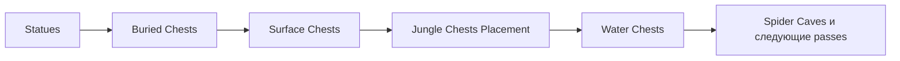

# Vanilla world generation: persistent chest placement

[English](../en/vanilla-worldgen-chest-placement.md) · [Post-settle stage](vanilla-worldgen-post-settle.md)

`terraruntime:vanilla` продолжает перенос ordinary Terraria 1.4.5.8 через четыре chest placement pass-а сразу после `Statues`.

## Chest metadata является частью generation

Раньше fresh world generation безусловно записывал пустую chest section. Это было безопасно только пока генераторы вообще не создавали chest tiles. Теперь generation workspace владеет dense registry `WorldChest` рядом со своим unpublished `WorldTileStore`.

Chest регистрируется только после того, как его top-left tile стал валидным chest anchor. Slot ids назначаются плотно в порядке generation, потому что Terraria не сохраняет отдельный chest slot id: порядок records в `.wld` после load становится runtime/network slot identity. Duplicate coordinates, invalid item states и слишком большие item arrays отклоняются.

`RuntimeWorldCreationPersistencePipeline` получает detached chest snapshot и передаёт его в `WorldFileFreshComposer326`. Composer использует обычный `WorldFileChestEncoder`, после чего проверяет весь image повторной загрузкой через `WorldFileLoader`. Tile frames и chest side table поэтому проходят persistence одной candidate transaction.

## Реализованные passes

- `Buried Chests` размещает Gold Chest style `1` в underground/cavern openings.
- `Surface Chests` размещает Wooden Chest style `0` на подходящем surface floor вне тесных spawn/dungeon exclusion zones.
- `Jungle Chests Placement` размещает Ivy Chest style `10` в underground jungle material.
- `Water Chests` размещает Water Chest style `17` в submerged chambers с solid floor.

Все четыре используют `Containers` tile `21`, существующую source-backed геометрию chest object 2 × 2, полные frame coordinates, расстояние от других frame-important objects и соответствующие records `WorldChest`.

Style identities Ivy Chest и Water Chest дополнительно сверены с официальной Terraria Wiki: style `10` у `Containers` соответствует Ivy Chest, style `17` соответствует Water Chest.

## Владение loot

Обычные generated chests теперь получают source-backed loot default-world непосредственно в момент placement, пока pass ещё точно знает семейство сундука и depth branch. Это важно, потому что `WorldGen.AddBuriedChest` расходует общий `genRand` во время размещения и заполнения контейнера; поздний cleanup-pass уже не может восстановить этот порядок, не сдвинув RNG последующих стадий worldgen.

Текущий clean-room порт покрывает используемые этими четырьмя pass-ами default-world ветви surface, underground, cavern, Underworld/Shadow, jungle и water, включая primary families, stack ranges и stateful циклы hell/jungle/water. Прежний поздний filler сундуков из `FinalCleanup` удалён полностью и не оставлен fallback-ом. Prefix generation пока находится вне этого slice, потому что Terraria проводит `Prefix(-1)` через item-prefix RNG, а не через world-generation `genRand`.

## Acceptance

Production acceptance по-прежнему требует:

1. exact source-order graph contract;
2. invariants generated chest registry;
3. полный `.wld` encode/decode через `TerraRuntime.WorldVerify`;
4. успешный boot pinned official TerrariaServer 1.4.5.8.

Acceptance дополнительно проверяет, что canonical Small мир содержит непустой loot во всех generated chests, валидные vanilla item ids, ожидаемые primary families для styles Wooden/Gold/Shadow/Ivy/Water и нетривиальный объём secondary loot. Это всё ещё не означает bit-identical chest coordinates или полный parity для семейств сундуков, которыми владеют другие worldgen passes вне этого четырёхпроходного slice.
