# Vanilla worldgen 1.4.5.8: dungeon-stage

`terraruntime:vanilla` теперь продвинут по source-backed ordinary-world pipeline до закреплённого прохода TerrariaServer 1.4.5.8 `Pyramids`. Плоский генератор по-прежнему существует отдельно как `terraruntime:flat`.

## Покрытый участок source order

Для канонических размеров Terraria $4200 \times 1200$, $6400 \times 1800$ и $8400 \times 2400$ обычные сиды теперь регистрируют следующие десять проходов после `Slush`:

1. `Dual Dungeons Dither Snake`
2. `Dungeon`
3. `Mountain Caves`
4. `Beaches`
5. `Gems`
6. `Gravitating Sand`
7. `Create Ocean Caves`
8. `Shimmer`
9. `Clean Up Dirt`
10. `Pyramids`

Production-план теперь содержит 49 runtime entries. В это число входят миграционные runtime-идентичности вроде `Reset`, `TerrainLayers` и compatibility barriers. Это не утверждение, что сама Terraria имеет 49 проходов.

```mermaid
graph LR
    S[Slush] --> B[compat Biomes barrier]
    B --> C[compat Caves barrier]
    C --> O[Shinies-owned Ores barrier]
    O --> D0[Dual Dungeons Dither Snake]
    D0 --> D1[Dungeon]
    D1 --> MC[Mountain Caves]
    MC --> BE[Beaches]
    BE --> G[Gems]
    G --> GS[Gravitating Sand]
    GS --> OC[Create Ocean Caves]
    OC --> SH[Shimmer]
    SH --> CD[Clean Up Dirt]
    CD --> P[Pyramids]
    P --> SS[ordinary SecretSeeds barrier]
    SS --> M[compat Metadata]
```

Compatibility residual/barrier entries не потребляют общий Terraria `UnifiedRandom`. Десять новых source-order проходов используют `VanillaSharedRng`, кроме операций, которые детерминированы и поэтому не должны вытягивать случайные значения.

## Граф Dungeon и владение RNG

На канонических ordinary worlds source-backed dungeon stage больше не вызывает старый aggregate compatibility dungeon generator. Размещение подземелья начинается с уже сохранённого состояния `WorldGen.Reset` в `VanillaWorldGenerationBootstrapState1458`:

- `DungeonSide` задаёт сторону, выбранную Reset;
- `DungeonLocation` задаёт горизонтальный anchor;
- созданное подземелье публикует anchor в world metadata;
- палитры dungeon brick/wall/cracked brick выбираются в `Dunes`, где Terraria инициализирует dungeon generation;
- проход `Dungeon` расходует закреплённые выборы уникальных shelf/lantern styles, режим entrance halls,
  корректировку стартовой глубины, размеры входа и масштабированное по ширине число layout steps;
- topology `LegacyDungeonLayoutProvider` представлена типизированными компонентами starting room, room, hall,
  entrance hall и entrance вместо coordinate-driven вертикальной шахты;
- общий `UnifiedRandom` владеет решениями графа и seeds компонентов, включая безусловный source-roll `Next(3)` из-за
  побитового `&`; каждая room и hall строит геометрию из изолированного `UnifiedRandom(RandomSeed)`;
- варианты dungeon bricks используют проверенные vanilla tile IDs 41, 43 и 44 и соответствующие unsafe walls.

Этим удалена прежняя аппроксимация shaft + periodic rooms. Реализация остаётся clean-room структурным портом графа,
а не claim byte-for-byte equality dungeon. Точные collision/protection interactions перекрывающихся rooms,
распределение cracked bricks, doors/platforms, furniture, locked и biome chests, traps, paintings, banners и все global
dungeon features остаются дальнейшей parity-работой.

## Mountain Caves и существующие объекты мира

Для обычных seed `MountainCaves` теперь следует поведению закреплённого `WorldGen.Mountinater`: насыпает земляные холмы в неактивных клетках, сохраняя все существующие активные тайлы. Прежняя аппроксимация нисходящим туннелем могла стирать сундуки данжа и приводила к отказу финализации Small с seed `42`. Кандидаты выбираются в центральной половине мира с исходными ограничениями расстояния до спавна и других холмов, а также исключением песчаных тайлов. Сила кисти, число шагов и движение потребляют общий RNG в исходном порядке.

Размещение твёрдого блока сразу очищает вытесненную жидкость через существующий помощник размещения тайлов: runtime-компактор не обрабатывает жидкость внутри твёрдых клеток. Это нормализация представления, а не утверждение об идентичности промежуточных состояний жидкости. Регрессионный тест проверяет опорные тайлы зарегистрированных сундуков после каждого прохода генерации и падает на старом алгоритме туннелей. Точное равенство рельефа и варианты холмов для секретных seed остаются за пределами подтверждённого объёма.

Локальная проверка Windows NativeAOT охватывает генерацию и повторную загрузку Small, Medium и Large с seed `1`, `42` и `8675309`. Закреплённый официальный сервер также загружает все три размера с `8675309`. Small проходит существующие структурные пороги сравнения с эталонным миром, но содержит `104` сундука против `178` в эталоне; эти результаты не подтверждают полный ванильный паритет. Выполнение Linux NativeAOT остаётся проверкой CI и в этом Windows-окружении не проводилось.

## Beaches и ocean caves

`Beaches` использует принадлежащие Reset границы `LeftBeachEnd` и `RightBeachStart`, а не придумывает новые размеры краёв мира. Проход формирует песок и waterline на обеих сторонах. После этого `Create Ocean Caves` режет входы в пещеры из тех же beach regions.

Старый aggregate `Biomes` остаётся только как ничего не записывающий compatibility barrier. Океанским телом на закреплённой позиции прохода владеет `Beaches`; barrier не может продвигать общий vanilla RNG или повторно закрашивать биомы.

## Gems, gravity, Shimmer и pyramids

`Gems` размещает vanilla gem tile family 63–68 в глубоких естественных каменных областях. `Gravitating Sand` осаждает sand, evil sand, silt и slush без потребления случайных значений.

`Shimmer` создаёт Aether-подобную подземную полость на той же стороне мира, что и выбранный Reset Jungle, и заполняет бассейн runtime-liquid типом `Shimmer`. Сейчас это source-shaped placement. Точная геометрия Aether и декоративные блоки ещё не заявляются как паритетные.

`Pyramids` сначала ищет реально сформированную desert band по состоянию тайлов. После этого проход может создать ноль, одну или две структуры из sandstone brick в зависимости от ширины мира и общего RNG stream. Мебель и loot пирамид намеренно не выдумываются до переноса соответствующих world-object/chest passes.

## Compatibility barriers

Два старых aggregate-прохода теперь явно лишены возможности ломать parity:

- `Caves` становится no-op `IsolatedDeterministic` barrier, потому что ранний source-backed pipeline уже владеет семействами cave passes до второго Jungle;
- ordinary `SecretSeeds` становится изолированным no-op barrier и привязывается после `Pyramids`.

`Ores` уже ранее стал no-op barrier после того, как `Shinies` получил владение pre-hardmode ore generation.

## Acceptance

Vanilla acceptance workflow собирает TerraRuntime, запускает только focused world-generation contract classes, генерирует канонический small world через `terraruntime:vanilla`, проверяет его `TerraRuntime.WorldVerify`, а затем запускает закреплённый TerrariaServer 1.4.5.8 с полученным `.wld`.

Зелёный official-server acceptance доказывает, что созданный файл мира структурно принимается закреплённым сервером. Это не заявление о reference-seed identity или полной готовности vanilla worldgen.

Canonical generated-world contract дополнительно требует минимум три rooms, масштабируемое по ширине число halls,
горизонтальные и вертикальные halls, не-шахтный span графа и связанный surface entrance. Fail-closed finalizer повторяет
эти проверки перед acceptance candidate. `tools/ci/probe_worldgen_dungeon_graph.py` независимо сверяет layout decisions,
передачу component seeds, диапазоны strength/steps rooms и halls и создание изолированного RNG с закреплённым decompile
1.4.5.8.

## Следующая source boundary

Следующий закреплённый участок начинается после `Pyramids` с `Dirt Rock Wall Runner`, затем идут `Living Trees`, `Wood Tree Walls`, `Altars`, `Wet Jungle`, `Jungle Temple`, `Hives`, `Jungle Chests` и первая стадия liquid settling.
