# Vanilla worldgen 1.4.5.8: dungeon-stage

Проверка полного данжа (2026-09-09): все24 сравнения обычного Dungeon-прохода с неизменённым executable TerrariaServer1.4.5.8 совпали по каждой нормализованной клетке, упорядоченному содержимому/префиксам сундуков, точке старика и следующему значению общего RNG. Покрыты Legacy, Dome и Tower, обе стороны и три seed генерации на независимо заданном плоском входе Small. Также совпали16 сохранённых случаев на одинаковом реальном префиксе для всех канонических размеров, видов входа и обеих разновидностей зла; прошли ещё14 Small seed. Независимо проверен Dungeon-проход на этих входах, не генерация предшествующего префикса и не каждое сохраняемое глобальное поле.

Существующий pipeline теперь включает мебель, обычные ранние ямы, дротиковые ловушки, картины, знамёна и поздние готические двери. Сравнения с оригиналом также охватывают 504 взаимодействия защиты ям, 108 сценариев дротиковых ловушек (включая треснувшие опоры), 72 прохода поздних дверей и 144 случая framing/разрушения люстр. Обычные входные лестницы включены во всех трёх зданиях. Исправленная подготовка официальных сценариев сохраняет настоящие границы crawler и несолидность треснувшего кирпича при генерации; 540 эталонов зданий/платформ повторно сняты с оригинального executable.

Полный проход выявил пропущенный RNG настроек входа, отсутствующие лестницы, правила треснувшего кирпича при заполнении стен/LOS/опоре сундуков, framing соседей после установки ловушки и изменяемые границы поздних дверей. Разрушение люстры при последующем framing знамён тоже должно расходовать RNG пыли из оригинала, хотя её отображение подавлено при генерации. Это изменения изолированного кандидата, не альтернативные live-authorities. `VanillaWorldCanHit.HasLineOfSight` теперь принимает `crackedBricksSolid` (по умолчанию `true`); освещение Dungeon явно передаёт `false`, не меняя обычные live-запросы. Разрушение стула жидкостью при загрузке проверяет исходный атлас с шагом 40 пикселей и отвергает нецелостный объект до изменений.

Локальная приёмка: Release8048/8048, сборка без предупреждений/ошибок, WindowsNativeAOT и все шесть smoke-тестов пройдены. Свежий Small/Classic/Corruption1458 загрузился в обоих серверах, после чего они остановлены. Неизменённые пороги сравнения с тем же оригиналом пройдены: tile L1 `0.125242`, wall L1 `0.388221`, смещение данжа `(0,0)`; ненулевые различия мира остаются. Неизвестные основные стены отвергаются до RNG/изменений; все3 регрессии падают на старом пути, восстановленные27 тестов полного прохода/допуска проходят. Итоговый полный набор занял $197.974\,\mathrm{s}$; подробности в agent-memory. Стадия36 — ограниченный `R16`: **40P + 32C = 72 незавершённые стадии**, а **31 E9 / 279 независимых многостадийных проверок** не меняются. LinuxNativeAOT, прохождение реальным клиентом, специальные seed и равенство полного мира не подтверждены. Приёмка ниже относится к прежним этапам.

Итоговые проверки начала layout: **Release 5586/5586**, ноль предупреждений/ошибок, Windows NativeAOT и шесть smoke-тестов, загрузка свежей карты обоими серверами и проверки документации/исходников пройдены. Равенство полного мира остаётся открытым; доказательства ниже относятся только к указанным границам.

Приёмка свежей карты после исправления начала layout: Windows NativeAOT и все шесть smoke-тестов пройдены. Новый Small/Classic/Corruption `1458` загружается TerraRuntime и официальным сервером. Смещение входа в данж теперь `(0,0)` вместо `(-3,-3)`; прежние пороги сравнения пройдены, но tile L1 `0.134359` / wall L1 `0.433354` подтверждают, что мир ещё не равен оригиналу. Этот seed проверяет обычный Legacy, не полную интеграцию Dome/Tower. CI-контракт исходников теперь проверяет реальные владельцы графа, комнаты и коридора; потеря передачи RNG проваливает его regression-тест. Linux NativeAOT и прохождение реальным клиентом не подтверждены.

Начальная планировка (2026-09-09): существующий граф выполняет свой цикл через `GenerateLayout`. Для заранее рассчитанного входа начало равно `(entranceX - 10 + Next(20), entranceY + 30)`: после выборок размеров/числа шагов crawler и до seeds настроек компонентов. Обычная планировка не получает лишней выборки. Комнаты сохраняют исходные `InnerBounds` с ограничением метаданных десятью клетками от края; границы рисования остаются отдельными. Соединение начинается в центре верхней внутренней границы самой высокой комнаты; при равенстве выбирается первая. Отсутствие метаданных комнаты — нарушение инварианта, не повод использовать внешний контур.

Восемнадцать независимых вызовов официального `LegacyDungeonLayoutProvider.LegacyDungeonLayout` совпали по всем нормализованным клеткам, следующему общему RNG, конечным координатам/направлению и упорядоченной геометрии комнат. Проверены обычное и предварительно рассчитанное начало, три палитры/seed и ноль/20/35 шагов. У 63 прежних официальных fixtures комнат также совпали внутренние границы; сохранены девять эталонов внутренних/краевых случаев. Все 574 проверки Dungeon прошли; возврат старых координат и начала от внешнего контура проваливает 20 из 22 новых layout-тестов. Итоговые интеграционные проверки записаны в agent memory.

Это закрывает долг начальной планировки из исторических абзацев ниже, но не полный Dungeon: **здания** Dome/Tower, оставшиеся порядок crawler/setup/декораций и равенство реальных полных префиксов ещё требуют проверки. Dungeon остаётся `C`; общий реестр — **40P + 33C = 73 незавершённые строки, 31 E9 / 279 checkpoints**.

Итоговые проверки соединения: Release **5501/5501** ($188.865\,\mathrm{s}$), сборка без warnings/errors, Windows NativeAOT и все шесть smoke-тестов пройдены. Свежий Small/Classic/Corruption1458 загружается обоими серверами и побайтно совпадает с кандидатом прошлого прохода Legacy-здания; прежние пороги сравнения пройдены без изменений. Этот seed проверяет обычный Legacy, не интеграцию Dome/Tower. Linux NativeAOT, прохождение реальным клиентом и равенство полного мира не подтверждены.

Соединение предварительно рассчитанного входа (2026-09-09): существующий граф теперь использует `DungeonEntranceRoute1458` и ту же кисть `DungeonLegacyEntranceHall1458` для соединений Dome/Tower. Исходные countdown, интерполяция double, длина кисти по конечным точкам, извлечение seed из общего RNG и предел 99 попыток заменили придуманные короткие прямые сегменты и финальный догоняющий отрезок. Упорядоченные записи платформ коридора сохраняют `InAHallway` и `PlacePotsChance`; существующий владелец размещения получает их координаты перед кандидатами здания и комнат. Не все исходные поля этих записей уже используются при размещении.

54 сравнения полного соединения с настоящим официальным `MakeDungeon_GenerateNextEntranceHall_Precalculated` совпали по каждой нормализованной клетке, cursor/bounds/countdown каждого шага, упорядоченным метаданным платформ и следующему общему RNG. Включены дробные, горизонтальные случаи и остановка на исходной границе. Прошли 59 сохранённых и 631 затронутый тест; использование `OverrideSteps` вместо расстояния между концами кисти проваливает 54 теста. Это доказательство компонента, не паритета всего Dungeon. **Здания** Dome/Tower, начальная позиция/RNG предварительно рассчитанного layout, выбор верхней комнаты по `InnerBounds`, декорации и равенство реального префикса остаются открытыми. Счётчики аудита не изменены. Ниже — исторические проходы; текущие итоговые проверки записаны в памяти агента.

Итоговая локальная приёмка Legacy-здания: Release **5442/5442** ($182.143\,\mathrm{s}$), сборка без warnings/errors; пройдены Windows NativeAOT, все шесть smoke-тестов и загрузка свежего Small/Classic/Corruption1458 в TerraRuntime и официальном сервере. Структурные пороги прежнего эталона пройдены без изменений: tile L1 `0.134182`, wall L1 `0.426197`, смещение данжа `(-3,-3)` вместо `(-41,-3)`. Это не равенство полного мира; Linux NativeAOT и прохождение реальным клиентом не подтверждены.

Наземный Legacy-вход (2026-09-09): существующий renderer графа теперь вызывает `DungeonLegacyEntrance1458` для обычных Legacy-настроек. Прямоугольную аппроксимацию заменяют две соединённые камеры, опоры, башенки, зубцы, полосы фоновых стен и дверь стиля 13. Точка Старика из source передаётся существующему владельцу graph/metadata/NPC; кандидат платформы входа сохраняется перед последующими кандидатами комнат и коридоров. Corruption и вход используют общие retained framing-эффекты `GenerationWallPlacement1458`. Live tile/NPC authority и план генерации не заменяются.

Независимые вызовы `LegacyDungeonEntrance.GenerateEntrance` в официальном executable (включая создание NPC при `CurrentDungeon=0`) совпали в 108 fixtures: шесть входных состояний, три палитры, три seed и обе стороны мира. Сравниваются все нормализованные поля клеток, следующий общий RNG, точка Старика, границы компонента и кандидат платформы. Старый прямоугольник проваливает 111 из 112 первоначальных сохранённых проверок; дополнительная проверка покрывает порядок и дедупликацию кандидатов. Ещё один тест отклоняет неизвестный вид входа. Полный Dungeon остаётся незавершённым: здания Dome/Tower, precalculated-соединения, layout и decoration не подтверждены. Строка аудита остаётся `C`, не `E9`; общие счётчики не меняются. Итоговая приёмка этого пакета записывается в agent memory.

Запись Старика для сохранения теперь переводит source bottom-center в верхний левый угол с hitbox $18\times40\,\mathrm{px}$ из `NPC.SetDefaults(37)`. `WorldFile` сохраняет position, а не входную точку `NPC.NewNPC`. Регрессия на полном мире падает со старой записью и проходит после исправления. Home tile coordinates и существующий владелец NPC lifecycle не изменены. Отдельный проход Guide ещё требует полного аудита source-floor/naming/RNG; паритет всех стартовых NPC этим не заявляется.

Пакет поверхностных материалов (2026-09-09): `Gems`, `Gravitating Sand` и `Clean Up Dirt` совпадают с 54 независимыми ordinary fixtures официальных делегатов: две ширины, три входных состояния и три RNG seed. Проверяются все нормализованные поля клеток и следующее значение общего RNG, включая дробное число gem-кандидатов, actuation/slopes, жидкости, стены и граничные колонки пустыни. Старый код проваливает 51 из 58 сохранённых проверок; замена проходит все 58 и affected-набор из 473 тестов. Пройдены итоговый Release **5329/5329**, сборка без warnings/errors, Windows NativeAOT, шесть smoke-проверок и загрузка свежего Small/Classic/Corruption1458 обоими серверами. Пороги прежнего эталона не менялись: tile L1 `0.138047`, wall L1 `0.415631`. Равенство полного префикса через Dungeon и итогового мира, Linux NativeAOT и клиентское прохождение не доказаны; три строки аудита имеют статус `C`, не `E9`. Предыдущие абзацы приёмки ниже являются историческими.

Обновление подъёма (2026-09-09, заменяет статус входа в историческом абзаце комнат/коридоров ниже): существующий renderer теперь использует `DungeonLegacyEntranceHall1458` и общий узко допущенный воздушный проход `SmallTerrainRunner1458`. Девяносто официальных примеров компонентов совпадают по всем нормализованным клеткам, курсору, флагу поверхности и оставшемуся shared RNG. Сохранённые тесты включают переход через уровень поверхности, обнаруживающий удаление затухания скорости (шесть падений при отрицательной проверке). Полный Release — **5261/5262**, падает только ранее замеченный allocation-тест пустого тика с 7960 байтами; GC во время замера не было. Новая приёмка NativeAOT/свежего мира и паритет Dungeon целиком не заявляются. Dungeon остаётся P, глобальный счётчик стадий не изменён.

Проверка компонентов комнат/коридоров (2026-09-09): существующий граф теперь использует `DungeonLegacyRoom1458` / `DungeonLegacyHall1458`, общий неизменённый RNG компонентов и операции клеток на существующих каталогах. Независимые официальные эталоны совпадают по всем полям:63 комнаты и135 коридоров трёх палитр, включая существующие стены/комнаты, флаги, выбор направления и остановку по глубине; совпадают конечные координаты и направления. Отрицательные проверки выявляют84 ошибки сброса полости и6 ошибок последнего шага. Проверки запуска мира обнаружили пропущенное исключение tileSolidTop в сглаживании и каскад разрушения платформы с книгой при загрузке; оба исправлены в существующих компонентах (отрицательное сглаживание7, focused345/345). Обычный Release5164/5164 прошёл183.459с, сборка0/0, Windows NativeAOT30353920байт, шесть smoke-проверок и загрузка свежего Small/Classic/Corruption1458 обоими серверами — успешно. Прежние бюджеты сравнения выдержаны:tile L1 .186698 / wall L1 .415579. Причина прежних падений allocation-теста не доказана; зелёный прогон не означает устранения его нестабильности. Dungeon целиком остаётся P: геометрия входа, исходные параметры графа и наполнение ещё открыты. Подготовлены18 официальных эталонов подъёма; production-вход пока не менялся. Полное равенство миров, Linux NativeAOT и клиентское прохождение не заявляются.

Source workflow графа Dungeon использует текущего владельца `TerraRuntime.WorldGeneration/Generation/Vanilla/DungeonGraphGenerator1458.cs` и имя `DungeonGenerationCatalog1458`. Чтение source поддерживает UTF-8 и UTF-16 с BOM; проверки source/RNG остаются обязательными. Regression проверяет существование production-файлов, указанных в workflow. Это восстановление проверки после переноса владельца, а не новая геометрия Dungeon.

`terraruntime:vanilla` теперь продвинут по source-backed ordinary-world pipeline до закреплённого прохода TerrariaServer 1.4.5.8 `Pyramids`. Плоский генератор по-прежнему существует отдельно как `terraruntime:flat`.

## Покрытый участок source order

Для канонических размеров Terraria $4200 \times 1200$, $6400 \times 1800$ и $8400 \times 2400$ обычные сиды теперь регистрируют следующие десять проходов после `Slush`:

1. `Dual Dungeons Dither Snake`
2. `Dungeon`
3. `Mountain Caves`
4. `Beaches`
5. `Gems`
6. `Gravitating Sand`
7. `Create Ocean Caves`
8. `Shimmer`
9. `Clean Up Dirt`
10. `Pyramids`

Production-план теперь содержит 49 runtime entries. В это число входят миграционные runtime-идентичности вроде `Reset`, `TerrainLayers` и compatibility barriers. Это не утверждение, что сама Terraria имеет 49 проходов.

```mermaid
graph LR
    S[Slush] --> B[compat Biomes barrier]
    B --> C[compat Caves barrier]
    C --> O[Shinies-owned Ores barrier]
    O --> D0[Dual Dungeons Dither Snake]
    D0 --> D1[Dungeon]
    D1 --> MC[Mountain Caves]
    MC --> BE[Beaches]
    BE --> G[Gems]
    G --> GS[Gravitating Sand]
    GS --> OC[Create Ocean Caves]
    OC --> SH[Shimmer]
    SH --> CD[Clean Up Dirt]
    CD --> P[Pyramids]
    P --> SS[ordinary SecretSeeds barrier]
    SS --> M[compat Metadata]
```

Compatibility residual/barrier entries не потребляют общий Terraria `UnifiedRandom`. Десять новых source-order проходов используют `VanillaSharedRng`, кроме операций, которые детерминированы и поэтому не должны вытягивать случайные значения.

## Граф Dungeon и владение RNG

На канонических ordinary worlds source-backed dungeon stage больше не вызывает старый aggregate compatibility dungeon generator. Размещение подземелья начинается с уже сохранённого состояния `WorldGen.Reset` в `VanillaWorldGenerationBootstrapState1458`:

- `DungeonSide` задаёт сторону, выбранную Reset;
- `DungeonLocation` задаёт горизонтальный anchor;
- поиск входа использует source countdown, строгую 380-tile beach boundary, нисходящий поиск surface exit и точное исключение cloud set вместо выбора уже созданного sky island;
- созданное подземелье публикует принятый anchor в world metadata и регистрирует Old Man NPC 37 в исходной bottom-center позиции с этим home;
- палитры dungeon brick/wall/cracked brick выбираются в `Dunes`, где Terraria инициализирует dungeon generation;
- проход `Dungeon` расходует закреплённые выборы уникальных shelf/lantern styles, режим entrance halls,
  корректировку стартовой глубины, размеры входа и масштабированное по ширине число layout steps;
- topology `LegacyDungeonLayoutProvider` представлена типизированными компонентами starting room, room, hall,
  entrance hall и entrance вместо coordinate-driven вертикальной шахты;
- общий `UnifiedRandom` владеет решениями графа и seeds компонентов, включая безусловный source-roll `Next(3)` из-за
  побитового `&`; каждая room и hall строит геометрию из изолированного `UnifiedRandom(RandomSeed)`;
- варианты dungeon bricks используют проверенные vanilla tile IDs 41, 43 и 44 и соответствующие unsafe walls.

Этим удалена прежняя аппроксимация shaft + periodic rooms. Реализация остаётся clean-room структурным портом графа,
а не claim byte-for-byte equality dungeon. Точные collision/protection interactions перекрывающихся rooms,
распределение cracked bricks, doors/platforms, furniture, locked и biome chests, traps, paintings, banners и все global
dungeon features остаются дальнейшей parity-работой.

## Выходы горных пещер и существующие объекты мира

Проход на позиции 37 исходника — это `MountainCaveOpenings`, а не второй построитель гор. `WorldGen.Mountinater` принадлежит более раннему проходу `MountCaves`, который насыпает холмы и сохраняет их опорные точки. Позиция 37 возвращается к каждой сохранённой точке и выполняет `WorldGen.CaveOpenater`, а затем `WorldGen.Cavinator(genRand.Next(40, 50))`, поэтому холм получает выход на поверхность и ветвящийся спуск к слою камня.

Прогулка выхода в девяти случаях из десяти направлена к ближайшему краю карты, поднимается со скоростью, ограниченной интервалом $[-0.5, 0]$, и завершается после последнего мазка кистью, как только её головная клетка оказывается без стены или содержит блок вне `TileID.Sets.CanBeClearedDuringGeneration`. Прогулка спуска разыгрывает бюджет шагов до начальной скорости падения, падает со скоростью в пределах $[0, 2]$, отказывается очищать природный песок, прерывает весь спуск, как только кисть касается кладки данжа, и рекурсивно продолжается из усечённой конечной позиции, пока та выше $\mathrm{rockLayer} + 50$.

Оба помощника сбрасывают только ванильный бит активности. Тип, кадры, стены, жидкость, цвета и форма остаются нетронутыми, поэтому проход намеренно не использует нормализующий помощник очистки, общий для других проходов стадии данжа. Тайл с идентификатором вне диапазона отклоняется fail-closed, а не получает тихий ответ «нельзя очистить», потому что исходник индексирует набор очистки напрямую.

Точное равенство рельефа для реального сгенерированного префикса и варианты секретных seed остаются за пределами подтверждённого объёма.

Локальная проверка Windows NativeAOT охватывает генерацию и повторную загрузку Small, Medium и Large с seed `1`, `42` и `8675309`. Закреплённый официальный сервер также загружает все три размера с `8675309`. Small проходит существующие структурные пороги сравнения с эталонным миром, но содержит `104` сундука против `178` в эталоне; эти результаты не подтверждают полный ванильный паритет. Выполнение Linux NativeAOT остаётся проверкой CI и в этом Windows-окружении не проводилось.

## Beaches и ocean caves

`Beaches` использует принадлежащие Reset границы `LeftBeachEnd` и `RightBeachStart`, а не придумывает новые размеры краёв мира. Проход формирует песок и waterline на обеих сторонах. После этого `Create Ocean Caves` режет входы в пещеры из тех же beach regions.

Каждая сторона идёт вглубь суши от собственной точки старта воды, углубляя чашу по исходным полосам приращения глубины. Одна сторона из четырёх получает более крутой профиль Florida-style, а последние $30$ колонок перед краем карты углубляются ровно на $1$ за колонку вместо розыгрыша. Затопленные клетки теряют только ванильный бит активности, поэтому их материальная идентичность, кадры и форма остаются читаемыми для последующих проходов; строка уровня воды записывает лишь количество жидкости и не трогает существующую идентичность жидкости. Каждая посещённая клетка теряет стену.

Проход также сохраняет две опорные точки раковин океана, которые потребляет более поздний проход Shell Piles. Строка опоры — это найденная поверхность океана до случайного смещения уровня воды, а колонка — первая колонка уровня воды на этой стороне. Сторона, где ни одна колонка не заняла опору, сохраняет исходное нулевое значение, а не выдуманную позицию.

Старый aggregate `Biomes` остаётся только как ничего не записывающий compatibility barrier. Океанским телом на закреплённой позиции прохода владеет `Beaches`; barrier не может продвигать общий vanilla RNG или повторно закрашивать биомы.

`Create Ocean Caves` пытается создать по одной пещере на сторону, никогда на стороне данжа, и только при удачном броске один к трём, который разыгрывается после проверки стороны. Для правой пещеры стартовая колонка разыгрывается дважды: исходник всегда сначала берёт левую колонку и только потом перерисовывает её для правой стороны, поэтому правая пещера потребляет два общих значения. Пещера спускается, пока не пройдёт одновременно $rac{2\,\mathrm{worldSurface} + \mathrm{rockLayer}}{3}$ и $30$ тайлов ниже собственного старта, после чего выравнивается; она вырезает внутреннюю оболочку пещеры, стены из песка и твёрдого песка, одну боковую полку и одну водяную шахту длиной $100$ тайлов за шаг. Вода записывается в каждую клетку в радиусе независимо от того, оказалась ли клетка твёрдой, потому что разрешает это более поздний проход оседания. Проход сохраняет обе опоры сокровищ океанской пещеры с зацикливанием на исходном максимуме $2$ для более позднего прохода Water Chests.

## Мерцание

Бассейн никогда не оказывается на стороне данжа. Его колонка берётся из $[0.89\,W,\;W-200)$, когда данж не справа, и
из $[200,\;0.11\,W)$ в противном случае, а строка — из полосы, выведенной из `worldSurface`, `rockLayer` и высоты
мира. Кандидат отклоняется сразу, если его квадрат $(2r+1)^2$ выходит за пятидесятитайловую границу мира или
содержит лизардский кирпич либо эбонит; проход просто перерисовывает координаты и пробует снова, а после
двадцатитысячного отказа исходника полоса колонок расширяется к середине мира. Исходник повторяет попытки без
ограничения, поэтому рантайм ограничивает цикл и отклоняет fail-closed, а не подвешивает генерацию.

Принятый кандидат переписывает свой квадрат камнем, раскрывает полость, заливает бассейн мерцающей жидкостью —
наполовину на центральной строке и полностью ниже — и попутно сбрасывает краску, склоны и полублоки. Один вариант
формы из двух дополнительно выращивает ряд сужающихся каменных колонн, свисающих с потолка, каждая из которых
завершается сталактитом. Затем два коридора идут наружу, пока три подряд идущие колонки не окажутся свободными.
Наконец пятьсот попыток сажают самоцветное дерево на новый каменный пол, используя тот же ростовой алгоритм по
профилю, что и ясеневые деревья, с семью профилями `GemTree_*`. Проход публикует позицию бассейна и защищённый
прямоугольник $200 	imes 200$ вокруг него.

## Gems, gravity и pyramids

`Gems` выполняет шесть упорядоченных серий gem (`63`–`68`) через существующий общий `SmallTerrainRunner1458`. Каждый кандидат получает три попытки найти активный камень; активные некаменные блоки gem не заменяет. Следующие два прохода по краям песка сохраняют metadata/жидкости, пропускают колонки строго внутри сохранённых границ подземной пустыни и переносят только activity/type. Отсутствие границ пустыни отклоняется до мутации и расхода RNG.

`Gravitating Sand` — только генерационное **заполнение пустот** снизу вверх, а не перемещение блоков вниз. Под поверхностным сыпучим блоком проход заполняет клетки до предыдущего solid/sloped блока, используя полный набор из одиннадцати типов `TileID.Sets.Falling`. Actuated cells, платформы, cracked dungeon bricks и rolling cactus исключаются согласно унаследованному generation solidity. `Tile.ResetToType` очищает headers, краску, slopes, frames и жидкость, но сохраняет тип стены. RNG не расходуется; live-физику сыпучих блоков этот проход **не** реализует.

`Clean Up Dirt` меняет только фоновые стены. Прямой и обратный проходы сохраняют асимметричные source wall/sand gates, порядок соседей и условный расход RNG; повторное открытие колонки требует проверенного пустого коридора. Грунтовые блоки не конвертируются и не удаляются.

`Pyramids` обходит кандидатов, сохранённых проходом Dunes, в их исходном порядке. Кандидат пропускается, если он
находится ближе $300$ тайлов к любому краю карты, если попадает в полосу исключения шириной $0.15\,W$ со стороны
данжа относительно колонки генерируемого данжа, или если он ближе $220$ тайлов к любому более раннему кандидату —
включая тех, кого этот же проход отклонил. Уцелевший кандидат затем ищет грунт вниз от собственной записанной
строки, пока не встретит его или не дойдёт до `worldSurface`; принимается только песок, а опора, передаваемая
строителю, находится на одну строку выше этого грунта. Принятые опоры сохраняются.

Внутренность пирамиды по-прежнему принадлежит TerraRuntime и намеренно не выдаётся за ванильную. Исходный
`WorldGen.Pyramid` строит оболочку, вход, нисходящий коридор, погребальную камеру и путь отхода вокруг
`WorldGen.AddBuriedChest`, который не перенесён; одна обычная ванильная пирамида потребляет десятки тысяч значений
общего RNG там, где временный строитель потребляет два. Поэтому мебель и добыча пирамид не выдумываются до переноса
соответствующих проходов с сундуками.

## Compatibility barriers

Два старых aggregate-прохода теперь явно лишены возможности ломать parity:

- `Caves` становится no-op `IsolatedDeterministic` barrier, потому что ранний source-backed pipeline уже владеет семействами cave passes до второго Jungle;
- ordinary `SecretSeeds` становится изолированным no-op barrier и привязывается после `Pyramids`.

`Ores` уже ранее стал no-op barrier после того, как `Shinies` получил владение pre-hardmode ore generation.

## Acceptance

Vanilla acceptance workflow собирает TerraRuntime, запускает только focused world-generation contract classes, генерирует канонический small world через `terraruntime:vanilla`, проверяет его `TerraRuntime.WorldVerify`, а затем запускает закреплённый TerrariaServer 1.4.5.8 с полученным `.wld`.

Зелёный official-server acceptance доказывает, что созданный файл мира структурно принимается закреплённым сервером. Это не заявление о reference-seed identity или полной готовности vanilla worldgen.

После исправления входа повторно выполнен differential для large `4200x1200` seed `1458`. В сравнении с закреплённым официальным миром 1.4.5.8 пройдены все structural budgets: spawn delta `(1,0)`, dungeon delta `(69,6)`, surface и rock-layer deltas `0`, silhouette NMAE `0.021349` / p95 `0.13` / correlation `0.606524` и `181 -> 98` chests. Оставшиеся различия явно показывают, что это не byte parity и не полный vanilla worldgen.

Canonical generated-world contract дополнительно требует минимум три rooms, масштабируемое по ширине число halls,
горизонтальные и вертикальные halls, не-шахтный span графа и связанный surface entrance. Fail-closed finalizer повторяет
эти проверки перед acceptance candidate. `tools/ci/probe_worldgen_dungeon_graph.py` независимо сверяет layout decisions,
передачу component seeds, диапазоны strength/steps rooms и halls и создание изолированного RNG с закреплённым decompile
1.4.5.8. Он также проверяет порядок вызовов основного пути: поиск кандидатов, шипы, двери, варианты стен и платформы,
включая раннюю область без расширения. Доказательства по всем клеткам/RNG и оставшиеся ограничения паритета полного
crawler описаны в [текущем аудите проходов](vanilla-worldgen-pass-audit.md).

## Следующая source boundary

Следующий закреплённый участок начинается после `Pyramids` с `Dirt Rock Wall Runner`, затем идут `Living Trees`, `Wood Tree Walls`, `Altars`, `Wet Jungle`, `Jungle Temple`, `Hives`, `Jungle Chests` и первая стадия liquid settling.
