# Vanilla world generation: структуры джунглей и первый settle liquids

[English](../en/vanilla-worldgen-jungle-structures.md) · [Dungeon stage](vanilla-worldgen-dungeon-stage.md)

`terraruntime:vanilla` продолжает перенос ordinary Terraria 1.4.5.8 от `Pyramids` до первого прохода `Settle Liquids`. Встроенный генератор `terraruntime:flat` не изменён.

## Production order

```mermaid
graph LR
    P[Pyramids] --> D[Dirt Rock Wall Runner]
    D --> LT[Living Trees]
    LT --> W[Wood Tree Walls]
    W --> A[Altars]
    A --> J[Wet Jungle]
    J --> T[Jungle Temple]
    T --> H[Hives]
    H --> C[Jungle Chests]
    C --> S[Settle Liquids]
    S --> N[оставшийся vanilla pipeline]
```

Названия и порядок девяти проходов закреплены `VanillaWorldGenerationPassCatalog1458`, полученным из проверенной последовательности регистрации pass-ов TerrariaServer 1.4.5.8.

## Реализованное поведение

### Dirt Rock Wall Runner

Проход заполняет пустые underground cave cells рядом с естественным terrain небезопасными dirt/rock background walls. Работа ограничена по числу попыток и использует общий vanilla RNG stream.

### Living Trees и Wood Tree Walls

Canonical worlds получают зависящее от размера мира количество living trees вне exclusion bands spawn, jungle, snow и dungeon. Используются vanilla tile identities `Living Wood = 191` и `Leaf Block = 192`. Следующий wall-pass заполняет natural living-wood background state без дополнительного расхода RNG.

### Altars

Проход размещает framed объекты Demon/Crimson Altar размером 3 × 2 с tile identity `26`. Для Crimson используется альтернативная полоса frame-ов. Размещение разрешается только при свободном объёме объекта и сплошном основании, чтобы генератор не создавал висящий frame-important content.

### Wet Jungle

В глубокой части jungle создаются ограниченные water/honey basins. Вырезанные клетки получают natural jungle walls, а граница бассейнов переводится в mud. Этот этап расположен до temple/hives, чтобы последующие структуры могли исключать пересечения.

### Jungle Temple

В районе jungle origin из Reset строится source-shaped оболочка храма из Lihzahrd Brick tile `226` и unsafe Lihzahrd Brick wall `87`. Текущий порт создаёт envelope структуры, внутренние перекрытия и связанный вертикальный corridor. Детальная отделка, traps и Lihzahrd Altar принадлежат более поздним проходам.

### Hives

Ульи используют tile `225`, unsafe Hive wall `86` и honey liquid. Кандидаты пересекающиеся с bounds храма отклоняются.

### Jungle Chests

Этот ранний проход резервирует разнесённые позиции будущих сундуков и подготавливает pedestal. Он намеренно **не** создаёт orphan chest tiles: в Terraria дальше существует отдельный `Jungle Chests Placement`, и TerraRuntime не должен генерировать frame-important chest tiles без соответствующей object/chest metadata.

### Первый Settle Liquids

Проход выполняет ограниченное число downward settling sweeps по сгенерированным liquids. Liquid kind сохраняется, разные жидкости не смешиваются в одной клетке, а при sweep без перемещений обработка завершается раньше. Это generation-time settling, а не runtime liquid simulation subsystem.

## Compatibility barriers

Source-backed `Beaches` уже владеет beach/ocean geometry, поэтому старый aggregate compatibility `Biomes` теперь является isolated no-op dependency barrier. Он не меняет tiles и не расходует общий vanilla RNG. Уже существующие barriers `Caves`, `Ores` и ordinary `SecretSeeds` остаются isolated по той же причине.

## Текущая граница parity

Полученный `.wld` по-прежнему обязан пройти три уровня acceptance:

1. focused contracts графа world generation;
2. parsing и metadata validation через `TerraRuntime.WorldVerify`;
3. запуск pinned official TerrariaServer 1.4.5.8 с созданным миром.

Эти проверки доказывают структурную корректность и загрузку мира. Они не означают byte-identical vanilla generation. Exact RNG consumption и geometry нескольких проходов этого блока ещё требуют дальнейшего переноса, особенно branching Living Trees, layout Jungle Temple, форма hives и алгоритм liquid settling.

Следующий source-order блок начинается с `Remove Water From Sand` и идёт через post-settle oasis/shell/smoothing/content placement stages.
