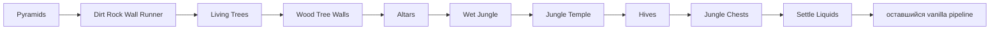

# Vanilla world generation: структуры джунглей и первый settle liquids

[English](../en/vanilla-worldgen-jungle-structures.md) · [Dungeon stage](vanilla-worldgen-dungeon-stage.md)

`terraruntime:vanilla` продолжает перенос ordinary Terraria 1.4.5.8 от `Pyramids` до первого прохода `Settle Liquids`. Встроенный генератор `terraruntime:flat` не изменён.

## Production order

```mermaid
graph LR
    P[Pyramids] --> D[Dirt Rock Wall Runner]
    D --> LT[Living Trees]
    LT --> W[Wood Tree Walls]
    W --> A[Altars]
    A --> J[Wet Jungle]
    J --> T[Jungle Temple]
    T --> H[Hives]
    H --> C[Jungle Chests]
    C --> S[Settle Liquids]
    S --> N[оставшийся vanilla pipeline]
```

Названия и порядок девяти проходов закреплены `PassCatalog1458`, полученным из проверенной последовательности регистрации pass-ов TerrariaServer 1.4.5.8.

## Реализованное поведение

### Dirt Rock Wall Runner

Проход делает ровно одно предложение стены на каждую колонку мира в поверхностной области. Если выбранная клетка имеет небезопасную Dirt-стену (`2`), запускается `WorldGen.DirtyRockRunner`: движущаяся сужающаяся кисть заменяет подходящие клетки на небезопасную Rocky Dirt-стену (`59`). Общий RNG расходуется на колебания кисти даже для клеток, чья стена не изменилась. Прямые официальные differential полного прохода на фикстурах `600 × 500` и canonical `4200 × 1200` сверяют каждую клетку и следующий RNG.

### Living Trees и Wood Tree Walls

Canonical worlds получают зависящее от размера мира количество living trees вне exclusion bands spawn, jungle, snow и dungeon. Используются vanilla tile identities `Living Wood = 191` и `Leaf Block = 192`. Следующий wall-pass сканирует только область выше `worldSurface`: Living Wood в центральной либо соседней по стороне клетке создаёт предложение, а все четыре диагонали должны быть Living Wood или уже иметь стену `244`. RNG не расходуется. Прямые официальные differential всего прохода для обычного и canonical-размера сверяют каждую клетку и неизменившийся общий RNG.

### Altars

Проход размещает framed объекты Demon/Crimson Altar размером 3 × 2 с tile identity `26`. Для Crimson используется альтернативная полоса frame-ов. Размещение разрешается только при свободном объёме объекта и сплошном основании, чтобы генератор не создавал висящий frame-important content.

Обычный зарегистрированный проход теперь имеет прямой официальный differential всего мира `4200 × 1200` по клеткам и следующему RNG. Он дополняет прежнюю исчерпывающую проверку `Place3x2` по материалам, форме и actuator, а также фикстуры поиска кандидатов. В этой canonical-фикстуре размещено `16` алтарей.

### Wet Jungle

`Wet Jungle` сканирует каждую колонку от `worldSurfaceLow` до строки перед `worldSurface - 1`. Решение принимает только первый активный тайл: если это Jungle Grass `60`, две клетки над ним получают полный объём воды. Проход не создаёт бассейны или мёд и не расходует RNG. Прямые официальные differential всего прохода для обычного и canonical-размера сверяют каждую клетку и неизменившийся общий RNG.

### Jungle Temple

В районе jungle origin из Reset строится source-shaped оболочка храма из Lihzahrd Brick tile `226` и unsafe Lihzahrd Brick wall `87`. Текущий порт создаёт envelope структуры, внутренние перекрытия и связанный вертикальный corridor. Детальная отделка, traps и Lihzahrd Altar принадлежат более поздним проходам.

### Hives

Ульи используют tile `225`, unsafe Hive wall `86` и honey liquid. Кандидаты пересекающиеся с bounds храма отклоняются.

### Jungle Chests

Этот ранний проход `JungleShrines` строит оболочки хижин, полости, опоры из Mud, ступенчатые крыши и предлагает факелы, после чего сохраняет центры хижин для позднего размещения сундуков. Он отклоняет близкие клетки и стены Hive/Temple и применяет исходные правила `StructureMap.CanPlace(area, 1)` для типов тайлов и пересечений хижин, созданных этим проходом. Две прямые официальные canonical-фикстуры полного прохода совпадают по всем клеткам, упорядоченным координатам хижин и следующему RNG, в том числе при препятствиях из Temple brick и Hive wall. Защищённые прямоугольники предыдущих проходов пока не передаются сюда; это остаётся межстадийным ограничением. Проход намеренно **не** размещает orphan chest tiles.

### Первый Settle Liquids

Проход следует обычному порядку генерации TerrariaServer 1.4.5.8: `QuickWater`, `WaterCheck`, десять ограниченных раундов quick-settle с повторным `WaterCheck` после каждого, затем очистка временных очередей. Каждый раунд допускает пять обновлений на элемент очереди, присутствующий в начале раунда. Временная твёрдость плиток при генерации остаётся отдельной от обычной runtime collision.

До settlement могут встречаться повреждённые объекты Antlion Larva (`485`). Их уничтожение при генерации следует `KillTile`/`CheckSuper`: удаляются активные клетки личинки внутри выведенного из кадров прямоугольника два на два; чужие и неактивные соседние клетки сохраняются, дочерние NPC не появляются. Противоречащие друг другу активные frame anchors по-прежнему отклоняются. Прямой вызов оригинальной сборки независимо закрепляет поведение частичного объекта.

Эта же граница генерации допускает повреждённые столбцы закрытых дверей (`10`) через исходный `CheckDoorClosed`: удаляются только сохранившиеся активные клетки двери в трёх строках, выведенных из кадров; чужие клетки и внешние опоры сохраняются. Противоречащие друг другу row anchors и запертые двери храма по-прежнему отклоняются, политика границы загрузки не меняется. Фикстура оригинальной сборки проверяет случай с чужой верхней клеткой.

Поздний `FinalCleanup` убирает изолированную неполную поверхностную жидкость, в том числе под восстановленной опорой алтаря: строгие внутренние границы берега и поверхности, количество меньше `255`, отсутствие полных левой, правой и нижней соседних клеток и активных облаков в этих трёх клетках. Полные водоёмы, прибрежная жидкость и жидкость с опорой на облака сохраняются. Шесть исходных типов облаков: `189/196/460/717/718/719`; остальные ветки Final Cleanup этим не закрываются.

## Compatibility barriers

Source-backed `Beaches` уже владеет beach/ocean geometry, поэтому старый aggregate compatibility `Biomes` теперь является isolated no-op dependency barrier. Он не меняет tiles и не расходует общий vanilla RNG. Уже существующие barriers `Caves`, `Ores` и ordinary `SecretSeeds` остаются isolated по той же причине.

## Текущая граница parity

Полученный `.wld` по-прежнему обязан пройти три уровня acceptance:

1. focused contracts графа world generation;
2. parsing и metadata validation через `TerraRuntime.WorldVerify`;
3. запуск pinned official TerrariaServer 1.4.5.8 с созданным миром.

Эти проверки доказывают структурную корректность и загрузку мира. Они не означают byte-identical vanilla generation. Exact RNG consumption и geometry нескольких проходов этого блока ещё требуют дальнейшего переноса, особенно branching Living Trees, layout Jungle Temple, форма hives и алгоритм liquid settling.

Следующий source-order блок начинается с `Remove Water From Sand` и идёт через post-settle oasis/shell/smoothing/content placement stages.
