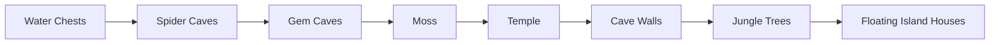

# Vanilla world generation: поздние структуры

[English](../en/vanilla-worldgen-late-structures.md) · [Chest placement](vanilla-worldgen-chest-placement.md)

`terraruntime:vanilla` продолжает перенос ordinary TerrariaServer 1.4.5.8 ещё через семь pass-ов, которые в pinned source-order идут сразу после `Water Chests`.

Production-план canonical мира вырастает с 71 до 78 entries. Identity генератора остаётся `terraruntime:vanilla`, а source-backed passes продолжают использовать один общий vanilla RNG stream.

## Vanilla identities материалов

На этом этапе используются реальные vanilla tile/wall identities, а не придуманные substitute-блоки:

- Spider Caves: Cobweb tile `51`, unsafe Spider Wall `62`;
- Gem Caves: gemstone stone tiles `63`–`68`;
- Moss: natural stone moss tiles `179`–`183`;
- Temple refinement: Lihzahrd Brick `226`, unsafe Lihzahrd Brick Wall `87`;
- Cave Walls: natural unsafe cave-wall families `54`–`58`, `170`, `171`;
- Jungle Trees: Living Mahogany `383` и Living Mahogany Leaf `384`;
- Floating Island Houses: Sunplate Block `202`, Disc Wall `82`, Skyware Chest как `Containers` style `13`.

Эти identities сверены с официальной Terraria Wiki. Геометрия и количества пока являются очередным этапом source-parity migration, а не заявлением о byte-identical результате vanilla worldgen.

## Persistent Skyware Chests

`Floating Island Houses` создаёт frame-important объект, поэтому Skyware Chest нельзя просто нарисовать четырьмя тайлами. Он проходит через generation-owned chest registry из предыдущего этапа: 2 × 2 footprint `Containers` и соответствующий `WorldChest` record сохраняются одной candidate transaction.

Loot остаётся отдельной задачей. Unique-item ordering Floating Islands, secondary loot rolls, prefixes и точное RNG consumption здесь не подделываются случайными предметами ради галочки.

## Что делают passes

`Spider Caves` формирует ограниченные cavern pockets, unsafe spider walls и cobwebs, не прорезая temple, hive, granite и marble structures. `Gem Caves` заменяет exposed cavern stone шестью vanilla gemstone-stone types. `Moss` работает только по exposed stone и не перекрашивает произвольные biome blocks.

`Temple` является refinement-pass над Lihzahrd structure, созданной раньше: существующие brick bounds находятся из tile store, после чего недостающие unsafe interior wall cells заполняются только рядом с Lihzahrd Brick. `Cave Walls` добавляет bounded patches естественных cave backgrounds.

`Jungle Trees` пока строит геометрию из Living Mahogany blocks. Это сознательно безопаснее, чем генерировать недостоверные frame-important tree sprites. `Floating Island Houses` находит cloud-supported islands, добавляет комнаты из Sunplate/Disc Wall и связывает каждый успешно размещённый Skyware Chest с persistence metadata.

## Acceptance boundary

Acceptance требует exact 78-entry source-order contract, совпадение с pinned catalog segment, полную generation canonical small world, round-trip через `WorldVerify` и успешный boot pinned official TerrariaServer 1.4.5.8.

Это подтверждает ordering, persistence integrity и server-loadable `.wld`. Exact vanilla counts, coordinates, room templates, tree sprite framing и loot остаются следующими parity-слоями.
