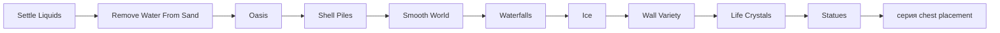

# Vanilla world generation: post-settle terrain и объекты

[English](../en/vanilla-worldgen-post-settle.md) · [Структуры джунглей](vanilla-worldgen-jungle-structures.md)

`terraruntime:vanilla` продолжает перенос ordinary Terraria 1.4.5.8 от первого `Settle Liquids` до `Statues`. Отдельный генератор `terraruntime:flat` не изменён.

## Production order

Названия и порядок девяти проходов закреплены `VanillaWorldGenerationPassCatalog1458`, полученным из проверенной registration sequence TerrariaServer 1.4.5.8.

## Реализованный срез

- `Remove Water From Sand` очищает liquid, оставшийся внутри active Sand, Hardened Sand и Sandstone cells после первого settling stage.
- `Oasis` ищет подходящую inland sand surface вне exclusion bands spawn, jungle, snow и dungeon, вырезает water basin и формирует его берега.
- `Shell Piles` размещает vanilla Shell Pile tile `495` на сухом beach sand около обоих океанов.
- `Smooth World` применяет ограниченное slope/half-block shaping только к exposed natural terrain.
- `Waterfalls` находит существующие liquid sources рядом с вертикальным обрывом и формирует bounded falling-liquid column.
- `Ice` расширяет snow biome в underground stone/water pockets и применяет unsafe ice walls.
- `Wall Variety` заменяет однообразные cave backgrounds естественными unsafe cave-wall variants.
- `Life Crystals` размещает vanilla Heart tile `12` размером 2 × 2 с полными frame coordinates и проверкой solid floor.
- `Statues` размещает обычный vanilla statue tile `105` размером 2 × 3 с полными frame coordinates и расстоянием от других frame-important objects.

Identity и dimensions Life Crystal, Statue и Shell Pile дополнительно сверены с официальной Terraria Wiki, при этом executable acceptance остаётся закреплён за TerrariaServer 1.4.5.8.

## Почему блок заканчивается на Statues

Следующие source passes: `Buried Chests`, `Surface Chests`, `Jungle Chests Placement` и `Water Chests`. Это уже не простая tile decoration: frames созданных сундуков должны совпадать с chest side table `.wld` и runtime object metadata. Поэтому TerraRuntime переносит chest-серию отдельным большим блоком, а не рисует визуально правдоподобные orphan chest tiles.

## Граница parity

Это всё ещё source-shaped migration, а не byte-identical clone. Для ряда проходов остаётся перенести точное helper/RNG consumption поведение, особенно smoothing, выбор waterfalls, wall weathering и schedules попыток placement. Каждое production изменение по-прежнему обязано пройти focused graph contracts, `TerraRuntime.WorldVerify` и реальный boot созданного мира pinned official TerrariaServer 1.4.5.8.
