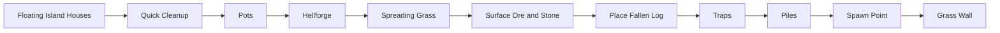

# Vanilla world generation: завершение surface-слоя

[English](../en/vanilla-worldgen-surface-finish.md) · [Поздние структуры](vanilla-worldgen-late-structures.md)

`terraruntime:vanilla` продолжает ordinary TerrariaServer 1.4.5.8 source-order migration от `Quick Cleanup` до `Grass Wall`.

Canonical production-план вырастает с 78 до 88 entries. Identity генератора остаётся `terraruntime:vanilla`, а все десять добавленных source-order pass-ов продолжают общий Terraria-compatible RNG stream.

## Ore tiers конкретного мира

`Surface Ore and Stone` не считает, что каждый мир обязан иметь классический набор Copper/Iron/Silver/Gold. Reset bootstrap уже хранит Terraria-выборы `CopperOre`, `IronOre`, `SilverOre`, `GoldOre`, поэтому pass использует именно их. Миры с Tin, Lead, Tungsten и Platinum не превращаются обратно в classic-ore миры из-за удобного хардкода.

## Frame-important объекты

Группа materializes несколько vanilla frame-important объектов, которым не нужна отдельная `.wld` side table:

- Pot: tile `28`, 2 × 2;
- Hellforge: tile `77`, 3 × 2;
- Fallen Log: tile `488`, 3 × 2;
- pressure plate / dart-trap pair: tiles `135` и `137`;
- ambient small piles: tile `185`.

При размещении trap между trigger и механизмом также прокладывается непрерывный red-wire path. Одинокая ловушка без провода выглядела бы вполне убедительно, пока игрок не попробовал бы на неё наступить, что является не лучшим моментом для обнаружения архитектурной экономии.

## Владение spawn point

`Spawn Point` теперь принимает source-order решение около центра мира. Pass отклоняет чрезмерную жидкость и frame-important obstructions, очищает обычные non-frame-important blocks из player-clearance volume и публикует semantic spawn через `IWorldGenerationMetadataWorkspace`.

Legacy compatibility Metadata pass всё ещё выполняется позже, потому что владеет другими header anchors. Узкий `SpawnPreservingMetadataPass1458` восстанавливает source-backed spawn после fallback, по той же модели, по которой ранее были сохранены source-backed terrain layers.

## Cleanup, grass и walls

`Quick Cleanup` нормализует stale shape/frame state, не уничтожая frame-important objects. `Spreading Grass` переводит exposed Dirt и Mud в Grass и Jungle Grass. `Grass Wall` размещает natural unsafe Grass Wall (`63`) только в пустых surface cavities рядом с surface soil.

`Pots`, `Fallen Log`, `Traps` и `Piles` используют bounded deterministic placement attempts. Это всё ещё incremental source parity: exact vanilla counts, style distributions, trap templates и RNG consumption каждого неудачного source-placement пока не заявляются byte-identical.

## Поселения ада и адские печи

Сообщение тестера от 2026-09-07 о редких/низких крепостях и вырезанном рельефе/лаве Ада остаётся открытым. Source-backed anchors крепостей проверяются на всё ещё приблизительном рельефе: базовый этап строит сплошной пол и периодические лужи `x % 19`, а не source-последовательность roof/basin/runner/QuickWater. Исправлять нужно эту основу до изменения проверенных правил размещения крепостей. Геометрия итогового мира, спуски данжа/пирамид и вид биомов требуют независимых fixtures; успешная загрузка `.wld` официальным сервером сама по себе их не доказывает.

Обычный проход `Underworld` теперь вызывает проверенную часть размещения `AddHellHouses`, которая раньше полностью отсутствовала. В центральной половине карты поиск идёт от `height - 40` вверх через активные или заполненные жидкостью клетки; подходит только сухая пустая клетка непосредственно над активным основанием. Source-пары кирпича и стены — `75/14` и `76/13`; выбор палитры и расстояний использует общий RNG.

`HellFort` использует пять возможных колонок и десять этажей, source-диапазоны ширины/высоты, боковые крылья, расширение центральной башни, исключение существующих стен и вертикальные границы ада. Создаются комнаты, выбранные по source дверные соединения (обсидиановая дверь, стиль `19`), платформы между этажами и на крыше (стиль `13`), сухие внешние входы и разрушенные наружные стены. Сохранены перезаписываемые RNG draws и неубывающий zero/nonzero draw бокового крыла. Поиск ограничен: исчерпание защитного бюджета отменяет генерацию, а не подставляет выдуманную планировку.

`Hellforges` теперь использует source-бюджет `width / 200`, выбор `x` из `[1,width)` и `y` из `[height-250,height-30)`, проверяет стену дома `13/14` в выбранной клетке, затем ищет вниз активную клетку. Source прекращает поиск очередной печи после 10000 неудачных размещений внутри домов; выбор клетки без стены дома в этот счётчик не входит. Отдельный защитный лимит в миллион выборок предотвращает бесконечный поиск при повреждённой геометрии. `Place3x2(77)` проверяет каждую опору через `SolidTile2`, допускает полные платформы, но не поверхности с одним лишь свойством стола, и атомарно записывает все шесть кадров. Размещение не требует выдуманной сухости и не стирает жидкость, краску, стены или провода.

Внешний `PlaceTile` до попытки `Place3x2` очищает старые тип, кадры, slope и block paint/coating только в своей неактивной anchor-клетке, включая неудачное размещение. Остальные клетки объекта сохраняют краску. Размещение дверей/платформ учитывает ту же границу очистки anchor; стены, жидкость, провода и состояние actuator не очищаются.

После всех крепостей обычная фаза факелов `AddHellHouses` запрашивает `200 * (width / 4200)` размещений: целочисленное деление исходника даёт бюджеты Small/Medium/Large 200/200/400. На каждый запрос приходится не более 1001 выборки кирпичной клетки. Левая фоновая стена имеет приоритет перед правой даже при занятой выбранной стороне; целевая клетка и клетка под ней должны быть неактивны, а полуоткрытый квадрат исключения соседних факелов центрирован на выбранном кирпиче. Адский факел стиля `7` отвергает жидкость до очистки anchor; этот отказ всё равно завершает запрос. Frame-important `CheckTorch` работает во время генерации и выбирает крепление слева/справа/на стене: `FrameX=22/44/0`, `FrameY=154`, с проверкой slope и source-наборов опор. Неизвестные типы опоры обрабатываются fail-closed.

Обычные пепельная трава и деревья на краях ада теперь создаются перед крепостями на том же RNG; отдельные правила settings-tree описаны в [растительности](vanilla-worldgen-vegetation.md#пепельная-растительность-ада).

Следующая фаза напольной мебели теперь допускает все 13 обычных вариантов `AddHellHouses`: стол/стулья/свеча, верстак/стул/свеча, статуя, книжный шкаф, стул, кровать, пианино, комод, скамья, напольные часы, диван, торшер и канделябр. Source-бюджет обратно пропорционален ширине: `ceil(4200000 / width)`, то есть 1000/657/500 для канонических размеров. После начального выбора пустой клетки дома допускается не более 100001 повторной выборки; далее выполняются поиск пола через `SolidTile`, середины непрерывного участка пола, source-прямоугольник свободного места и условие `span >= halfWidth * 1.75`. Платформы не останавливают поиск пола. Общий RNG выбирает один из 13 вариантов, смещение свечи и направление стула/кровати/дивана; отвергнутый вариант не расходует дополнительные броски.

Размещение сохраняет source-обсидиановые стили и полные кадры, включая 40-пиксельный период стула и раздельные горизонтальные/вертикальные атласы мебели. `PlaceTile` очищает только свою неактивную anchor-клетку; прямой `Place4x2` для кровати/дивана этого не делает. Торшер отвергает жидкость во всей занимаемой области, обычная мебель сохраняет жидкость. Это генерация в проверенной свободной комнате, а не универсальное размещение игроком: допускаются только твёрдый пол и собственный стол/верстак композиции для свечей; неподдержанные опоры обрабатываются fail-closed.

Комоды используют тайл `88`, полный объект 3x2 и существующую плотную таблицу generated chest: пустое имя и 40 пустых слотов. Это не сундуки с добычей. Отказ размещения/регистрации не публикует частичный комод или новую фантомную запись; в отличие от возможной orphan-записи после неудачного vanilla-размещения изолированный кандидат сохраняет согласованные объект и метаданные. Оба валидатора генерации теперь используют общую проверку размеров контейнера из каталога вместо предположения, что все они 2x2. Проверяются все клетки и единый стиль кадров; повреждённая третья колонка комода и смешанные стили обычного сундука отвергаются.

Следующие фазы картин и подвесных украшений используют по `ceil(420000 / width)` запросов (100/66/50). Картины дважды центрируют свободную область дома, затем измеряют трёхклеточные пустые полосы уже без требования фоновой стены. Горизонтальный span должен превышать 7, вертикальный — 5. `nearPicture2` учитывает только активные tiles `240/241/242` внутри включительного source-прямоугольника; маленькие картины `245/246` намеренно не входят в этот набор. `RandHellPicture` повторно выбирает family `1` ровно один раз, затем выбирает только подтверждённые адские стили. Этот выбор предшествует более тесной асимметричной проверке всех активных клеток. Размещение проверяет каждую фоновую стену и записывает полные кадры 3x3, 6x4, 2x3 или 3x2, сохраняя жидкость и краску вне anchor.

Подвесные украшения выбирают три разных стиля баннеров из `[16,22)` после всех трёх начальных бросков. Поиск потолка вверх через `SolidTile` проходит сквозь платформы. Кажущийся прямоугольником свободного места цикл исходника повторно читает только anchor-клетку; дополнительного запрета на соседние объекты нет. Само размещение проверяет полный footprint и центральную потолочную опору для баннера `91`, люстры `34` стиля `32` либо фонаря `42` стиля `32`. Неизвестные стили отвергаются. Source-лимиты поиска дома, отмена и защитный fail-closed лимит подбора палитры не дают повреждённой генерации зависнуть; подставных украшений нет.

Scripted helper tests и полная генерация канонических Small/Medium/Large с seed `42` проверяют крепости, сохранённые факелы, пепельные леса, мебель, зарегистрированные пустые комоды, полные footprints картин/подвесных украшений и адские печи. Независимое отключение освещения, пепельной растительности, мебели или украшений ломает все три канонические регрессии; пропуск третьей колонки комода ломает две проверки повреждений. Это **не** закрывает весь ад: terrain/lava/ore runner пока приближённый, растительность специальных seed ещё не перенесена; совпадение общего RNG и карты по seed не заявляется. Полнота данжа, биомов и прохождение игры от начала до конца также не доказаны.

Существующий ordinary Underworld terrain stage теперь восстанавливает лаву в неактивных клетках `height-145` и `height-144` непосредственно перед Hellstone, как pinned source после carving. Оба края мира участвуют; active tiles, включая actuated, и остальная metadata сохраняются, RNG не расходуется.11 helper/real-pass tests покрывают canonical heights и вызов Small/Medium/Large; его удаление ломает все три карты. Initial basin geometry, QuickWater, terrain/ore runners и whole-pass RNG equality остаются открытыми. Последующий liquid compaction может опустить лаву ниже: тест проверяет настоящую границу Underworld, а не выдуманный финальный горизонтальный слой.

## Следующая архитектурная граница

Следующий pinned source-order pass называется `Guide`. В отличие от pass-ов этого блока, он уже не является tile-only операцией. Корректная реализация требует generation-owned NPC persistence surface и fresh-world composer, который сериализует generated NPC records вместо всегда пустой NPC section.

Поэтому этот bridge намеренно не смешивается с surface-блоком. Генерировать Guide, который исчезает после первого открытия мира, было бы технически быстро и практически бессмысленно.

## Acceptance

Vanilla generated-world workflow теперь проверяет 88-entry graph, pinned source-order segment, spawn-preservation wrapper, полную generation canonical small world, round-trip через TerraRuntime loader и boot pinned official TerrariaServer 1.4.5.8.
