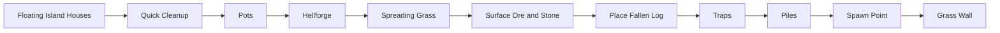

# Vanilla world generation: завершение surface-слоя

[English](../en/vanilla-worldgen-surface-finish.md) · [Поздние структуры](vanilla-worldgen-late-structures.md)

`terraruntime:vanilla` продолжает ordinary TerrariaServer 1.4.5.8 source-order migration от `Quick Cleanup` до `Grass Wall`.

Canonical production-план вырастает с 78 до 88 entries. Identity генератора остаётся `terraruntime:vanilla`, а все десять добавленных source-order pass-ов продолжают общий Terraria-compatible RNG stream.

## Ore tiers конкретного мира

`Surface Ore and Stone` не считает, что каждый мир обязан иметь классический набор Copper/Iron/Silver/Gold. Reset bootstrap уже хранит Terraria-выборы `CopperOre`, `IronOre`, `SilverOre`, `GoldOre`, поэтому pass использует именно их. Миры с Tin, Lead, Tungsten и Platinum не превращаются обратно в classic-ore миры из-за удобного хардкода.

## Frame-important объекты

Группа materializes несколько vanilla frame-important объектов, которым не нужна отдельная `.wld` side table:

- Pot: tile `28`, 2 × 2;
- Hellforge: tile `77`, 3 × 2;
- Fallen Log: tile `488`, 3 × 2;
- pressure plate / dart-trap pair: tiles `135` и `137`;
- ambient small piles: tile `185`.

При размещении trap между trigger и механизмом также прокладывается непрерывный red-wire path. Одинокая ловушка без провода выглядела бы вполне убедительно, пока игрок не попробовал бы на неё наступить, что является не лучшим моментом для обнаружения архитектурной экономии.

## Владение spawn point

`Spawn Point` теперь принимает source-order решение около центра мира. Pass отклоняет чрезмерную жидкость и frame-important obstructions, очищает обычные non-frame-important blocks из player-clearance volume и публикует semantic spawn через `IWorldGenerationMetadataWorkspace`.

Legacy compatibility Metadata pass всё ещё выполняется позже, потому что владеет другими header anchors. Узкий `VanillaSpawnPreservingMetadataPass1458` восстанавливает source-backed spawn после fallback, по той же модели, по которой ранее были сохранены source-backed terrain layers.

## Cleanup, grass и walls

`Quick Cleanup` нормализует stale shape/frame state, не уничтожая frame-important objects. `Spreading Grass` переводит exposed Dirt и Mud в Grass и Jungle Grass. `Grass Wall` размещает natural unsafe Grass Wall (`63`) только в пустых surface cavities рядом с surface soil.

`Pots`, `Hellforge`, `Fallen Log`, `Traps` и `Piles` используют bounded deterministic placement attempts. Это всё ещё incremental source parity: exact vanilla counts, style distributions, trap templates и RNG consumption каждого неудачного source-placement пока не заявляются byte-identical.

## Следующая архитектурная граница

Следующий pinned source-order pass называется `Guide`. В отличие от pass-ов этого блока, он уже не является tile-only операцией. Корректная реализация требует generation-owned NPC persistence surface и fresh-world composer, который сериализует generated NPC records вместо всегда пустой NPC section.

Поэтому этот bridge намеренно не смешивается с surface-блоком. Генерировать Guide, который исчезает после первого открытия мира, было бы технически быстро и практически бессмысленно.

## Acceptance

Vanilla generated-world workflow теперь проверяет 88-entry graph, pinned source-order segment, spawn-preservation wrapper, полную generation canonical small world, round-trip через TerraRuntime loader и boot pinned official TerrariaServer 1.4.5.8.
