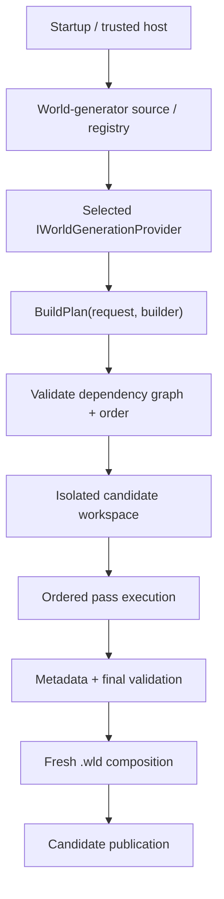
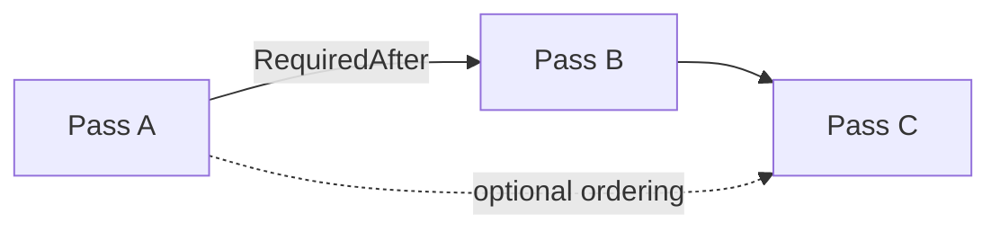
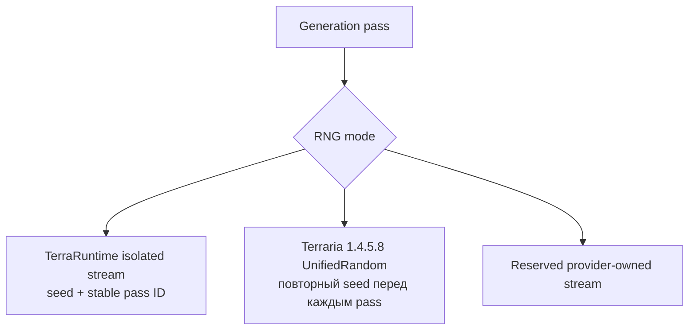
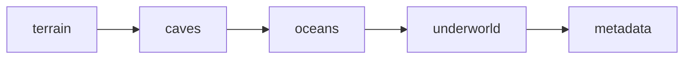
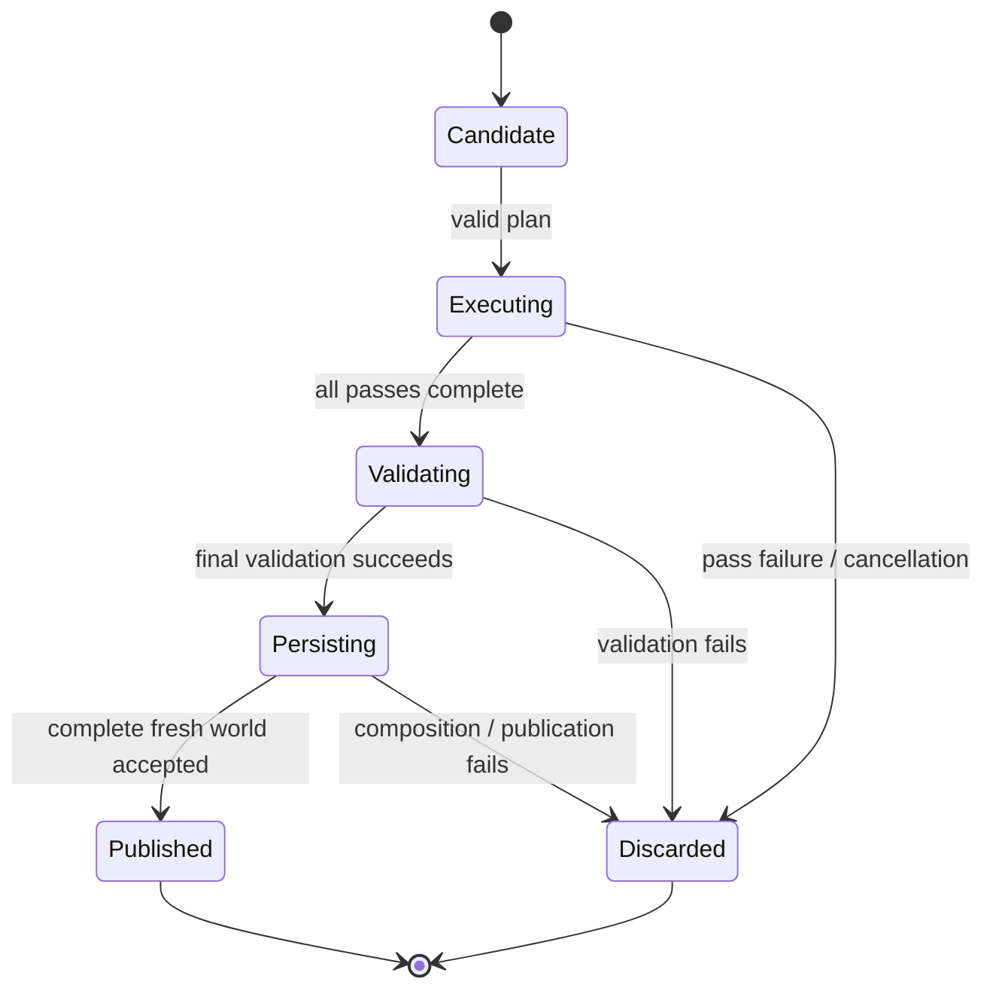

# World generation

[English](../en/world-generation.md) · [Документация](README.md) · [Host interfaces](host-interfaces.md) · [Worldgen roadmap](../roadmap/gameplay-worldgen-extensibility.md)

## 1. Текущий статус

У TerraRuntime есть настоящий world-generation framework и теперь два встроенных генератора:

- `terraruntime:vanilla` — runtime-owned линия генерации Terraria 1.4.5.8;
- `terraruntime:flat` — небольшой deterministic dirt/stone baseline для инфраструктурных тестов.

Vanilla generator **пока не является pass-complete Terraria WorldGen parity**. Первый selectable slice уже владеет интерпретацией seed, выполнением vanilla RNG для passes, вариативным terrain, caves, ocean water, underworld cavity/lava layer и semantic world anchors. Exact jungle/desert/ore/structure/chest/object/tile-entity generation и остальная часть source-pinned каталога из `$109$` passes остаются открытыми.

| Capability | Status |
|---|---|
| Worldgen framework | substantial |
| Trusted custom-provider surface | implemented |
| Built-in selectable vanilla profile | implemented, partial pass coverage |
| Full Terraria 1.4.5.8 WorldGen parity | incomplete |

## 2. Архитектура



Generator никогда не получает live authoritative world во время build/execute candidate.

## 3. Generator identity и request

`WorldGeneratorId` — stable namespaced identity. Он non-empty, не содержит whitespace/control characters и bounded до `$128$` characters.

`WorldGenerationRequest` содержит `GeneratorId`, `WorldName`, numeric `Seed`, exact optional `SeedText`, dimensions и `WorldGenerationOptions`. Для vanilla generation важен именно `SeedText`: текст, который не является `Int32`, проходит Terraria-compatible CRC-32 seed boundary, а не нормализуется через numeric fallback host'а.

Startup world creation теперь принимает textual seeds:

```text
TerraRuntime.Server \
  --create-world Example \
  --world-generator terraruntime:vanilla \
  --world-seed "get fixed boi" \
  --world-width 4200 \
  --world-height 1200
```

Для custom generators host всё ещё вычисляет stable numeric fallback, но `terraruntime:vanilla` использует exact `SeedText` path.

## 4. Provider contract

```csharp
public interface IWorldGenerationProvider
{
    WorldGeneratorId Id { get; }
    void BuildPlan(in WorldGenerationRequest request, IWorldGenerationPlanBuilder builder);
}
```

`BuildPlan` объявляет passes и ordering, но не мутирует live world.

## 5. Pass graph и ordering

Каждый pass имеет stable `WorldGenerationPassId` и descriptor. Dependencies выражаются через `RequiredAfter`, `OptionalAfter`, `OptionalBefore` и RNG mode.



Planner reject'ит missing hard dependencies, duplicate pass IDs и cycles до execution host-supplied code. Dependency arrays defensively copied.

## 6. Pass execution и cancellation

`IWorldGenerationPass.Execute` выполняется synchronously по isolated candidate workspace. Long loops обязаны проверять cancellation token. Progress является bounded observability и не может publish state.

Failure/cancellation отбрасывает candidate вместо частичной мутации authoritative world.

## 7. Candidate workspace

`IWorldGenerationWorkspace` предоставляет normalized candidate tile reads/writes вместо live `WorldTileStore`.

```csharp
int WidthTiles { get; }
int HeightTiles { get; }
bool TryGetTile(int x, int y, out WorldGenerationTile tile);
bool TrySetTile(int x, int y, in WorldGenerationTile tile);
```

Runtime валидирует candidate bounds, известные vanilla tile/wall ID ranges, tile flags, liquid kind и shape до принятия записи.

## 8. Tile и metadata surfaces

`WorldGenerationTile` содержит normalized tile/wall IDs, frames, wires/actuator/visibility/fullbright flags, liquid state, colors и shape.

`IWorldGenerationMetadataWorkspace` предоставляет semantic anchors: spawn, dungeon anchor, world surface и rock layer. Vanilla candidate дополнительно несёт internal source-versioned seed profile, чтобы generation decisions и fresh `.wld` metadata не могли молча разойтись по special-seed state.

## 9. RNG modes

RNG identities: `IsolatedDeterministic`, `VanillaSharedRng`, `CustomProviderRng`.



`IsolatedDeterministic` выдаёт каждому custom pass независимый TerraRuntime stream, выведенный из world seed и stable pass ID.

`VanillaSharedRng` теперь executable. Pinned evidence TerrariaServer 1.4.5.8 показывает, что `WorldGenerator.RunPass` перед каждым enabled generation pass заменяет global `Main.rand` на `new UnifiedRandom(_seed)`. TerraRuntime повторяет эту границу: каждый `VanillaSharedRng` pass получает новый `VanillaUnifiedRandom1458`, seeded через exact vanilla seed-text conversion. RNG общий для vanilla logic внутри одного pass, а не продолжается сквозь весь plan.

`CustomProviderRng` остаётся reserved и fail-closed, пока не появится explicit provider-owned RNG contract.

## 10. Built-in vanilla generator

Built-in ID: `terraruntime:vanilla`. Текущий первый coherent slice выполняет:



Implementation clean-room и намеренно использует только content IDs, уже допущенные runtime, там где более широкое exact vanilla placement ещё не source-verified. Current terrain non-flat и deterministic; caves вырезают deterministic tunnel cavities; edge ocean regions содержат water; нижняя часть мира получает underworld cavity/lava layer; финальный pass записывает spawn, dungeon и layer anchors.

Это runtime path, на который поэтапно переносится source-pinned каталог `$109$` vanilla passes. Пять coarse passes не объявляются эквивалентом всей официальной Terraria world generation.

Для `skyblock` уже есть отдельный special-world path: обычный terrain/ocean/underworld заменяется sparse central island candidate, а `SkyblockWorld` flag сохраняется в `.wld`.

## 11. Special world seeds и secret seed modifiers

Terraria 1.4.5.x разделяет special world seeds и combinable secret seed modifiers. TerraRuntime нормализует seed-code matching case-insensitively с удалением non-alphanumeric characters и поддерживает pipe-separated combinations текущего seed syntax.

Поддерживаемые special-seed identities включают Drunk (`5162020`), For the Worthy, Celebration Mk 10 (`5162011`, `5162021`, `celebrationmk10`), The Constant, Not the Bees, Remix, No Traps, Zenith (`get fixed boi`) и Skyblock. Zenith проецирует independent legacy special-world attributes в fresh `.wld` metadata, а не выставляет только `ZenithWorld`.

Source-versioned secret catalog распознаёт все `$37$` current modifier codes и их комбинации. Direct `SaveWorldFlags` state сохраняется для dedicated booleans:

- Vampirism / `VampireSeed`;
- Purify this / `InfectedSeed`;
- Royale with cheese / `TeamBasedSpawnsSeed`;
- Double daring dangers / `DualDungeonsSeed`;
- Electric Boogaloo / `MoreLightningSeed`;
- Calm before the storm / `NoLightningSeed`.

`Hocus pocus` и `Jingle all the way` также проецируются в существующие forever-Halloween и forever-Xmas fields.

Recognition шире, чем завершённая gameplay generation. Modifiers, чья canonical semantics зависит от ещё не реализованных passes или serialized `WorldManifest`, сохраняются как deterministic generation policy, но **не выдаются за полностью реализованную persisted support**. `WorldManifest` остаётся пустым, пока его exact 1.4.5.8 serialization и соответствующие passes не будут реализованы вместе.

## 12. Built-in flat generator

`terraruntime:flat` остаётся двухпроходным terrain/metadata baseline с simple dirt/stone layers. Он нужен для infrastructure/extension tests и не является vanilla approximation.

## 13. Isolation и publication



## 14. NativeAOT и CoreCLR boundary

Generation contracts, planner, executor, built-in providers и vanilla RNG остаются в statically known runtime graph и не требуют reflection discovery. Trusted CoreCLR modules могут explicitly register дополнительные providers через host contract; NativeAOT сохраняет built-in/static registration.

## 15. Trusted-host registration

Trusted CoreCLR modules регистрируют providers через `ITerraRuntimeWorldGeneratorRegistry`. Registration возвращает lifetime handle, который retire до unload owning module. Runtime не reflection-scan'ит arbitrary assemblies.

Generator listing:

```text
TerraRuntime.Server --list-world-generators
```

## 16. Правила provider

Provider/pass не должен mutate running world, retain candidate workspace после execution, assume internal tile storage layout, скрывать reflection-based discovery, игнорировать cancellation в больших loops, зависеть от TUI availability или claim vanilla parity для guessed structures/RNG behavior.

## 17. Оставшаяся работа по vanilla WorldGen

Pinned source contract TerrariaServer 1.4.5.8 разрешает все `$109$` registrations `WorldGen.AddPasses()` в exact pass names с zero unresolved entries. Ordered pass names и special-seed filtering fingerprinted независимо.

Новый selectable vanilla profile закрывает прежний разрыв между source catalog и executable generation, но exact pass parity остаётся большой задачей. Открыты, в частности: exact terrain feature sequencing, jungle/desert/snow shaping, ores/decorations, complete liquid settling, floating islands/micro-biomes, dungeon/temple/structure generation, traps, chests/loot, objects/tile entities, town NPC bootstrap/progression metadata, все special/secret seed pass alterations, `WorldManifest` persistence и reference-seed differential validation.

Full vanilla WorldGen нельзя помечать завершённым, пока generated worlds не проходят official TerrariaServer/client acceptance и source/reference-seed comparisons для реализованного набора passes.

## 18. Evidence и limitations

Current evidence включает planner validation, isolated workspace/finalization, exact `VanillaUnifiedRandom1458`, executable per-pass vanilla reseeding, tests exact text-seed CRC boundary, `$109$` source-pinned pass catalog, selectable built-in vanilla generation tests, parsing комбинации всех `$37$` secret modifiers и fresh metadata round-trip dedicated special/secret flags.

Текущий generator — **крупный foundation slice, но не full vanilla parity**. Exact structures/biomes/objects и многие modifier-specific mechanics намеренно остаются open вместо approximate implementation, ошибочно названной vanilla.

## 19. Checklist изменения worldgen

Worldgen change не завершён, пока dependencies validated, candidate mutation isolated, RNG ordering explicit, long work cancellable, metadata semantic, persistence flags согласованы с generation policy, provider lifetime safe across unload, failure не publish partial world, diagrams используют Mermaid, dimensional values используют LaTeX where applicable, и эта page изменена вместе с `docs/en/world-generation.md`.
