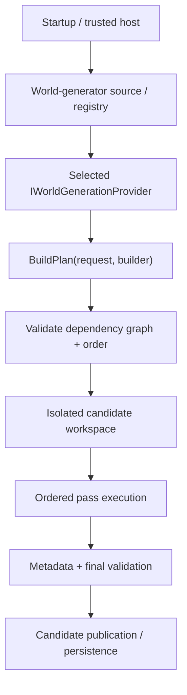
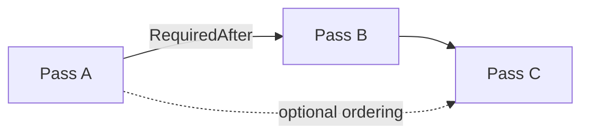
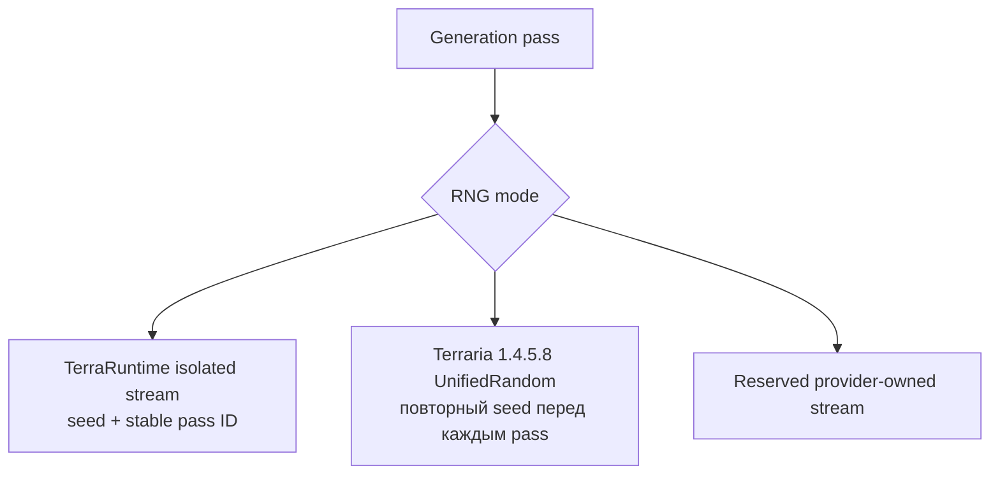
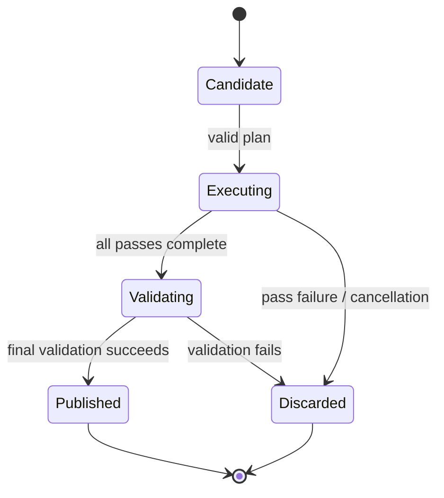
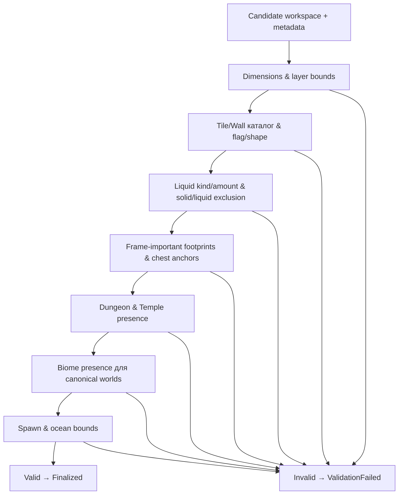

# World generation

[English](../en/world-generation.md) · [Документация](README.md) · [Host interfaces](host-interfaces.md) · [Vanilla generator](vanilla-world-generation.md) · [Worldgen roadmap](../roadmap/gameplay-worldgen-extensibility.md)

## 1. Текущий статус

В TerraRuntime есть общий world-generation framework и два встроенных generator ID с разными задачами:

| Capability | Status |
|---|---|
| Worldgen framework | substantial |
| Trusted custom-provider surface | implemented |
| `terraruntime:flat` infrastructure baseline | implemented |
| `terraruntime:vanilla` ordinary canonical pass coverage | все 109 закреплённых pass identity до `Final Cleanup` |
| Vanilla reference-world parity | incomplete |
| Special/secret-seed parity | incomplete |

`terraruntime:flat` остаётся маленьким deterministic dirt/stone generator для инфраструктурных тестов. `terraruntime:vanilla` является clean-room генератором TerrariaServer 1.4.5.8 и уже содержит source-backed/source-shaped overlay-цепочку по всей ordinary canonical registration sequence. Покрытие списка passes не означает точного совпадения миров: фиксированные официальные seeds ещё требуют differential evidence для RNG-sensitive geometry/content, а часть source-shaped алгоритмов требует более глубокого parity.

## 2. Архитектура



Generator не получает live authoritative world во время build/execute candidate.

## 3. Generator identity и request

`WorldGeneratorId` — stable namespaced identity. Он non-empty, не содержит whitespace/control characters и bounded до `$128$` characters. Предпочтительны IDs вроде `myhost:survival` или `myplugin:skyblock`.

`WorldGenerationRequest` immutable и содержит `GeneratorId`, `WorldName`, `Seed`, `WidthTiles`, `HeightTiles`. Dimensions positive, tile-count arithmetic checked. Request также хранит normalized seed text для генераторов, которым нужен Terraria-compatible textual seed resolution.

## 4. Provider contract

```csharp
public interface IWorldGenerationProvider
{
    WorldGeneratorId Id { get; }
    void BuildPlan(in WorldGenerationRequest request, IWorldGenerationPlanBuilder builder);
}
```

`BuildPlan` объявляет passes/order и не выполняет expensive generation напрямую, не мутирует live world.

## 5. Pass graph и ordering

Каждый pass имеет stable `WorldGenerationPassId` и descriptor. Dependencies выражаются через `RequiredAfter`, `OptionalAfter`, `OptionalBefore` и RNG mode.



Planner reject'ит missing hard dependencies, duplicate pass IDs и cycles до execution host-supplied code. Dependency arrays defensively copied.

## 6. Pass execution и cancellation

```csharp
public interface IWorldGenerationPass
{
    void Execute(IWorldGenerationContext context);
}
```

Execution synchronous по isolated candidate workspace. Long-running loops обязаны проверять supplied cancellation token. `context.ReportProgress(...)` является observability, а не mutation authority.

## 7. Candidate workspace

`IWorldGenerationWorkspace` предоставляет normalized candidate tile reads/writes вместо `WorldTileStore` или live runtime memory.

```csharp
int WidthTiles { get; }
int HeightTiles { get; }
bool TryGetTile(int x, int y, out WorldGenerationTile tile);
bool TrySetTile(int x, int y, in WorldGenerationTile tile);
```

Так host code не зависит от internal storage layout и не может publish half-generated state после exception.

## 8. Tile и metadata surfaces

`WorldGenerationTile` содержит normalized tile/wall types, frame coordinates, wire/actuator/visibility/fullbright flags, liquid state, colors и shape.

`IWorldGenerationMetadataWorkspace` предоставляет semantic anchors: spawn, dungeon anchor, world surface, rock layer, вместо raw `.wld` offsets. Runtime-owned generation workspace дополнительно хранит generated chests/NPC persistence и vanilla bootstrap state, необходимые встроенному генератору, не раскрывая live server world.

Возможность записать numeric tile ID не делает arbitrary multi-tile arrangement legal vanilla state.

## 9. RNG modes

Current identities: `IsolatedDeterministic`, `VanillaSharedRng`, `CustomProviderRng`.



`IsolatedDeterministic` — executable режим для custom providers. Каждый pass получает отдельный TerraRuntime stream, выведенный из world seed и stable pass ID. Поэтому добавление постороннего custom pass не сдвигает random sequence другого pass.

Название `VanillaSharedRng` не означает один непрерывный stream на весь vanilla plan. Pinned evidence TerrariaServer 1.4.5.8 показывает: `GenBase._random` ссылается на `WorldGen.genRand`, тот ссылается на global `Main.rand`, а `WorldGenerator.RunPass` непосредственно перед каждым enabled generation pass заменяет `Main.rand` на `new UnifiedRandom(_seed)`. То есть RNG общий для vanilla code **внутри одного pass**, но каждый зарегистрированный pass снова начинает с одного и того же resolved world seed.

TerraRuntime реализует этот контракт через source-pinned `VanillaUnifiedRandom1458` и отдельный vanilla RNG context. Executor преобразует Terraria seed text в закреплённый integer seed и создаёт новый vanilla RNG adapter для каждого `VanillaSharedRng` pass. Постоянный source-contract probe дополнительно проверяет, что официальный `RunPass` по-прежнему делает reseed до применения pass, поэтому runtime-only тесты не могут сами переопределить lifetime RNG.

Passes нельзя parallelize/reorder только потому, что RNG пересоздаётся. Vanilla passes всё равно последовательно читают и изменяют world state, metadata и bootstrap state. Custom pass code использует `IWorldGenerationRandom`, а не process-global `Random`.

## 10. Progress

`WorldGenerationProgress` содержит `PassId`, `PassIndex`, `PassCount`, `Fraction`, `Message`. Progress sink optional и не влияет на correctness.

## 11. Trusted-host registration

Trusted CoreCLR modules явно регистрируют providers через `IGeneratorRegistry`. Registration возвращает lifetime handle, который retire/dispose до unload owning module.

Runtime не reflection-scan'ит arbitrary assemblies. Generator listing остаётся literal CLI:

```text
TerraRuntime.Server --list-world-generators
```

## 12. Built-in generators

`terraruntime:flat` выполняет минимальный terrain pass, затем metadata pass. Используются simple deterministic dirt/stone и required anchors. Это infrastructure baseline, **не** vanilla WorldGen approximation.

`terraruntime:vanilla` является production clean-room vanilla identity. Для ordinary seeds на canonical Terraria dimensions финальный provider собирает закреплённую pass identity sequence до `Final Cleanup`; special/secret seeds и noncanonical synthetic dimensions пока сохраняют explicit compatibility fallback. Точная граница parity описана в [Built-in vanilla world generation](vanilla-world-generation.md).

## 13. Isolation и publication



Running authoritative world никогда не заменяется partial pass output.

## 14. NativeAOT и CoreCLR boundary

Generation contracts/planner/executor остаются compatible с NativeAOT-first core. Dynamic arbitrary DLL discovery core не требуется.

CoreCLR может load trusted modules и explicitly register providers. NativeAOT использует statically known/built-in providers, пока deliberate AOT-compatible path не добавлен.

## 15. Добавление custom generator

```csharp
public sealed class MyGenerator : IWorldGenerationProvider
{
    public WorldGeneratorId Id => new("example:flat-plus");

    public void BuildPlan(
        in WorldGenerationRequest request,
        IWorldGenerationPlanBuilder builder)
    {
        builder.Add(
            new WorldGenerationPassDescriptor(new("example:terrain")),
            new TerrainPass());

        builder.Add(
            new WorldGenerationPassDescriptor(
                new("example:metadata"),
                requiredAfter: [new("example:terrain")]),
            new MetadataPass());
    }
}
```

Register во время trusted-host bootstrap; returned registration хранится и dispose'ится до unload.

## 16. Правила provider

Provider/pass не должен mutate running world, retain candidate workspace после execution, assume `WorldTileStore` memory layout, hide reflection-based discovery, ignore cancellation, зависеть от TUI availability или claim vanilla parity guessed structures/RNG behavior.

## 17. Vanilla WorldGen work

Pinned source contract TerrariaServer 1.4.5.8 разрешает все `$109$` registrations `WorldGen.AddPasses()` в точные имена passes, unresolved entries равны нулю. Ordered sequence имён fingerprinted, а special-seed filtering fingerprinted отдельно, чтобы conditional behavior не путать с базовым registration order.

Built-in ordinary canonical provider теперь доходит до всей sequence через цепочку source-backed и source-shaped clean-room implementations, включая Terrain, biome/structure/object stages, micro-biomes, поздние cleanup passes, starting NPC и fresh-world metadata integration. Текущий end-to-end integration test генерирует canonical `$4200\times1200$` world, проверяет content bounds/chests/Guide metadata, собирает fresh protocol-326 `.wld` и загружает его обратно runtime loader'ом.

Оставшаяся работа — **глубокий parity, а не plumbing названий pass**: fixed-seed differential geometry/content проверки против official server, точное behavior/RNG consumption внутри source-shaped passes, special/secret seed branches и любые оставшиеся world-object/framing/content divergences, найденные reference worlds.

## 18. Валидация после генерации

Каждый валидный мир теперь проходит fail-closed `Validator1458`:



Для canonical `$4200\times1200$`, `$6400\times1800$` и `$8400\times2400$` ordinary миров валидатор проверяет плотность active tiles, `$147$`/`$161$` snow, `$59$`/`$60$` jungle, `$53$` desert, `$70$` mushroom, `$41$` dungeon, `$226$` temple, `$58$` hellstone, $2\times2$ `21`-chest footprints (modulo `$36$` style), уникальность chest-anchor, дубликаты сундуков, объекты вне границ, solid/liquid exclusion, spawn ground, минимумы ocean sand/water и непрерывную связанную с краем геометрию океанского бассейна с подъёмом к пляжу. Non-canonical и custom-generator миры валидируются только по tile/wall каталогу, liquid, chest-anchor и metadata, чтобы fixture generators и synthetic миры не отбрасывались ложно.

Валидация выполняется внутри `Finalizer`: `Finalized` возвращается только когда `Validate` даёт `Valid`; иначе возвращается `ValidationFailed` и candidate отбрасывается до сохранения. Новый `VanillaWorldGenerationValidator1458Tests` проверяет валидную canonical генерацию, невалидные tile/wall types, orphan chest anchors, дубликаты сундуков, spawn вне мира и нарушения ocean bounds.

## 19. Evidence и limitations

Current evidence покрывает planner validation/order, executor behavior, custom RNG isolation, pinned per-pass vanilla RNG reseed, exact Terraria 1.4.5.8 `UnifiedRandom`, каталог `$109$` registrations, source contracts нескольких vanilla stages, canonical world creation/file reload, post-generation structural validation, registry lifetime, startup world-creation parsing и trusted-host generation integration.

Самый сильный текущий claim — **полное ordinary canonical pass-identity coverage с валидным generated `.wld` и fail-closed structural validation**, а не reference-world equality. Dedicated vanilla document и roadmap намеренно оставляют reference-world parity и special/secret-seed parity открытыми до независимого differential evidence.

## 20. Checklist изменения worldgen

Worldgen change не завершён, пока dependencies validated, candidate mutation isolated, RNG lifetime/order закреплены official evidence, long work cancellable, metadata semantic, provider lifetime safe across unload, failure не publish partial world, post-generation validation зелёная, parity claims соответствуют independent evidence, diagrams используют Mermaid, dimensional values используют LaTeX where applicable, и эта page изменена вместе с `docs/en/world-generation.md`.
