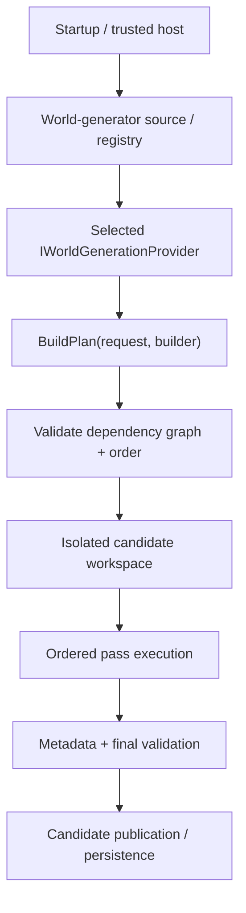
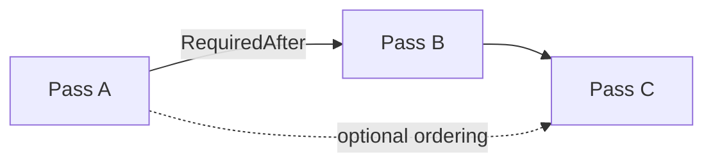
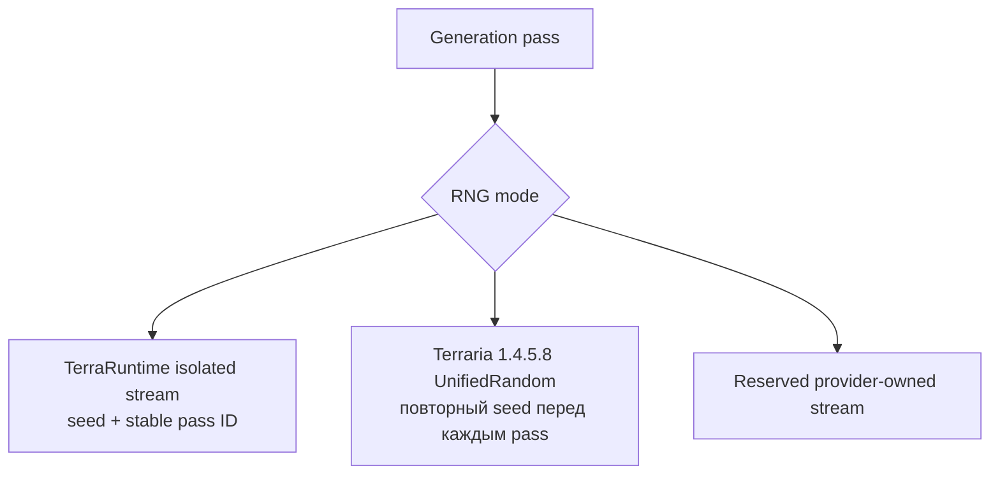
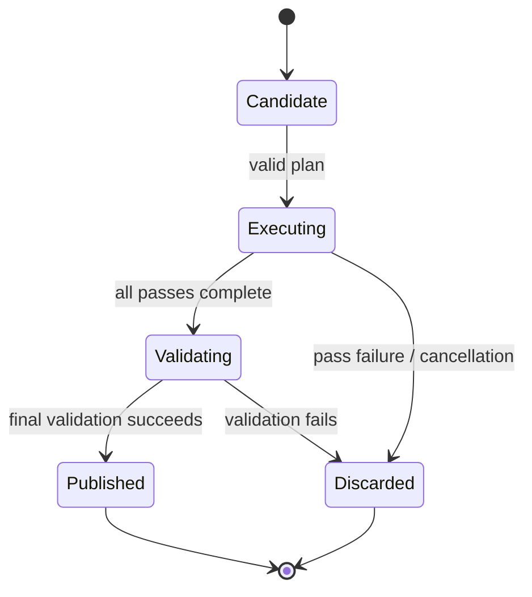

# World generation

[English](../en/world-generation.md) · [Документация](README.md) · [Host interfaces](host-interfaces.md) · [Worldgen roadmap](../roadmap/gameplay-worldgen-extensibility.md)

## 1. Текущий статус

У TerraRuntime есть настоящий world-generation **framework**, но vanilla Terraria WorldGen parity пока нет. Built-in generator является deterministic flat dirt/stone baseline для проверки contracts/publication, а не approximation vanilla biomes, structures или RNG ordering.

| Capability | Status |
|---|---|
| Worldgen framework | substantial |
| Trusted custom-provider surface | implemented |
| Vanilla Terraria WorldGen | incomplete |

## 2. Архитектура



Generator не получает live authoritative world во время build/execute candidate.

## 3. Generator identity и request

`WorldGeneratorId` — stable namespaced identity. Он non-empty, не содержит whitespace/control characters и bounded до `$128$` characters. Предпочтительны IDs вроде `myhost:survival` или `myplugin:skyblock`.

`WorldGenerationRequest` immutable и содержит `GeneratorId`, `WorldName`, `Seed`, `WidthTiles`, `HeightTiles`. Dimensions positive, tile-count arithmetic checked.

## 4. Provider contract

```csharp
public interface IWorldGenerationProvider
{
    WorldGeneratorId Id { get; }
    void BuildPlan(in WorldGenerationRequest request, IWorldGenerationPlanBuilder builder);
}
```

`BuildPlan` объявляет passes/order и не выполняет expensive generation напрямую, не мутирует live world.

## 5. Pass graph и ordering

Каждый pass имеет stable `WorldGenerationPassId` и descriptor. Dependencies выражаются через `RequiredAfter`, `OptionalAfter`, `OptionalBefore` и RNG mode.



Planner reject'ит missing hard dependencies, duplicate pass IDs и cycles до execution host-supplied code. Dependency arrays defensively copied.

## 6. Pass execution и cancellation

```csharp
public interface IWorldGenerationPass
{
    void Execute(IWorldGenerationContext context);
}
```

Execution synchronous по isolated candidate workspace. Long-running loops обязаны проверять supplied cancellation token. `context.ReportProgress(...)` является observability, а не mutation authority.

## 7. Candidate workspace

`IWorldGenerationWorkspace` предоставляет normalized candidate tile reads/writes вместо `WorldTileStore` или live runtime memory.

```csharp
int WidthTiles { get; }
int HeightTiles { get; }
bool TryGetTile(int x, int y, out WorldGenerationTile tile);
bool TrySetTile(int x, int y, in WorldGenerationTile tile);
```

Так host code не зависит от internal storage layout и не может publish half-generated state после exception.

## 8. Tile и metadata surfaces

`WorldGenerationTile` содержит normalized tile/wall types, frame coordinates, wire/actuator/visibility/fullbright flags, liquid state, colors и shape.

`IWorldGenerationMetadataWorkspace` предоставляет semantic anchors: spawn, dungeon anchor, world surface, rock layer, вместо raw `.wld` offsets.

Возможность записать numeric tile ID не делает arbitrary multi-tile arrangement legal vanilla state.

## 9. RNG modes

Current identities: `IsolatedDeterministic`, `VanillaSharedRng`, `CustomProviderRng`.



`IsolatedDeterministic` — текущий executable режим для custom providers. Каждый pass получает отдельный TerraRuntime stream, выведенный из world seed и stable pass ID. Поэтому добавление постороннего custom pass не сдвигает random sequence другого pass.

Название `VanillaSharedRng` не означает один непрерывный stream на весь vanilla plan. Pinned evidence TerrariaServer 1.4.5.8 показывает: `GenBase._random` ссылается на `WorldGen.genRand`, тот ссылается на global `Main.rand`, а `WorldGenerator.RunPass` непосредственно перед каждым enabled generation pass заменяет `Main.rand` на `new UnifiedRandom(_seed)`. То есть RNG общий для vanilla code **внутри одного pass**, но каждый pass снова начинает с одного и того же world seed.

В TerraRuntime уже добавлена source-pinned реализация `VanillaUnifiedRandom1458` с fingerprints официальных `SetSeed`, `InternalSample`, `Sample` и large-range алгоритмов. Общий executor пока fail-closed reject'ит `VanillaSharedRng`, пока не интегрированы точное official преобразование seed text в `int` и non-lossy vanilla RNG context. Мы не отображаем Terraria RNG на выдуманные `UInt32`/`UInt64` semantics только ради того, чтобы enum выглядел реализованным.

Passes нельзя parallelize/reorder только потому, что они кажутся computationally independent. Custom pass code использует `IWorldGenerationRandom`, а не process-global `Random`.

## 10. Progress

`WorldGenerationProgress` содержит `PassId`, `PassIndex`, `PassCount`, `Fraction`, `Message`. Progress sink optional и не влияет на correctness.

## 11. Trusted-host registration

Trusted CoreCLR modules явно регистрируют providers через `ITerraRuntimeWorldGeneratorRegistry`. Registration возвращает lifetime handle, который retire/dispose до unload owning module.

Runtime не reflection-scan'ит arbitrary assemblies. Generator listing остаётся literal CLI:

```text
TerraRuntime.Server --list-world-generators
```

## 12. Built-in flat generator

Built-in ID: `terraruntime:flat`. Plan запускает terrain pass, затем metadata pass. Используются simple deterministic dirt/stone, frame-free tiles и required anchors.

Это infrastructure baseline, **не** vanilla WorldGen approximation.

## 13. Isolation и publication



Running authoritative world никогда не заменяется partial pass output.

## 14. NativeAOT и CoreCLR boundary

Generation contracts/planner/executor остаются compatible с NativeAOT-first core. Dynamic arbitrary DLL discovery core не требуется.

CoreCLR может load trusted modules и explicitly register providers. NativeAOT использует statically known/built-in providers, пока deliberate AOT-compatible path не добавлен.

## 15. Добавление custom generator

```csharp
public sealed class MyGenerator : IWorldGenerationProvider
{
    public WorldGeneratorId Id => new("example:flat-plus");

    public void BuildPlan(
        in WorldGenerationRequest request,
        IWorldGenerationPlanBuilder builder)
    {
        builder.Add(
            new WorldGenerationPassDescriptor(new("example:terrain")),
            new TerrainPass());

        builder.Add(
            new WorldGenerationPassDescriptor(
                new("example:metadata"),
                requiredAfter: [new("example:terrain")]),
            new MetadataPass());
    }
}
```

Register во время trusted-host bootstrap; returned registration хранится и dispose'ится до unload.

## 16. Правила provider

Provider/pass не должен mutate running world, retain candidate workspace после execution, assume `WorldTileStore` memory layout, hide reflection-based discovery, ignore cancellation, зависеть от TUI availability или claim vanilla parity guessed structures/RNG behavior.

## 17. Vanilla WorldGen work

Pinned source contract TerrariaServer 1.4.5.8 сейчас разрешает все `$109$` registrations `WorldGen.AddPasses()` в точные имена passes, unresolved entries равны нулю. Ordered sequence имён fingerprinted, а special-seed filtering fingerprinted отдельно, чтобы conditional behavior не путать с базовым registration order.

Первый implementation target — `TerrainPass`. Его constructor, feature enum, `ApplyPass`, surface-offset logic, column fill и beach-retarget helpers source-fingerprinted. Official behavior подтверждает Dirt tile type `$0$` между surface и rock layer и Stone tile type `$1$` ниже rock layer, а выше generated surface tiles inactive. Terrain также вычисляет generation-time диапазоны surface/rock и water/lava lines.

После Terrain vanilla WorldGen всё ещё требует существенной работы: exact pre-pass bootstrap state, jungle/desert/ocean shaping, caves/ores/liquids, structures/dungeons, chests/objects/tile entities, progression metadata, framing/support rules, special seeds и deterministic/reference-seed validation против TerrariaServer 1.4.5.8.

## 18. Evidence и limitations

Current evidence покрывает planner validation/order, executor behavior, custom RNG isolation, exact Terraria 1.4.5.8 `UnifiedRandom`, каталог `$109$` registrations, initial `TerrainPass` source behavior, workspace/finalization, registry lifetime, startup world-creation parsing и trusted-host generation integration.

Built-in selectable generator пока остаётся flat. Vanilla Terrain ещё не exposed как selectable generator, vanilla structures/biomes/progression incomplete, semantic metadata surface intentionally narrow, а canonical fresh `.wld` должен продолжать проходить acceptance как TerraRuntime, так и official server.

## 19. Checklist изменения worldgen

Worldgen change не завершён, пока dependencies validated, candidate mutation isolated, RNG ordering explicit, long work cancellable, metadata semantic, provider lifetime safe across unload, failure не publish partial world, diagrams используют Mermaid, dimensional values используют LaTeX where applicable, и эта page изменена вместе с `docs/en/world-generation.md`.
