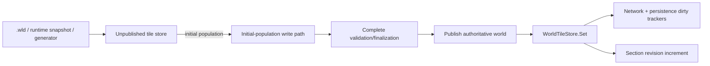

# Начальное заполнение мира и dirty tracking

[English](../en/world-initialization-dirty-tracking.md) · [Performance](performance-runtime.md) · [Roadmap](../roadmap.md)

TerraRuntime разделяет начальное построение мира и authoritative runtime mutation. Загрузка canonical `.wld`, восстановление доверенного runtime snapshot и world generation могут записывать почти каждый tile ещё до того, как мир способен увидеть хотя бы один connection. Прогонять такие записи через live dirty-section tracking означало бы искусственно создавать full-world invalidation backlog без полезной информации.

## Граница ownership

Для initial population действуют инварианты:

- network dirty-section entries не создаются;
- persistence dirty-section entries не создаются;
- section revisions остаются нулевыми, пока store не опубликован;
- частично decoded/generated state никогда не публикуется как authoritative;
- после publication обычный `WorldTileStore.Set` сразу возвращает штатное revision и dirty-tracking поведение.

## Загрузка canonical `.wld`

`WorldFileCoreLoader` выделяет tile storage через `WorldTileStore.CreateForSnapshotLoad`. Backing array создаётся без предварительного zero-fill, потому что успешный decode tile section гарантированно перезаписывает каждый tile до публикации store. `WorldFileTileDecoder` пишет напрямую в private backing span вместо вызова live `Set` для каждого decoded tile.

Так убираются два вида startup work без semantic value:

1. лишний managed zero-fill перед полным tile decode;
2. dirty/revision bookkeeping для initial state, который ещё никто из клиентов не наблюдал.

Failure остаётся transactional. При ошибке tile decode candidate store отбрасывается и никогда не становится authoritative.

## Runtime snapshots и generation

Runtime snapshot restore использует тот же принцип unpublished store. `Workspace` направляет generation writes через явный `SetInitialPopulationTile`, поэтому generation code больше не лезет напрямую в backing storage и при этом не создаёт live dirty/revision bookkeeping.

Оптимизация строго ограничена unpublished construction. Это не глобальный переключатель, способный отключить dirty tracking для live mutations.

## Regression contract

`InitialWorldPopulationDirtyTrackingTests` проверяет canonical `.wld` load, `.runtime-world` restore и полное generation population. Во всех трёх случаях network/persistence dirty queues должны оставаться пустыми, а section revisions нулевыми. Затем тот же suite выполняет первый authoritative `WorldTileStore.Set` и подтверждает, что оба dirty consumers и section revision tracking сразу возобновляют работу.
