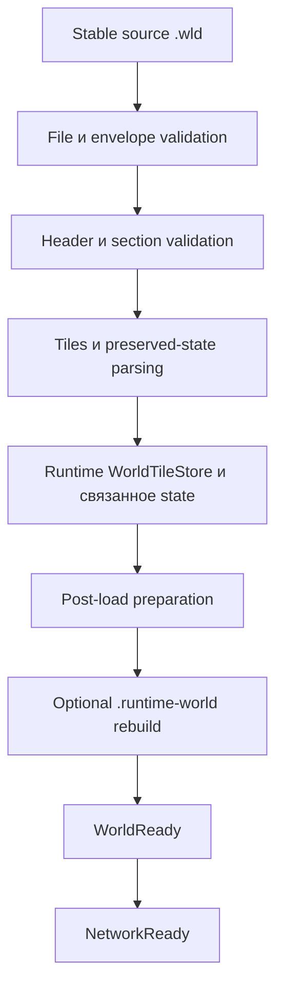
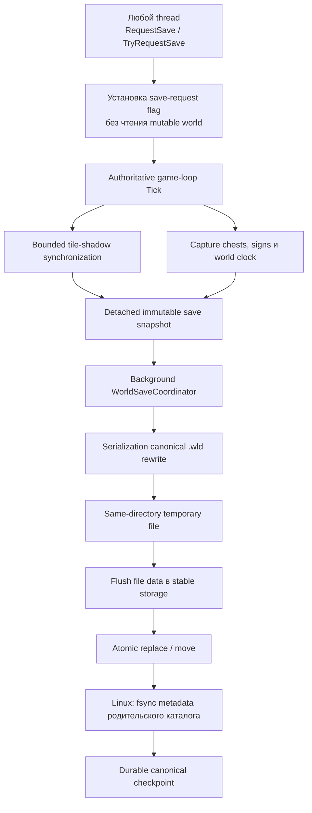

# Загрузка мира, persistence и runtime snapshot

[English](../en/world-persistence.md) · [Документация](README.md) · [Архитектура](architecture.md) · [Roadmap](../roadmap.md)

## 1. Модель persistence

TerraRuntime намеренно разделяет канонический Terraria-compatible world и оптимизированный runtime startup image:

```text
world.wld            canonical Terraria checkpoint / recovery source
world.runtime-world  disposable TerraRuntime startup snapshot
```

`.wld` остаётся границей совместимости. `.runtime-world` является оптимизацией и может быть отброшен при изменении layout или validation rules.

Ошибка cache никогда не должна превращаться в corruption мира.

## 2. World-loading path

Cold startup использует canonical `.wld` loader:



TerraRuntime привязан к проверенному поведению world format Terraria 1.4.5.8 в пределах текущей реализации. То, что неизвестный/newer world structurally readable, ещё не означает, что его безопасно переписывать.

## 3. Stable source reads

World loader считает внешнюю замену файла реальной возможностью. Loader и runtime-snapshot path используют source metadata и validation, чтобы authoritative world не мог незаметно собраться из несовместимых частей двух разных checkpoints.

Если source меняется во время проверки derived snapshot, snapshot отклоняется вместо публикации как authoritative state.

## 4. Runtime world snapshot

Valid warm startup может работать из `world.runtime-world`, не читая содержимое source `.wld`. Runtime всё равно читает дешёвые filesystem metadata исходника, чтобы externally newer canonical checkpoint инвалидировал snapshot.

Текущий snapshot самодостаточен для startup и содержит:

- embedded validated canonical `.wld` checkpoint;
- normalized runtime tiles, разбитые на integrity-checked shards;
- dimensions/version metadata мира;
- содержимое liquids в normalized tile records;
- pending liquid scheduler state;
- source file length и `LastWriteTimeUtc` stamp;
- integrity metadata embedded payloads.

Snapshot не является migration format. Несовместимый header/layout является обычным cache miss и приводит к fallback на canonical `.wld`.

## 5. Layout snapshot

Текущий runtime snapshot содержит fixed header размером \(128\ \mathrm{B}\), embedded canonical `.wld` checkpoint, tile shards, shard integrity table, `LIQSTATE` trailer и active/buffered liquid entries.

Важные свойства:

- normalized `WorldTile` disk records имеют фиксированный layout \(16\ \mathrm{B}\);
- tile shards рассчитаны примерно на \(16\ \mathrm{MiB}\);
- shard reads используют bounded positional `RandomAccess` I/O;
- conservative default допускает до четырёх одновременных tile-shard reads;
- embedded canonical data, tile shards и liquid payload проходят integrity checks до публикации.

Это implementation facts, а не обещание внешней совместимости формата `.runtime-world`.

## 6. Warm-start validity

Cheap source stamp сейчас включает byte length source `.wld` и его `LastWriteTimeUtc`.

Runtime snapshot принимается только если source stamp остаётся совместимым и все внутренние integrity/layout checks успешны.

SHA-256 исходного `.wld` намеренно не вычисляется на каждом warm start, потому что это заставило бы полностью читать source file и уничтожило бы смысл fast-start path. Integrity hashes применяются к данным внутри `.runtime-world`.

После загрузки snapshot source stat читается повторно, чтобы заметить concurrent external replacement во время validation.

## 7. Fallback behavior

Любое из следующего считается cache miss, а не поводом публиковать частично восстановленный world:

- отсутствующий runtime snapshot;
- stale source stamp;
- несовместимый snapshot header/layout;
- truncation;
- hash failure embedded canonical checkpoint;
- hash failure tile shard;
- invalid liquid-state trailer/hash;
- invalid или duplicate liquid queue entries;
- replacement source `.wld`, замеченный во время load.

Fallback читает и валидирует canonical `.wld`, строит authoritative runtime state и только после этого может rebuild derived snapshot.

Partially reconstructed runtime snapshot никогда не публикуется как world.

## 8. Liquid persistence

Tile liquid state и pending liquid work являются разными состояниями.

`WorldTile.LiquidAmount` и `WorldTile.LiquidKind` сохраняют фактический материал в tile. `WorldLiquidUpdateQueue` сохраняет работу, которую ещё должна выполнить liquid simulation.

Runtime snapshot сохраняет:

- active liquid cells в FIFO order;
- `delay` и `kill` state active entries;
- buffered/deferred liquid cells;
- deduplicated membership.

Это позволяет warm start восстановить scheduler напрямую, не сканируя весь мир ради повторного обнаружения pending liquid work.

## 9. Архитектура live save

Live world persistence принадлежит runtime. Mutable state захватывается только на authoritative boundary, а serialization и disk I/O вынесены из game loop.



Caller с другого thread не делает snapshot mutable world самостоятельно. Он просит authoritative owner сформировать snapshot в безопасной commit point.

## 10. Tile shadow

Копирование всего tile array за один save tick создало бы ненужную large-world pause. Текущий save service поддерживает save shadow и синхронизирует его bounded section increments.

Default synchronization budget: \(4\ \text{sections/tick}\).

Save state различает:

- initial shadow bootstrap ещё выполняется;
- dirty tile sections ждут synchronization;
- save requested, но ждёт consistency shadow;
- detached snapshot уже queued background writer.

Failed section snapshot requeue'ится. Save readiness определяется реальным pending dirty work persistence tracker, а не оптимистическим предположением о том, сколько sections пытались обработать в этом tick.

## 11. Что live save сейчас переписывает

Текущий authoritative save path имеет явную production-поддержку runtime-owned:

- tile state;
- chest state;
- sign state;
- world clock fields, которые умеет header patcher.

Остальные canonical world sections намеренно сохраняются из validated source checkpoint вместо регенерации guessed code.

Это безопаснее, чем делать вид, будто TerraRuntime уже реализовал полный Terraria `WorldFileWriter`.

По мере появления нового authoritative persistent state решение load/save должно приниматься явно, а writer support должен подтверждаться независимым round-trip evidence.

## 12. Coalescing saves

Одновременно активна только одна background serialization/write. Повторные save requests coalesce'ятся и не превращаются в бесконечный backlog disk work.

Runtime предоставляет scheduler/save status, включая:

- accepted snapshots;
- started writes;
- completed writes;
- coalesced requests;
- failed writes;
- active write;
- pending detached snapshot;
- tile-shadow bootstrap и dirty-section counts.

Такой state подходит и для TUI/operations surface, потому что UI не получает mutable world collections.

## 13. Atomic и crash-durable publication

`AtomicSaveFileWriter` записывает каждую замену в same-directory temporary file. Temporary file полностью сериализуется, проходит async flush, а затем синхронный `Flush(flushToDisk: true)` до изменения canonical destination.

Для существующего мира publication использует `File.Replace`; для первого save используется `File.Move`. В обоих случаях canonical path меняется только после того, как полный payload уже существует во временном файле.

На Linux после успешного replace/move дополнительно открывается родительский каталог и вызывается `fsync`. Это необходимо потому, что flush содержимого файла сам по себе не гарантирует durability изменения directory entry при внезапной потере питания. Поэтому успешный Linux save имеет два durability barrier:

1. contents файла flushed до publication;
2. metadata родительского каталога flushed после publication.

`WorldFileAtomicPublisher`, который публикует новый canonical world после world generation, использует тот же контракт: file flush до rename и Linux parent-directory `fsync` после него.

Publication invariant: canonical path видит либо предыдущий complete checkpoint, либо новый complete checkpoint, но никогда не partially serialized destination.

Process, убитый до publication, может оставить random-name `.tmp`, однако canonical world при этом не заменяется. Cleanup orphan temp является отдельной housekeeping-задачей и не нужен для определения canonical checkpoint.

## 14. Shutdown и termination save

`Ctrl+C` и POSIX `SIGTERM` входят в один graceful shutdown path. На non-Windows host регистрирует `PosixSignal.SIGTERM`, отменяет runtime shutdown token, дренирует принятые connection/game-loop операции, останавливает authoritative owner, снимает final save image и ждёт завершения save coordinator.

Именно этот path ожидается от обычных service managers и container runtimes. `SIGKILL` приложение обработать не может, поэтому для него проверяется не shutdown hook, а atomic-save crash invariant.

Ordering contract: более старый background save не должен перезаписать более новый final authoritative state.

## 15. `--save-wld`

Offline compatibility command:

```text
TerraRuntime.Server --save-wld path/to/world.wld
```

работает с canonical checkpoint, embedded в runtime snapshot, atomically экспортирует/восстанавливает его и затем обновляет source stamp runtime snapshot.

Не путайте эту команду с live authoritative save service выше.

Offline command пока является checkpoint export path, а не полным generic serializer каждого возможного future runtime-only state. Полный vanilla-equivalent `WorldFileWriter` ещё не завершён.

## 16. Правило save compatibility

TerraRuntime обязан fail conservatively, если не может доказать, что world layout безопасно переписывать.

Правила:

- unknown/newer layout не становится writable только потому, что часть sections читается;
- нельзя patch'ить поля по guessed offsets;
- unowned state сохраняется byte-for-byte там, где текущий targeted rewriter это позволяет;
- newly authoritative persistent state требует явной writer support;
- truncation или section failure не должны молча удалять unrelated valid state.

Silent data loss считается хуже, чем отказ от save.

## 17. Startup profiling

Runtime выдаёт machine-readable startup profile с relevant stages, включая:

- source metadata/stat;
- canonical `.wld` file read;
- runtime-snapshot load;
- canonical loader stages на fallback;
- runtime snapshot rebuild/write;
- bootstrap preparation;
- `WorldReady` и `NetworkReady` wall time;
- startup allocation delta.

На настоящем warm snapshot hit canonical `.wld` file-read stage остаётся нулевым, потому что содержимое файла не читается.

Official-world workflow проверяет это cold/warm запуском на одном мире и содержит warm path, в котором contents source `.wld` недоступны для чтения, а filesystem metadata остаются доступны.

## 18. Evidence и tests

Persistence behavior проверяется unit/integration tests и dedicated workflows, среди которых по применимости:

- world loader/parser tests;
- runtime snapshot/cache tests;
- liquid snapshot tests;
- preserved-section tests;
- save coordinator/coalescing tests;
- authoritative tile/chest/sign/clock save-service tests;
- world patch round-trip checks;
- official Terraria world generation/load workflows;
- live chest persistence probes;
- atomic writer tests и process-level `SIGKILL` crash probe.

Live persistence proof проходит полный маршрут: world, созданный official TerrariaServer 1.4.5.8, live packet-32 chest mutation, graceful termination TerraRuntime, exact `.wld` verification, restart TerraRuntime, reload/save официальным TerrariaServer и финальная exact verification.

`Authoritative World Save` run `33266509632` дополнительно убивает writer process через `SIGKILL` в момент, когда он остановлен до publication. Exact CI result:

```text
atomic_save_sigkill_ok existing_preserved=true first_save_hidden=true subsequent_save=true
```

Это доказывает pre-publication process-crash contract: существующий canonical destination остаётся byte-for-byte неизменным, первый save не становится видимым частично, а следующий нормальный save по-прежнему успешно commit'ится.

World-format changes требуют независимого evidence на real Terraria 1.4.5.8 worlds или official server layout. Self-generated round trip сам по себе не доказывает compatibility.

## 19. Текущие ограничения

Текущий persistence нельзя переоценивать:

- TerraRuntime ещё не реализует каждый field/section полного fresh vanilla `WorldFileWriter`;
- future gameplay systems, включая progression/events/housing/tile entities, потребуют explicit persistence integration по мере перехода в authoritative state;
- runtime snapshot layout намеренно disposable и не является stable external storage API;
- automatic backup rotation/rollback policy не является тем же самым, что atomic-save guarantee, и остаётся отдельной задачей;
- orphaned temporary files после неотлавливаемого process death безопасны для выбора canonical world, но dedicated startup cleanup policy для них пока отсутствует;
- power-loss durability на Linux явно усилен parent-directory `fsync`; эквивалентные filesystem semantics за пределами этого path зависят от платформы;
- `.wld` остаётся canonical recovery boundary.

## 20. Checklist изменения world/persistence

World/persistence change не завершён, пока по необходимости:

- ownership captured state определён явно;
- game-thread snapshot work bounded;
- background I/O не читает mutable authoritative collections напрямую;
- temporary-file и atomic-publication behavior протестированы;
- termination behavior проверен на правильном слое (`SIGTERM` для graceful shutdown, `SIGKILL` для pre-publication crash safety);
- durable publication содержит необходимый filesystem metadata barrier на поддерживаемых платформах;
- для format-sensitive changes есть evidence на real `.wld`;
- runtime-cache corruption безопасно падает обратно на `.wld`;
- эта страница и `docs/en/world-persistence.md` обновлены вместе.
