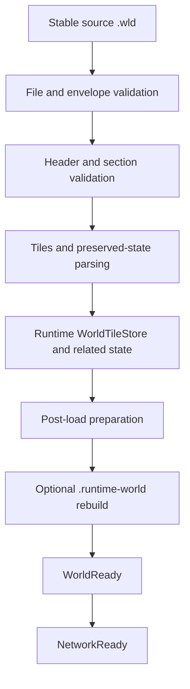
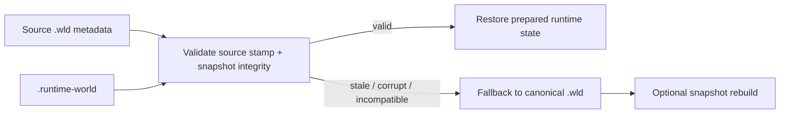
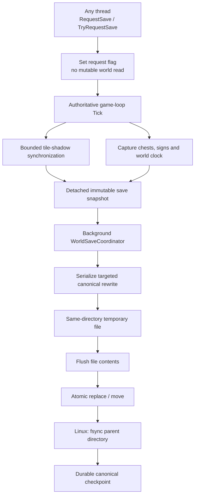
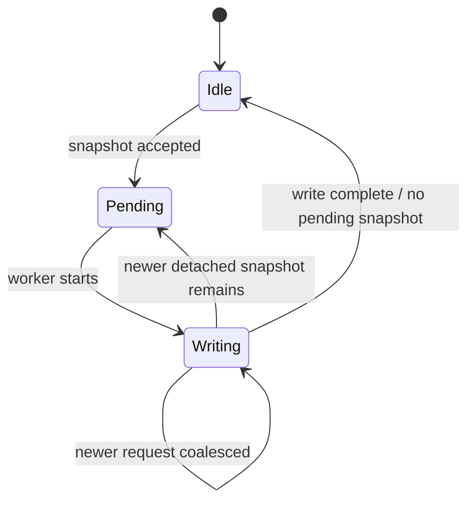
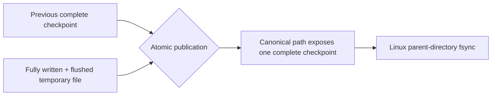

# Загрузка мира, persistence и runtime snapshots

[English](../en/world-persistence.md) · [Документация](README.md) · [Архитектура](architecture.md) · [Roadmap](../roadmap.md)

## 1. Модель persistence

TerraRuntime намеренно разделяет canonical Terraria-compatible world и оптимизированный runtime startup image:

```text
world.wld            canonical Terraria checkpoint / recovery source
world.runtime-world  disposable TerraRuntime startup snapshot
```

`.wld` остаётся compatibility boundary. `.runtime-world` является optimization и может быть отброшен при изменении layout/validation rules. Ошибка cache не должна превращаться в world corruption.

## 2. World-loading path

Cold startup использует canonical `.wld` loader:



TerraRuntime version-pinned к verified Terraria 1.4.5.8 world behavior в пределах current implementation. Structural readability unknown/newer world version не означает safe rewrite.

## 3. Stable source reads

World loading считает external file replacement реальной возможностью. Loader и runtime-snapshot path используют source metadata/validation, чтобы world не мог тихо собраться из несовместимых половин двух checkpoints.

Если source меняется во время validation derived snapshot, snapshot reject'ится вместо publication как authoritative state.

## 4. Runtime world snapshot

Valid warm startup может работать из `world.runtime-world`, не читая contents source `.wld`. Runtime всё равно читает cheap filesystem metadata, чтобы externally newer canonical checkpoint invalidated snapshot.



Current snapshot self-contained для startup и хранит embedded validated canonical `.wld`, normalized runtime tiles в integrity-checked shards, dimensions/version metadata, tile liquids, pending liquid scheduler state, source file length/`LastWriteTimeUtc` и integrity metadata embedded payloads.

Snapshot не migration format. Incompatible header/layout является normal cache miss и ведёт к canonical `.wld` fallback.

## 5. Snapshot layout

Current runtime snapshot имеет fixed header `$128\,\mathrm{B}$`, normalized `WorldTile` record с frozen `$16\,\mathrm{B}$` disk layout и tile shards target `$16\,\mathrm{MiB}$`.

Shard reads используют bounded positional `RandomAccess` I/O. Conservative default допускает до `$4$` simultaneous tile-shard reads. Embedded canonical data, tile shards и liquid payload проходят integrity checks до publication.

Остальная on-disk структура содержит embedded canonical checkpoint, shard-integrity metadata, `LIQSTATE` trailer и active/buffered liquid entries. Это implementation facts, а не public compatibility promises `.runtime-world`.

## 6. Warm-start validity

Cheap source stamp включает source `.wld` byte length и `LastWriteTimeUtc`.

Runtime snapshot принимается только при compatible source stamp и успешных internal integrity/layout checks. SHA-256 original `.wld` намеренно не пересчитывается при каждом warm start, иначе потребуется complete source-file read и fast-start потеряет смысл. Integrity hashes защищают embedded data `.runtime-world`.

После snapshot loading source re-stat'ится для detection concurrent external replacement.

## 7. Fallback behavior

Missing, stale, truncated, incompatible или integrity-invalid snapshot является cache miss, а не partial world. Invalid/duplicate liquid queue state и source replacement во время load также ведут к canonical fallback.

Fallback читает/валидирует canonical `.wld`, строит authoritative runtime state и только после этого может rebuild derived snapshot. Partially reconstructed snapshot никогда не публикуется как world.

## 8. Liquid persistence

Tile liquid state и pending liquid work являются разными concepts. `WorldTile.LiquidAmount`/`WorldTile.LiquidKind` сохраняют material state, а `WorldLiquidUpdateQueue` сохраняет scheduler work.

Runtime snapshot сохраняет active liquid cells в FIFO order, `delay`/`kill` state, buffered/deferred cells и deduplicated membership. Warm startup может restore scheduler напрямую без full-map scan ради rediscovery pending work.

## 9. Архитектура live save

Live world persistence принадлежит runtime. Mutable state capture происходит только на authoritative boundary; serialization/disk I/O detached от game loop.



Caller с другого thread не capture'ит mutable world самостоятельно. Он просит authoritative owner сформировать snapshot в safe commit point.

## 10. Tile shadow

Copy полного tile array за один save tick создал бы avoidable large-world pause. Save service поддерживает shadow bounded section increments.

Default synchronization budget: `$4\,\text{sections/tick}$`.

Save state различает initial shadow bootstrap, dirty sections waiting synchronization, save request waiting shadow consistency и detached snapshot queued background writer. Failed section snapshots requeue'ятся; readiness основана на actual pending dirty work.

## 11. Что live save сейчас переписывает

Authoritative production save path явно поддерживает runtime-owned tile state, chest state, sign state и world-clock fields header patcher.

Authoritative sign persistence переписывает sign section из `RuntimeSignStore`. Current encoder ограничивает текст одного sign `$64\,\mathrm{KiB}$` UTF-8 data, а total sign text одного save snapshot — `$64\,\mathrm{MiB}$`. Выход за accepted contract fail'ит save вместо silent truncation/corruption unrelated world data.

Runtime slot identity табличек следует TerrariaServer 1.4.5.8, пока процесс запущен. Packet `47` может заменить любой valid runtime slot; если переданные coordinates не указывают на active sign tile, vanilla `TextSign` semantics очищают этот slot. Последующий packet `46` для всё ещё active sign tile использует поведение `ReadSign(CreateIfMissing: true)` и может снова выделить первый свободный runtime slot.

Persistence намеренно compact'ит эту runtime identity. Vanilla `SaveSigns` сериализует non-null slots в ascending runtime-slot order, но не сохраняет сами slot IDs, поэтому `RuntimeSignStore` преобразует sparse runtime slots в contiguous file-order IDs `$0,1,\ldots,N-1$`. Duplicate coordinates также записываются, как в vanilla save. При load первое вхождение coordinates выигрывает, более поздние duplicates отбрасываются; surviving signs сохраняют slot IDs, определённые их исходным file order. Поэтому duplicate coordinates не являются encoder error.

Остальные canonical sections намеренно сохраняются из validated source checkpoint вместо regeneration guessed code. TerraRuntime пока не изображает complete Terraria `WorldFileWriter`.

## 12. Coalescing saves

Одновременно active только одна background serialization/write. Redundant save requests coalesce'ятся вместо unbounded disk-work backlog.



Operations/TUI telemetry публикует accepted/started/completed/coalesced/failed writes, active/pending state, shadow bootstrap progress и dirty-section counts без mutable world collections.

## 13. Atomic и crash-durable publication

`AtomicSaveFileWriter` пишет replacement в same-directory temporary file. Temporary file полностью serialized, asynchronously flushed и затем synchronously flushed через `Flush(flushToDisk: true)` до изменения destination namespace.

Existing world публикуется через `File.Replace`, first save через `File.Move`. На Linux после successful replace/move parent directory дополнительно open'ится и получает `fsync`. Поэтому successful Linux save имеет два durability barriers:

1. file contents flushed до publication;
2. parent-directory metadata flushed после publication.

`WorldFileAtomicPublisher` для first publication newly generated canonical world использует тот же file-flush + Linux parent-directory `fsync` rule.



Process kill до publication может оставить orphan random-name `.tmp`, но не заменяет canonical world. `AtomicSaveFileWriter` теперь создаёт рядом с каждым managed temporary файл `.tmp.lease` и держит его открытым с `FileShare.None` на протяжении всей transaction: write, flush, validation, backup и publication. Перед следующим save runtime сканирует только корректно именованные leased temporary для того же target и удаляет orphan только если lease удалось получить эксклюзивно. Поэтому temporary живого writer защищён даже между процессами. Legacy `.tmp` без TerraRuntime lease намеренно не удаляется автоматически: безопасно доказать ownership такого файла нельзя.

Successful validated replacement existing canonical checkpoint также сохраняет предыдущую canonical generation в `<world>.wld.bak`. При startup, если canonical `.wld` не проходит structural/content validation, TerraRuntime может проверить этот backup полным supported world loader и atomically восстановить его. Invalid backup fail'ится closed и оставляет canonical file untouched; broken canonical во время recovery никогда не ротируется поверх known-good backup.

Automatic recovery намеренно подавляется при explicit format incompatibility. Structurally readable world с unsupported version, например `327`, является compatibility decision, а не corruption: startup fail'ится вместо замены future-world файла более старым `326` backup. Canonical и backup bytes в этом случае остаются unchanged.

## 14. Shutdown и termination save

`Ctrl+C` и POSIX `SIGTERM` входят в graceful shutdown path. На non-Windows host регистрирует `PosixSignal.SIGTERM`, cancel'ит runtime shutdown, drains accepted connection/game-loop work, останавливает authoritative owner, capture'ит final save image и waits save coordinator.

`SIGKILL` application code обработать не может, поэтому он покрывается atomic-publication crash invariant, а не shutdown hooks.

Ordering contract: older background save не должен overwrite newer final authoritative state.

## 15. `--save-wld`

Offline compatibility command остаётся literal CLI syntax:

```text
TerraRuntime.Server --save-wld path/to/world.wld
```

Она работает с canonical checkpoint, embedded в runtime snapshot, atomically export/restores его и refresh'ит source stamp. Это не live save service и не complete generic serializer любого future runtime-only state.

## 16. Правило save compatibility

TerraRuntime fail conservatively, если safe rewrite world layout не доказан.

Unknown/newer layout не становится writable из-за partial parsing; fields не patch'ятся по guessed offsets; unowned state сохраняется там, где targeted rewrite это позволяет; newly authoritative persistent state требует explicit writer support; truncation/section failure не должны silently delete unrelated valid state.

Silent data loss хуже отказа save.

## 17. Startup profiling

Runtime emits machine-readable startup profile для source metadata/stat, canonical `.wld` read, runtime-snapshot load, fallback loader stages, snapshot rebuild/write, bootstrap preparation, `WorldReady`/`NetworkReady` wall time и startup allocation delta.

На genuine warm hit canonical `.wld` file-read time остаётся zero. Official-world workflow проверяет cold/warm startup и warm path, где source `.wld` contents unreadable при доступных filesystem metadata.

## 18. Evidence и tests

Persistence evidence включает world loader/parser tests, runtime snapshot/cache tests, liquid snapshots, preserved-section tests, save coordinator/coalescing tests, authoritative tile/chest/sign/clock save-service tests, sign persistence round trips, world patch checks, official-world load workflows, live chest/sign persistence probes, atomic writer tests и process-level crash/recovery probes.

Live persistence proof использует world, созданный official TerrariaServer 1.4.5.8, выполняет live `packet 32` chest mutation, gracefully terminates TerraRuntime, проверяет exact `.wld`, restart'ит TerraRuntime, reload/save через official server и проверяет снова.

`Authoritative World Save` run `33270005299` убил writer processes через `SIGKILL` во время stall до publication как для existing destination, так и для first save, после чего получил:

```text
atomic_save_sigkill_ok existing_preserved=true first_save_hidden=true subsequent_save=true orphan_cleanup=true live_lease=true
```

Это доказывает не только pre-publication process-crash contract, но и cross-process orphan cleanup: existing canonical destination остаётся byte-for-byte unchanged, first save не exposed partially, killed process оставляет соответствующую пару `.tmp`/`.tmp.lease`, а следующий successful save удаляет abandoned pair перед commit и не трогает temporary с live lease.

`World Checkpoint Recovery` run `33269875235` использовал world из official TerrariaServer 1.4.5.8 и доказал rotation previous-generation backup, exact recovery из structurally corrupted canonical checkpoint, fail-closed behavior invalid backup, official-server reload после recovery и suppression rollback для otherwise intact world, где изменилось только little-endian format version field с `326` на `327`. Future-version canonical и его valid `326` backup оба остались byte-for-byte unchanged.

World-format changes требуют independent evidence real Terraria 1.4.5.8 worlds или official layout. Self-generated round trip alone не sufficient compatibility proof.

## 19. Текущие ограничения

TerraRuntime ещё не реализует каждый field/section complete fresh vanilla `WorldFileWriter`. Future progression/events/housing/tile-entity systems требуют explicit persistence integration при переходе authoritative.

Runtime snapshot layout остаётся disposable, не stable external storage API. Validated previous-generation backup rotation и automatic corruption recovery уже реализованы, но multi-generation retention/history policy отсутствует. Managed orphan `.tmp` удаляются при следующем save только если TerraRuntime lease удаётся получить эксклюзивно; unknown legacy temporaries без lease намеренно не удаляются автоматически. Linux parent-directory `fsync` усиливает power-loss durability; equivalent filesystem semantics вне этого path platform-dependent. `.wld` остаётся canonical recovery boundary.

## 20. Checklist изменения world/persistence

World/persistence change не завершён, пока по необходимости:

- ownership captured state explicit;
- game-thread snapshot work bounded;
- background I/O не читает mutable authoritative collections directly;
- temporary-file/atomic-publication behavior tested;
- backup recovery валидирует candidate и никогда не трактует explicit format incompatibility как corruption;
- `SIGTERM` graceful shutdown и `SIGKILL` pre-publication crash safety tested на correct layer;
- durable publication включает required filesystem metadata barriers на supported platforms;
- format-sensitive changes имеют real `.wld` evidence;
- runtime-cache corruption safely falls back;
- diagrams используют Mermaid вместо pseudographics;
- dimensional measurements используют LaTeX с explicit units;
- эта page и `docs/en/world-persistence.md` обновлены вместе.
